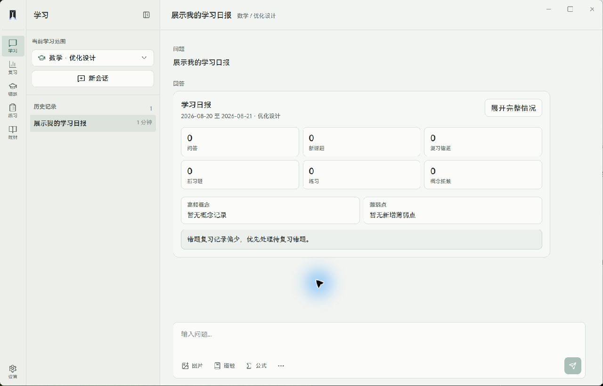
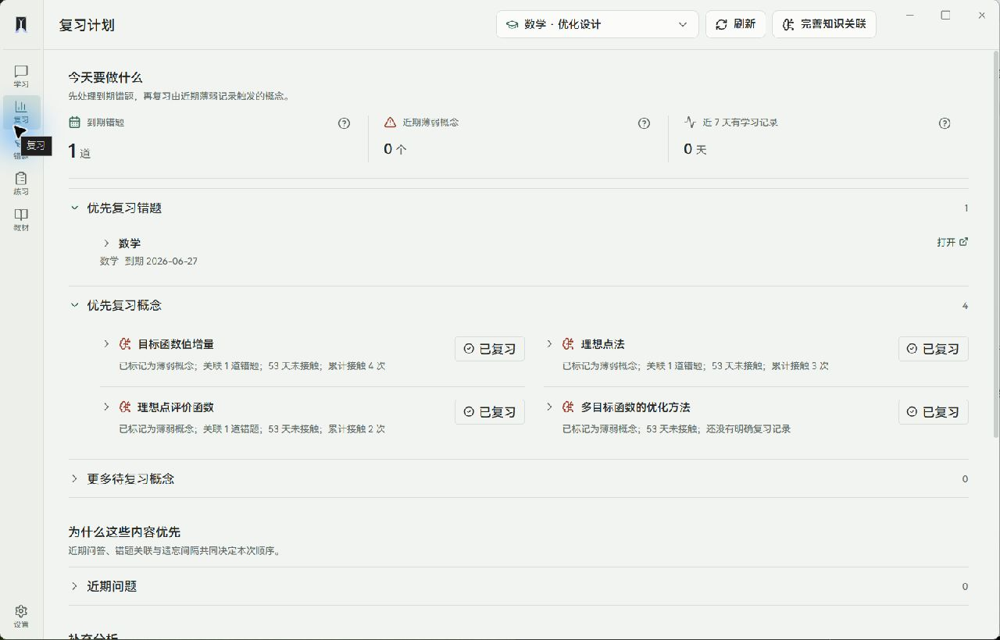
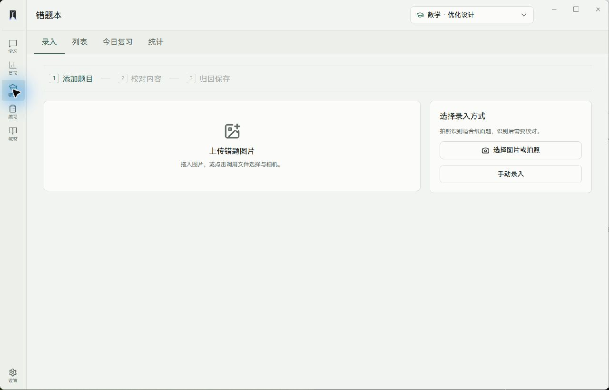
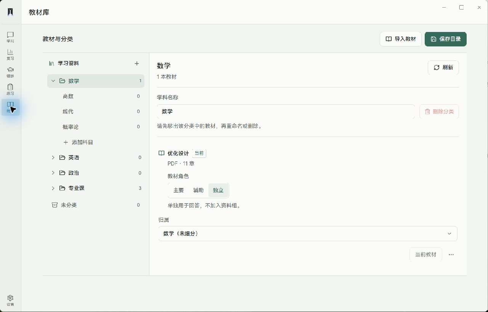

<div align="center">


# Texa

面向教材学习、练习与长期复习的本地桌面工作台

[界面预览](#界面预览) · [核心功能](#核心功能) · [系统架构](#系统架构) · [安装与运行](#安装与运行)

</div>

Texa 面向考研数学与专业课学习。它把教材、对话、习题、错题和复习记录组织在同一个学习范围内，让一次提问可以回到教材证据，让一道错题可以进入复习计划，也让长期积累不散落在多个工具中。

项目优先提供 Electron 桌面体验，学习数据保存在本地；生成式能力通过可配置的模型服务接入。

## 界面预览

### 学习工作区

围绕当前教材组织会话、历史记录、图片题目、公式输入与学习报告。



### 复习计划

把到期错题、薄弱概念与近期学习记录合并为今天可执行的复习队列。



<table>
  <tr>
    <td width="50%"></td>
    <td width="50%"></td>
  </tr>
  <tr>
    <td align="center">错题录入与校对</td>
    <td align="center">教材分类与资料角色</td>
  </tr>
</table>

## 核心功能

### 教材范围内的问答与讲解

- 以当前学科、教材和章节作为学习范围。
- 结合知识图谱定位、向量检索、词法检索与相邻片段补全证据。
- 支持连续追问、公式渲染、教材来源与流式生成过程。
- 检索源局部不可用时保留降级路径，避免中断整个问答流程。

### 教材与资料管理

- 导入 PDF 教材或复用 MinerU 解析结果。
- 按学科与分类管理资料，并设置主要、辅助或独立教材角色。
- 保存章节结构、片段、关键词、概念关系和向量索引。

### 习题库与练习

- 手动录入，或从 Word、PDF 中抽取候选题并校对后入库。
- 记录题干、答案、解析、来源、章节、题型、难度和概念标签。
- 支持练习会话、进度恢复、作答记录以及习题与错题之间的转换。

### 错题与复习

- 支持手动录入、图片上传、OCR 校对和错因归档。
- 关联教材、章节、概念、来源与用户答案。
- 通过兼容 SM-2 的间隔调度生成到期复习队列。
- 汇总概念接触、薄弱信号、学习日报和周报。

### 本地桌面体验

- Electron 管理本地 FastAPI 服务、数据目录、启动检查与更新入口。
- 页面切换保留已访问工作区的状态，会话与列表在后台静默刷新。
- 模型凭据由本地设置管理；教材、索引和学习记录默认留在本机。

## 学习流程

```text
导入教材
   │
   ▼
解析章节与内容 ──► 建立词法 / 向量 / 概念索引
   │
   ▼
在教材范围内提问 ──► 规划意图 ──► 混合检索 ──► 组织证据 ──► 流式回答
   │
   ├──────────────► 保存会话与学习线索
   │
   ▼
练习题目 ──► 记录作答 ──► 错题归因 ──► 到期复习 ──► 更新概念记忆
```

对话历史采用追加式事件记录保存；回答时只提取与当前问题相关的近期上下文、结构化会话状态和教材证据，不把完整历史直接塞进模型输入。

## 系统架构

```text
┌────────────────────────────────────────────────────────┐
│ Electron desktop                                       │
│ 窗口生命周期 · 本地后端托管 · 数据目录 · 更新与恢复     │
└──────────────────────────┬─────────────────────────────┘
                           │
┌──────────────────────────▼─────────────────────────────┐
│ React + TypeScript                                     │
│ 学习 · 复习 · 错题 · 练习 · 教材 · 设置                │
└──────────────────────────┬─────────────────────────────┘
                           │ REST + SSE
┌──────────────────────────▼─────────────────────────────┐
│ FastAPI application                                    │
│ API 协议层 · 应用服务 · 后台任务 · 数据边界             │
└───────────────┬──────────────────────┬─────────────────┘
                │                      │
┌───────────────▼──────────────┐  ┌────▼─────────────────┐
│ LangGraph / RAG              │  │ Learning services    │
│ Resolver · Retrieval         │  │ 习题 · 错题 · SM-2   │
│ EvidencePack · Generation    │  │ 概念记忆 · 学习记录  │
└───────────────┬──────────────┘  └────┬─────────────────┘
                └──────────┬───────────┘
                           ▼
              ChromaDB · SQLite · JSON · Files
```

主要边界：

- `backend/api` 负责 HTTP、SSE、依赖绑定和错误映射。
- `backend/services` 编排教材、练习、错题、会话与学习状态用例。
- `graph` 负责意图解析、检索、上下文控制和回答生成。
- `ingestion` 与 `knowledge` 负责教材解析、索引和概念关系。
- `memory` 负责错题、反馈、概念记忆与间隔复习。
- 前端页面只装配工作区，稳定的领域状态放在 `features` 与 hooks 中。

## 项目目录

```text
texa/
├── desktop/                  Electron 桌面壳、安装包与运行时管理
├── frontend/                 React + Vite 用户界面
│   └── src/
│       ├── api/              REST / SSE 客户端
│       ├── components/       通用组件
│       ├── contexts/         全局学习与会话上下文
│       ├── features/         习题、错题等领域工作流
│       ├── layouts/          桌面布局
│       └── pages/            页面装配
├── backend/
│   ├── api/                  FastAPI 路由与协议转换
│   ├── services/             应用用例与跨存储协调
│   ├── conversation_memory.py
│   └── main.py
├── graph/                    LangGraph、检索与回答生成
├── ingestion/                PDF、MinerU、OCR 与向量索引
├── knowledge/                知识图谱、概念记忆与关键词索引
├── memory/                   错题、反馈与间隔复习
├── evaluation/               上下文与检索评测工具
├── scripts/                  构建、索引和维护脚本
├── tests/                    后端与工作流测试
├── docs/images/              README 界面截图
├── site/                     项目静态站点
├── config.py                 模型与本地路径配置
└── main.py                   CLI 入口
```

## 安装与运行

### 环境要求

- Windows 10/11（桌面端优先）
- Python 3.10
- Node.js 20 或更高版本
- 可选：OpenAI-compatible 模型服务、MinerU 或视觉模型

### 1. 获取代码

```powershell
git clone https://github.com/jayceto946-byte/texa.git
cd texa
```

### 2. 创建 Python 环境

```powershell
py -3.10 -m venv venv310
.\venv310\Scripts\Activate.ps1
python -m pip install -r requirements.txt
```

复制环境配置：

```powershell
Copy-Item .env.example .env
```

模型角色、API Key、Base URL、MinerU 与数据路径均可在 `.env` 中配置；桌面端首次启动后也可以在“设置”中填写模型连接。

### 3. 安装前端与桌面依赖

```powershell
cd frontend
npm install
cd ..\desktop
npm install
cd ..
```

### 4. 开发运行

分别启动后端与前端：

```powershell
.\venv310\Scripts\python.exe -m uvicorn backend.main:app --port 8000
```

```powershell
cd frontend
npm run dev
```

连接现有开发服务启动 Electron：

```powershell
cd desktop
npm run dev:vite
```

也可以让 Electron 按桌面运行方式启动并托管本地后端：

```powershell
cd desktop
npm run dev
```

### 构建与测试

```powershell
cd frontend
npm run build
```

```powershell
.\venv310\Scripts\python.exe -m pytest -q
```

Windows 安装包需要先准备桌面后端与嵌入运行时，再执行：

```powershell
cd desktop
npm run dist
```

## 数据与配置

默认本地数据位于 `data/`：教材、章节、图片、会话、学习记录与 ChromaDB 索引按类型保存。桌面安装版使用 Electron 的用户数据目录，并在卸载时保留学习数据。

请勿提交 `.env`、API Key、个人教材、题库、学习记录、数据库或索引文件。公开分享教材和题库前，也应确认相应内容的授权范围。

## 发展方向

Texa 的目标不是增加更多零散的 AI 按钮，而是形成稳定、可追溯的个人学习基础设施。后续会继续围绕这些方向推进：

- 提升 PDF、扫描件、公式与题目结构化的导入质量。
- 完善习题来源、答案校对、错因归档和复习反馈闭环。
- 让教材证据、会话上下文与概念记忆在长周期学习中保持一致。
- 降低本地安装、模型配置、索引维护和数据迁移的成本。
- 在核心桌面流程稳定后，探索移动端、离线能力与提醒机制。

---

Texa 希望让教材不只被存放，让练习不只被做完，让每次错误都能成为下一次复习的入口。
