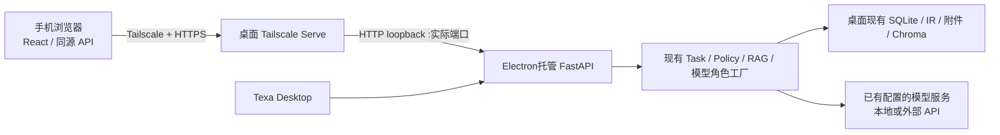

# Texa Mobile Remote V0 可行性审计

审计日期：2026-10-08。对象：当前工作区，HEAD `71279642383ca144c0f3930197cf2b29c406edf5` **加现有未提交修改**，不是该提交的纯净版本。结论依据源代码、已有离线测试和官方网络/框架文档；没有启动远程服务、改动应用代码、连接手机、执行真实模型调用或修改业务数据。

## 1. 决策结论

**值得现在启动一个有明确退出条件的 PoC。最经济路线是 Mobile Web，稳定后再补 PWA 安装体验；不用新建 Agent，不用跨设备数据库同步，不用先统一全部 Runtime 存储。**

Texa 已具备大部分业务端点和浏览器客户端。距离“手机可打开页面”很近，距离本次要求的可靠完整闭环，仍有三个关键缺口：

1. 桌面启动与鉴权围绕本机设计：动态端口、随机桌面 token、首次设置状态和失效的 `/capture` 入口，尚无完整远程接入体验。
2. 手机断线恢复需要客户端重新读取权威状态。现有流的连接关闭通常会中断/暂停任务；不能承诺切后台后桌面继续跑，也不能把遥测事件回放当作答案续传。
3. 上传图片已能识图和推理，但**该路径未接入教材 Final EvidencePack**；图片题干/资产到 Session、错题草稿和笔记的继承也不完整。这是主要业务关键路径。

估算：熟悉本仓库的单人开发，网络与文字浏览 PoC 约 **1–2 人日**；正常网络下完整照片闭环约 **5–8 人日累计**；含断线、双端编辑、手机布局和桌面回归的可用 V0 约 **12–20 人日累计（约 3–4 周）**。这是基于下述范围的工程估算，不是实测工时；真实模型/OCR质量、校园网络限制和未提交代码基线不稳定可能增加约 30% 缓冲。

### 约束解释

桌面端是唯一应用执行与数据权威，手机只承担输入和展示。但当前 `llm` 工厂可调用远程模型 API：**“桌面发起推理”不等于“模型权重全部运行在桌面”**。本方案按“不新增云端后端/推理架构，复用用户已配置的模型角色”估算。若“无云端计算”要求连现有云模型调用也禁止，则需另行验证本地视觉/回答模型、硬件与延迟，本文工期不适用。此次没有付费或数据出境测试。

## 2. 现有能力矩阵

“已具备”表示仓库具备能力，并不表示已通过手机验收。路径后的行号为本次工作区快照定位。

| 能力 | 状态 | 代码证据 | 对 V0 的含义 |
|---|---|---|---|
| FastAPI 托管 React、SPA 深链接 | 已具备 | `backend/main.py:38` SPAStaticFiles，文件末尾挂载 `frontend/dist` | 可由同一 HTTPS origin 提供页面和 `/api`，避免开发服务器跨域 |
| Electron 托管唯一后端及数据目录 | 已具备 | `desktop/main.cjs:87` runtimePaths、`:155` backendEnv；`desktop/backend_server.py` main | 沿用 Electron 当前进程与 userData，不能额外启动第二个默认数据目录后端 |
| 网络稳定地址、远程配对 | 部分具备 | `desktop/main.cjs:41` 随机 token、`:360` 动态端口；`frontend/src/api/client.ts:11` hash bootstrap | 可用 token header；缺远程发放、撤销和重启后接入流程 |
| 手机采集入口 | 部分具备/页面缺失 | `desktop/main.cjs:134` 生成 `/capture#capture_token=…`；`backend/security.py:26` capture allowlist；`frontend/src/App.tsx:30` 无 `/capture` route | 遗留后端范围只允许识图与新增题目，不允许聊天/笔记；链接不等于可运行手机页面 |
| 文字教材问答及引用 | 已具备 | `backend/api/chat.py:1708` stream；`graph/main_graph.py`、`graph/evidence_pack.py`、`graph/generator.py`；`frontend/src/hooks/useChat.ts`、`components/ChatMessage.tsx` | 可复用文字入口、范围选择、Markdown/KaTeX及引用呈现 |
| 浏览器 POST SSE | 已具备 | `frontend/src/api/client.ts` chatStream/consumeSseChunk；`backend/api/chat.py:1641` | fetch 流可携带 token，不要求 WebSocket；没有浏览器 EventSource 自动重连语义 |
| 会话权威历史及分页 | 已具备 | `backend/conversation_memory.py:55`、`:745` 附近消息读取；`backend/api/chat.py:735–769` | 回到手机后可读同一会话；无需同步手机数据库 |
| 任务停止、恢复、迟到事件隔离 | 部分具备 | `backend/services/owned_stream.py`；`backend/api/chat.py:1719–1848`；`backend/services/learning_task.py` | 有 checkpoint/fence 和状态接口，仍缺移动端网络恢复的完整协调 |
| RuntimeEvent 答案回放 | 缺失（不是其设计职责） | `backend/services/runtime_events.py:1–5` 明确 best-effort、无正文；`:203` 有限队列 | 只能诊断，不能拿它恢复答案或补齐丢失 token |
| SQL Runtime 执行事件分页 | 部分具备 | `backend/api/chat.py:1812` events 仅接收 runtime task，delta 不持久化；`agent_runtime/chat_binding.py:240` | 可恢复状态/最终快照，不能泛化成所有图片/文字任务的完整逐字回放 |
| 上传照片、视觉结构、流式解题 | 已具备 | `backend/api/mistakes.py:797`；`backend/services/multimodal_bridge.py:20,178` | 上传、视觉 IR、缺失输入门槛、流式 reasoning 可复用 |
| 上传照片自动同范围教材 RAG | 缺失 | `backend/api/mistakes.py:294,317,950`、`multimodal_bridge.py:317` | prompt 只有视觉结构与问题等，不传教材 EvidencePack；book_name 用于资产/概念范围不代表检索 |
| 真正 native 图片直达最终回答模型 | 部分具备 | `backend/api/mistakes.py:353` 只选择模型；`:335` stream(prompt)；bridge analyze 独立视觉调用 | 当前上传图片仍先 IR 再文本推理，不能凭 native 配置声称最终模型直接看图 |
| 教材 Canonical IR、公式、图像资产 | 已具备结构能力 | `ingestion/document_ir.py:20–140,317–377`；`document_adapters.py`、`mineru_structured.py`；`backend/api/figures.py:113–156` | 教材图、公式、页码/位置有契约；保真度、OCR正确性需人工核验 |
| 图片原件及手机格式兼容 | 部分具备 | `mistake_images.py` save_upload/optimize_for_ocr/save_draft_attachment；`frontend/src/features/mistakes/imageProcessing.ts` | 聊天图通常保留压缩工作图而非原件；HEIC不在聊天后端扩展白名单 |
| 错题记录、查看、编辑 | 已具备 | `backend/api/mistake_lifecycle.py:384–525`；`memory/mistake_book.py`、`memory/mistake_lifecycle.py` | 复用草稿、附件、revision、operation_id；避免改用旧 add 端点自动重试 |
| 从 Session 保存错题 | 部分具备 | `backend/services/mistake_chat_sources.py:43`；`frontend/src/components/ChatMessage.tsx:232` | 稳定来源去重复用已具备；UI只传问题正文等，未自动继承答案/照片/视觉 IR |
| Session 笔记生成、编辑、显式保存、浏览 | 已具备 | `backend/api/notes.py:35–133`；`backend/services/session_notes/{service,jobs,sources}.py`；`memory/session_notes.py` | 后台 Job + 草稿/CAS/不可变 revision，适合远程复用 |
| 图片题完整进入笔记素材 | 部分具备 | `backend/api/mistakes.py:581–606`；`session_notes/sources.py:37` | 会话投影 user 文本取用户 question/goal，可能仅为“请完整讲解这道题”；notes 不拥有原图，不能保证冻结了完整题目 |
| 手机布局和拍照 UX | 部分具备 | `MainLayout.tsx:21`、`ApprovedWorkspace.css:314`、`notes.css:61`、`MistakeIntakePage.css:31`；`ChatPage.tsx:964` | 有窄屏/触摸基础；聊天上传无 capture 提示，键盘/相机/公式横滚尚未真机确认 |
| PWA、离线同步 | 缺失 | 当前 frontend 源码/公开资源未发现 Service Worker 或 webmanifest 注册 | V0 可先在线 Mobile Web；离线数据库和同步不是阻塞项 |

## 3. API、Electron、React 与 Runtime 的实际边界

浏览器的业务调用集中在 `frontend/src/api/client.ts`，API_BASE 默认 `/api`，统一追加 `X-Kaoyan-Token`。业务接口并不要求 Electron IPC。窗口控制、更新、日志、首次配置完成标记等才依赖可选 `window.kaoyanDesktop`；`DesktopTitleBar` 在非 Electron 环境直接不显示。因此不需要拆后端或重写前端框架。

实际耦合主要在启动和客户端状态：

- Electron 默认选空闲端口，设置 `DATA_DIR/ENV_PATH/MINERU_OUTPUT_PATH` 和强制 token，最终加载带启动 hash 的页面。手机不能使用其中的 `127.0.0.1` API base，必须使用远程同源 `/api`。
- `FirstRunGuide.tsx:55–65` 同时要求模型已配置和 desktop/localStorage 完成标记。新手机没有这两个客户端标记，即使桌面已配置，也会进入设置流程。需要新增“连接现有桌面”的只读就绪判断，不能让手机重复填写模型密钥。
- `ChatContext` 管客户端消息和当前会话，不是全端共享状态通知服务。双端展示会暂时不同，重新查询可以解决；无须引入跨设备数据复制。
- 当前有普通 LearningTask JSON 存储和 opt-in SQL Agent Runtime 并存。`agent_runtime/chat_binding.py:112` 由 `TEXA_AGENT_RUNTIME_READ/TEXTBOOK/WRITE` 等开关决定是否接管，且只接管特定能力；不能因移动端而开启所有开关或宣称所有聊天已通过统一 SQL Runtime。
- `DecisionRouter`、`RulePolicyV0`、工具白名单和 RAG 应继续由现有后端执行。手机不选择供应商、不决定跳过证据、不发起第二套 Agent loop。

## 4. Session、执行事件与断线恢复

### 四种状态不要混用

| 数据 | 当前作用 | 手机恢复用法 |
|---|---|---|
| 会话 append-only SQLite | 完整消息与持久化投影，最近窗口 JSON 兼容 | 分页重读最终正文、来源和任务关联 |
| LearningTask/checkpoint | 普通 QA/visual_qa 状态、输入与 outcome；公开事件/正文投影有界 | GET task 判断 running/interrupted/waiting/completed，正文以会话为准 |
| SQL Runtime run/events/outbox | 部分能力的任务权威和可靠投影 | 指定 task/run/seq 拉事件，再读最终结果；保留现有存储选择 |
| runtime_events.db | 无正文、有限队列、允许丢失的诊断遥测 | 排障统计，不参与正确性和消息恢复 |

`OwnedStreamingResponse` 在断开时 fence 活跃 run，普通任务中断；SQL chat stream 的 on_close 将 run 暂停。恢复创建新 run，复用同一 task/turn，但可能重做生成，并不是从最后一个 token 继续。文字恢复会检查教材 checkpoint provenance/索引版本；过期证据不能直接继承。

`GET /api/chat/tasks/{task_id}/events` 仅适用 `rtask_`，不是图片任务通用事件端点。LearningTask public artifacts 仅给最近 40 个事件，以及最多 4000 字的部分/完成正文投影（`learning_task.py:263–280`）；它不是完整答案来源。

现有客户端有 SSE解析、缺结束边界检测、停止确认、恢复入口和 run/seq 合并，但在 `useChat`、`ChatPage`、`ChatContext` 中没有形成完整的 visibility/online 恢复对账流程。浏览器刷新、相机切换、锁屏或网络切换后，不能只改本地 message.stage。

**V0 最小恢复合同：**

1. 请求开始前保留稳定 conversation_id/turn_id；收到 task_id/run_id 后保留关联。首个任务事件丢失时先按会话/turn查找，不盲目重发上传。图片入口目前每次创建任务，此窗口需要做身份去重或增加只读查找，不能假设重试天然幂等。
2. `online/pageshow/visibilitychange` 回到可见时读取会话和任务权威状态；仍运行就观察，有结果就加载，已中断才显示恢复；waiting_for_input 则补材料。
3. 用户主动恢复后使用新的 run_id，同一 task/turn；旧 SSE 回调不再改变页面。网络失败不得被呈现为成功完成。
4. 保存超时使用原 operation_id 查询/重试，409保留本地编辑供用户处理，不覆盖另一端最新版本。
5. V0 接受“锁屏可能中断，回前台可继续”。全天候脱离连接的后台 QA、全量 delta 日志、多订阅者实时广播可延期。现有笔记 Job 本来独立于浏览器请求，不要为一致性把它改为连接拥有。

## 5. 多模态与学习资产链路：已接通什么、未接通什么

### 当前上传照片链路

`ChatPage` → multipart `/api/mistakes/solve-image-stream` → `MistakeImageStore.save_upload` → task 稳定工作图 → `KimiVisionBridge.analyze`（实际复用 vision角色工厂，名称是兼容名）→ `VisualProblemIR` → missing-input gate → 文本 prompt 的 reasoning流 → thinking过滤/LaTeX整理/答案验证 → task outcome → Session投影。

VisualProblemIR保存题干、公式、实体、关系、手写步骤、标记、不确定项和缺少材料。它是有界、可能有损的视觉结构：题干最多12000字符，若干列表项最多500字符等。不是教材 `CanonicalBook/DocumentBlock`。手机照片不必先导入教材或创建 Chroma collection。

**主要断点：**

- 图片解答调用 `_iter_visual_solution_chunks`，没有同范围检索及 Final EvidencePack。只凭输出中出现教材名称或有关概念，不能认定完成了 RAG。
- `native` 分支只换 reasoning client；最终 stream 的输入仍是字符串 prompt。V0优先验证已有 split 链路即可；真 native 端到端不应成为首版前置重构。
- 聊天图前端可先缩到1800像素，后端默认再缩到1600像素；`optimize_for_ocr` 默认删除 raw。`retain_for_task` 保的是传给它的工作图，不是原件保真承诺。草稿附件接口已有保留 original + OCR work image 的能力，应复用。
- `ChatMessage.tsx:232` Session转错题只发问题正文等；`_clean_draft_data` 不接受任意文件路径。不能靠手机回传桌面绝对路径把图片“关联”进错题。
- 图片完成投影的用户消息常是泛化提问；笔记来源冻结主要读取消息正文与证据，不会自动把 task中的所有视觉字段变成题目内容。虽能生成一篇笔记，不代表完整保留了原题。

### 推荐的最小接线

保留现有图片端点与主聊天 UI，在后端服务层复用现有同范围检索/EvidencePack能力：把校对后的题干作为检索问题，把视觉 IR作为**本轮用户输入证据**独立传入生成上下文；教材 E-id只来自实际检索 pack，不能把OCR当教材出处。不通过另开文字 turn 伪装一次完整图片任务。

图片任务保存 book/subject/answer_mode、最终教材证据/索引身份和视觉资产引用到 checkpoint，恢复仍用既有 fence和证据版本检查。图片响应 sidecar、Session投影及前端同时传递/显示 sources（当前图片回调只合并正文、概念、任务，亦需补齐）。验证沿用 required outputs、引用合法性和可验证数值/公式支持。

从 Session保存错题时，由服务端按 task/turn读取原始附件、VisualProblemIR和已持久化答案，复制/关联到现有草稿附件结构；用户可改题干、答案、错因后显式保存。笔记冻结来源至少含经确认的完整题干、回答、视觉文字摘要及教材证据；V0不必把照片嵌入每篇笔记，也不允许假装笔记生成器看过未提供的原图。

教材链路独立保留：PDF/MinerU → Canonical IR及report → staged索引 → 同范围召回 → Final EvidencePack。`figures.py` 的教材图目录/图片/figure-stream已有另一条能力，它适合从教材选图，不能自动视为“任意手机照片已匹配教材图”。V0先做文字/结构检索，不加图像向量库或图像相似匹配系统。

## 6. 数据权威：不需要跨设备同步

| 资产 | 当前存储/访问 | 建议 |
|---|---|---|
| Session消息/管理 | `PROGRESS_PATH/conversations/_conversation_events.db`，窗口JSON兼容 | 仅桌面后端访问，手机REST分页 |
| 普通学习任务 | `LearningTaskStore` JSON、原子写、run fence、outcome/effects | 维持现状，不为手机统一迁移 |
| SQL Runtime | `agent_runtime/store.py` SQLite，locator按任务ID区分 | 维持现有权威归属 |
| 错题与草稿/回执 | `mistake_book_<book>.db`及lifecycle表，附件文件 | 沿用revision和operation_id；不共享数据库文件 |
| Session笔记 | `session_notes.db`，来源冻结、草稿、版本与操作回执 | 手机与桌面访问同一笔记，不创建副本 |
| 笔记生成 | JobManager + 后台线程，重启标记interrupted/reconcile | 重入页面重新读取job/draft，不自动重新付费生成 |
| 教材与检索 | Canonical IR/manifest/lexical/Chroma `data/vector_db`等 | 手机只选范围、读引用/图片；导入/重建留在桌面 |

“单一权威”指一个桌面服务拥有现有全部存储，**不意味着必须合并成一个SQLite文件**。手机不下载 Chroma，不经 SMB/网盘打开SQLite，也不启动第二个后端写同一库。业务数据在线写入后端，浏览器只保存连接信息/草稿UI状态。

双端同时打开属于多客户端，不是多租户。现有错题/笔记CAS已经可以拒绝冲突；还需测试同一Session并发发问的服务端准入和相同turn重试。教材选取显式随请求传 book/subject，避免用全局 `/books/switch` 管手机会话范围。V0使用回前台/保存后刷新即可；实时跨端广播可延期。

## 7. 远程连接与安全

### 推荐拓扑



选择 Tailscale Serve 反代到 loopback，前端静态文件和API走同一origin，FastAPI无需开放全部网卡。官方说明 Serve用于tailnet内服务并支持本地HTTP反代；这是连接方案依据，不是此仓库网络实测。[Tailscale Serve](https://tailscale.com/docs/reference/tailscale-cli/serve)

PoC可手工指定 Desktop已支持的固定 `KAOYAN_BACKEND_PORT`，再将Serve指向该端口；正式V0在桌面显示当前目标端口，或在运行就绪后更新**本服务**映射。重启发生端口占用应明确失败，不能接到旧实例/其他服务。不要为省事暴露Vite、开启Funnel或另起公共服务器；Serve不是自建Relay。

### 仓库能够确认的安全事实

- `LocalApiBoundaryMiddleware`有恒定时间token比较。桌面进程明确设置 `KAOYAN_REQUIRE_API_TOKEN=1`，包括loopback也要求token；这是反向代理接入的重要保护。
- 普通开发启动若没设置require_token，来自loopback的代理请求可能被当成本机请求放行。**不能依赖代理后的request.client判断远程用户，也不能只配Serve就认为应用已鉴权。** `KAOYAN_ALLOW_PRIVATE_CLIENTS` 不应拿来解决远程接入。
- 有效全权token可以访问API整体，且绕过local-only Origin检查；capture token则只有三个采集端点。当前没有远程学习token，也没有按设备/session隔离。这是单用户管理凭证，不是多租户授权。
- 当前hash bootstrap支持token并清除地址栏hash，但保存于localStorage，没有远程登录/退出/过期处理UI。临时PoC可在自有手机手动输入管理token；日常V0建议单独随机的可撤销学习token，复用middleware内 method+path allowlist，不需要账户系统。
- 同源API无需改成CORS通配符。独立WebView跨源路线则需要额外验证预检；当前边界中间件在CORS外层，不能假设带自定义header的OPTIONS能自然通过。
- 上传文件处理有20MiB逐块上限，但中间件提前限制表漏掉 `/solve-image-stream` 和带文件的resume/草稿路由，框架可能先解析multipart再进入保存函数。应给实际开放路径补一致的请求体/解码像素约束和友好错误，避免手机超大图造成浪费。
- 原图、教材PDF/图片通过受控API读取；新远程链路继续用authenticated blob，绝对文件路径不能当手机URL。静态页和 `/health` 位于API token边界外；需要保持tailnet访问范围受限，健康信息不含学习正文/密钥。

V0只允许自己的手机访问此桌面服务，检查实际tailnet Grants/ACL，不能假设默认已经隔离其他成员。学习token可允许聊天、教材只读引用、错题/笔记领域操作和所需Job读取；拒绝模型配置、backup restore、update、shutdown、教材purge等管理操作。新token禁用后旧手机请求须失败。此处是一个小范围权限集合，不是角色平台。

### 校园网与蜂窝：假设及验证

Tailscale有直连与中继连接；UDP受限时可回落DERP，双端必须能够访问所需网络服务。官方机制说明“有机会穿越NAT”，不保证本校网络、认证门户或运营商可用。[连接类型](https://tailscale.com/docs/reference/connection-types)、[防火墙要求](https://tailscale.com/docs/reference/faq/firewall-ports)

无需公网IP、端口映射或自建Relay，但仍使用Tailscale控制平面，必要时使用其加密流量中继；这不是零外部依赖。蜂窝CGNAT本身不是判定失败的理由；UDP阻断、校园VPN冲突、DNS/HTTPS限制和手机VPN切换必须现场测。

必须真机验证：校园Wi-Fi→桌面、蜂窝→桌面、Wi-Fi/蜂窝切换、手机锁屏/相机返回、桌面睡眠/退出/重启。记录Serve是否就绪、连接为direct或relay、上传耗时、首事件/首正文/总耗时、断线后权威状态和恢复结果。桌面睡眠或退出后服务不可用是V0约束；不引入后台守护架构。手机应给出可理解的离线提示，不能永远停在“思考中”。

## 8. 移动技术路线比较

| 路线 | 本仓库可复用内容 | 额外工程 | 结论 |
|---|---|---|---|
| Mobile Web，后补PWA | React页面/hooks、fetch SSE、DOM Markdown/KaTeX、MathLive、canvas图片处理、CSS | 窄屏交互、相机/格式、凭证和恢复；安装体验另补manifest/更新策略 | **V0首选**，代码直接沿用当前frontend |
| Capacitor | 大部分Web页面/样式与逻辑 | iOS/Android构建签名、WebView origin/CORS、文件桥接、发布更新、设备生命周期 | 有明确原生相机/系统分享需求后再考虑；不能自动解决SSE后台中断 |
| React Native | 纯TS类型/转换部分可复用；状态逻辑需拆离浏览器API | DOM/CSS、react-markdown/KaTeX、MathLive、canvas、router/storage均需适配或重写 | 当前收益不足；不作为V0 |

Capacitor提供Web应用的原生容器；React Native使用原生组件，不能因为两者都用React就等同页面可直接复用。以上成本判断结合了本仓库具体依赖，并非框架性能排名。[Capacitor文档](https://capacitorjs.com/docs)、[React Native组件模型](https://reactnative.dev/docs/intro-react-native-components)

V0首页保持学习/错题/笔记和会话选择，教材只选范围和查看引用，管理配置留在桌面。不复制聊天业务状态机。现有窄屏CSS是基础，不是375px手机已验收的证明；需要重点检查输入法顶起、safe area、长公式局部滚动、图片编辑手势、引用面板和笔记保存按钮。PWA缓存如后续加入，先只缓存静态壳，不缓存API和SSE，不做离线写队列。

## 9. 阻塞项与可延期优化

P0：要求的端到端闭环不能正确交付；P1：日常远程使用前必须补齐。注明“可延期”的项目不计入V0必要改动。

| 级别 | 项目 | 性质与最小解决方式 |
|---|---|---|
| P0 | 稳定接入、鉴权与首次进入 | 必要：loopback+Serve，强制token，手机凭证输入/失效提示和现有桌面就绪判断；不使用失效capture页 |
| P0 | 图片问答没有教材证据链 | 必要：复用同范围检索和Final EvidencePack，贯通prompt、验证、来源sidecar和引用UI |
| P0 | 照片题干/附件未完整流入Session与错题、笔记 | 必要：服务器按task/turn继承完整题干、视觉摘要、附件和答案；复用草稿校对与显式保存 |
| P0 | 断线后状态对账及首次事件丢失 | 必要：识别已有task再决定恢复；图片提交稳定身份与去重，旧run不覆盖新run |
| P1 | 手机图片、超大上传、旋转与密集公式 | 必要：JPEG/PNG首版，HEIC提供明确转换提示/可用fallback；保留原件与工作图，检查体积和像素限制 |
| P1 | 远程学习访问范围与撤销 | 日常V0必要：小型method/path白名单；自有手机一次性PoC可用管理token，明确其权限 |
| P1 | 双端编辑/弱网保存 | 必要：CAS冲突保留编辑、同operation_id重试、同Session准入回归；不引入同步引擎 |
| P1 | 手机布局、恢复提示、真实网络验证 | 必要：目标两种手机浏览器和桌面回归；如只验一种平台必须明确限制 |
| P1 | 全量token回放、断线仍自动后台QA、多端实时广播 | 可延期：V0采用中断后确认恢复+读取最终正文 |
| P1 | 原生安装包、完整PWA离线、真native图像直推、图像检索 | 可延期：不解决当前主要闭环断点 |

## 10. 最小工程改动、依赖与工作量

下面都是后续实施建议，**本次未执行**。不改变数据库权威、不迁移索引、不重新开发Agent。

| 包 | 改动位置与内容 | 依赖 | 人日估算 |
|---|---|---|---|
| A 接入 | `desktop/main.cjs`显示/维护实际端口与远程开关；`security.py`学习token范围；`api/client.ts`连接错误与凭证；`FirstRunGuide`远程就绪入口 | 无；先确认目标桌面Tailscale发行版/CLI可用 | 1–2 |
| B 图片资产 | `mistake_images.py`保原件，上传路径限制；`mistakes.py`稳定提交身份；服务层按task/turn转错题草稿/完整Session来源 | A可联调；可先离线实现 | 2–3 |
| C 图片RAG | 在现有视觉用例中复用graph检索/EvidencePack；保存来源与版本；图片SSE引用字段和ChatPage展示 | B身份稳定；已有RAG能力 | 3–5 |
| D 恢复 | 客户端回前台/重连读取task、history；首事件丢失查找；明确用户恢复；保存冲突与回执 | A、B；C需覆盖证据恢复 | 2–3 |
| E 手机UI | 当前MainLayout/ChatPage/图片编辑/错题/notes窄屏适配，拍照入口及键盘/公式/引用 | A；复用现有hooks | 2–3 |
| F 验收 | 真机网络矩阵、真实模型图片样本、双端保存、桌面启动/恢复/关闭和打包资源 | A–E | 2–4 |
| 合计 | 含小范围合同测试与修复；不含本地模型部署/新账户体系/原生包 | | **12–20** |

关键依赖：**稳定接入 → 图片稳定身份/资产 → 视觉输入+教材证据 → Session权威投影 → 错题/笔记闭环 → 断线和双端验收**。无需等待远期语义PolicyLM或开放式AgentLoop；对现有Policy Router保持原配置。新增代码应落在现有服务/feature边界内，不把更多规则堆进Router或复制ChatPage。

## 11. 分阶段计划与验收门槛

| 阶段 | 范围 | 可验证验收 |
|---|---|---|
| S0 基线与接入（累计1–2日） | 冻结当前源码/构建身份；同源Serve；手机凭证和只读数据 | 手机蜂窝打开页面、列出同一教材/Session；无token和错误token访问API失败；无tailnet授权设备不可达；桌面原启动正常。校园网失败则先定位网络，不继续做RN/Relay |
| S1 正常网络照片闭环（累计5–8日目标） | 先选已有教材的清晰例题，贯通B/C最小切片及资产保存 | 拍照→同一task的识图/检索/答案→可打开真实引用→Session转错题含题干/答案/图→笔记生成、编辑、显式保存；桌面刷新能读同一资产ID |
| S2 日常可用（累计9–14日目标） | 状态恢复、双端冲突、移动布局、访问范围 | 上传后首事件前断开、识图中断、生成中断、保存响应丢失各3次；不重复task/正式错题/笔记，不覆盖新run；非完整结果不显示完成；409不丢编辑 |
| S3 V0验收（累计12–20日） | 真实网络/模型与桌面回归 | iOS Safari和Android Chrome完成下述PoC与断网变体；375/390/430px及桌面1280×820/1024×768/760×820无核心控件遮挡；升级/后端重启后地址/凭证状态可解释 |

S1为压缩happy-path切片，不等于A–F全部做完，亦不承诺锁屏后台持续运行。正式上线前选至少10道人工核对样本：文字公式、几何/电路图、表格、模糊字、缺附表/下一页、教材无支持。逐题记录识图关键条件是否正确、证据是否支持、数值/单位是否验证，不能用“10次HTTP成功”替代准确性。关键缺材料样本必须等待输入；证据不足不得编引用。真实模型运行需另行明确付费/数据出境授权。

## 12. 端到端 PoC 执行说明（待实施/待真机，非已完成演示）

### 准备

桌面已运行Texa，已有可检索的教材及配置好的vision/reasoning角色；手机与桌面加入同一受限tailnet。使用独立PoC会话和人工可核对的一道教材例题，不重建线上索引。记下Desktop实例ID、源码/构建、索引版本与模型角色，记录不含凭证。

接入示例仅用于后续操作：在确认桌面实际端口后，使用 `tailscale serve --bg http://127.0.0.1:<实际端口>`，再用 `tailscale serve status`核对映射。不要原样使用占位符，不覆盖别的Serve服务；本次没有执行。桌面保持require_token=1。手机输入应用token后用同源 `/api`，不把带desktop `api_base=127.0.0.1` 的URL复制到手机。

### 正向脚本

1. **选择Session与教材。** 手机在新会话明确选择book/subject，记录conversation_id。桌面看到同一会话。只改变手机当前选择不能偷偷切换桌面其他会话的教材范围。
2. **拍照提问。** 输入“根据所选教材解释解题依据并计算结果”，选照片/相机；预览可旋转/裁剪，保留原件。multipart上传，指定conversation_id与稳定turn_id，`import_to_mistakes=false`。后端只创建一个task，返回task/run标识。不能把上传成功算解答完成。
3. **识图与RAG。** 展示视觉题干/不确定项；缺附表时进入waiting_for_input并通过原task补材料。教材检索保持同范围，记录实际Final EvidencePack、E-id和索引版本；回答前过滤thinking并执行验证。
4. **手机查看回答。** 正文流式出现，公式可读；引用能打开对应教材片段/页码或受控图片。只有权威状态结束才显示完成；degraded需如实显示。刷新后从会话加载完整正文，不能只取task里4000字摘要。
5. **保存错题。** 对该turn选择“收录错题”，走 `/api/mistakes/chat-sources/capture` → 既有draft → PATCH校对 → `/drafts/{id}/save`。后端复用task资产；题干、原图、用户答案、正确答案、解析/错因、来源齐全。填必需字段，显式保存，记录operation_id和mistake_id。重复点击/响应丢失重试仍是一条正式记录。
6. **生成Session笔记。** `/api/notes/preflight`冻结含该完整turn的选区 → `/generations`返回202及job/draft → 读Job与draft → 手机编辑 → `/drafts/{id}/save`。来源包含完整题干、回答及教材证据；未保存前不是正式笔记。记录note_id/revision，重复保存回执一致。
7. **桌面交叉确认。** 查看同一Session、mistake_id和note_id；手机编辑错题后桌面刷新可见。双方同时编辑同revision时第二个请求得到冲突，不静默覆盖。无需同步按钮或导入手机数据库。

### 必测故障变体

| 操作 | 预期 |
|---|---|
| 上传已接受但手机尚未收到task_id时切网 | 按稳定turn找回已建task；不再次收费建新任务 |
| 识图中/生成中锁屏30–60秒再回来 | 读取权威状态；若中断可显式恢复，若完成读取结果；不承诺后台不断流 |
| 旧run迟到，恢复run已开始 | 旧事件被丢弃；同一task/turn只投影一次问题与最终结果 |
| 最终答案已落库但final事件丢失 | 会话/任务查询找回答案，不重新问一遍 |
| 错题/笔记提交完成后网络断开 | 同operation_id恢复回执，无重复正式资产 |
| 笔记生成时关闭手机页 | Job继续；重开读已有draft；桌面后端重启则提示中断，不自动重新付费 |
| 照片含模糊数值、HEIC、超大图或旋转EXIF | 明确校对/格式/体积错误或正确转换，无伪造条件、无限等待、原图丢失 |
| 桌面退出/睡眠/重启 | 手机展示不可达/需重连；数据仍在原userData，端口和凭证失效可诊断 |
| 撤销学习token后再次请求 | 401/403并回连接页；不能调用管理端点 |

建议验收记录字段：网络场景、direct/relay、图片格式/尺寸/字节数、conversation/turn/task/run、首事件/首正文/完成耗时、Final EvidencePack身份、verification状态、mistake/note ID、重试次数、是否重复写入。不要记录原始token或模型密钥。弱网性能门槛应在S0测得基线后确定；现有客户端图片流6分钟、后端reasoning超时420秒并不一致，需统一给用户可解释的超时/恢复语义。

## 13. 本次实际验证与边界

使用仓库 `venv310/bin/python`，确认Python **3.10.21**。测试配置 `ENV_PATH=/dev/null`，数据与进度目录指向 `/tmp/texa-mobile-audit-20261008/`；关闭pytest缓存/字节码输出。本次运行：

```text
pytest -q -p no:cacheprovider
  tests/test_security_boundary.py
  tests/test_multimodal_bridge.py
  tests/test_mistake_chat_sources.py
  tests/test_session_notes.py
  tests/test_chat_stream_reliability.py
  tests/test_runtime_events.py

100 passed, 6 warnings in 3.02s
```

这些是离线合同/桩模型回归，证明当前所选测试通过，不证明真实模型正确率、完整前端渲染、所有Runtime分支或实际网络连通。日志在 `/tmp/texa-mobile-audit-20261008/tests.log`（临时文件，非长期验收归档）。未运行前端构建、Electron启动/打包、Tailscale配置、手机浏览器或真实教材模型PoC。所列真机门槛均仍待验证。

未修改现有代码、依赖、数据库、AGENTS.md或patch_notes.md；仅交付本审计文档。后续实施前应冻结/确认大量已有未提交修改，避免把同时进行的桌面修复当成移动改动引入的回归。

关键证据快速定位：[桌面启动和凭证](/Users/jichengqian/Documents/ChatGPT/texa/desktop/main.cjs:155)、[API安全边界](/Users/jichengqian/Documents/ChatGPT/texa/backend/security.py:112)、[浏览器请求客户端](/Users/jichengqian/Documents/ChatGPT/texa/frontend/src/api/client.ts:11)、[实际前端路由](/Users/jichengqian/Documents/ChatGPT/texa/frontend/src/App.tsx:30)、[图片上传流](/Users/jichengqian/Documents/ChatGPT/texa/backend/api/mistakes.py:797)、[图片生成prompt](/Users/jichengqian/Documents/ChatGPT/texa/backend/services/multimodal_bridge.py:317)、[连接关闭语义](/Users/jichengqian/Documents/ChatGPT/texa/backend/services/owned_stream.py:19)、[遥测能力边界](/Users/jichengqian/Documents/ChatGPT/texa/backend/services/runtime_events.py:1)、[Session转错题](/Users/jichengqian/Documents/ChatGPT/texa/frontend/src/components/ChatMessage.tsx:232)、[笔记素材冻结](/Users/jichengqian/Documents/ChatGPT/texa/backend/services/session_notes/sources.py:37)。

## 14. 最终三个问题

**Texa目前距离可用的Mobile Remote V0还有多远？**

不是从零建设：HTTP业务接口、浏览器渲染、视觉结构、会话历史、错题和笔记已经可复用。连通PoC约1–2人日，要求范围内可靠V0约12–20人日；不能仅打开端口就宣布已完成。

**最大的工程风险与真正关键路径是什么？**

最大工程风险是把“图片能回答”“有RuntimeEvent”“会话能保存”误认为照片—教材证据—可恢复任务—学习资产已完整贯通。关键路径是图片证据与资产接线、移动网络下任务身份/恢复和幂等保存。校园网络是必须尽早验证的外部风险，但无需先为它建新Relay或新客户端框架。

**是否值得现在启动，还是先补桌面特定基础能力？**

建议现在启动限时PoC，同时先补图片同范围RAG、完整题干/原图来源继承、首事件丢失找回和恢复状态对账。这些直接改善桌面可靠性，不是移动专属重构。接入门槛通过后再完成手机布局与日常验收；不必等待全部远期桌面计划，不应先投资React Native、完整离线同步或全库Runtime迁移。
