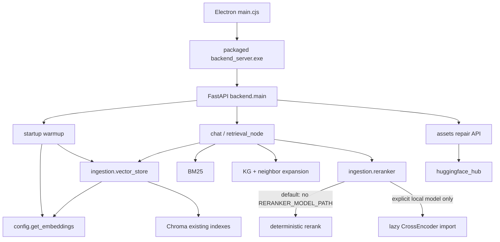

# ONNX Runtime Phase 2 — Dependency, Reachability & Windows Release Feasibility

生成日期：2026-08-14
范围：仅 dependency / production reachability / packaging feasibility。正式 `config.py` backend、embedding semantics、ONNX graph、模型、BM25、KG、chunking、query resolver 和 frontend 均未在 Phase 2 迁移。

## 1. Phase 2 Executive Summary

Phase 2 的 feasibility 结论是：**Texa Standard 可以使用 ONNX 作为正式 embedding backend，并构建不携带 Torch / SentenceTransformers / Transformers / safetensors 的 Windows Standard Release。** 这不是正式迁移完成声明；正式默认 backend、requirements 和 release pipeline 仍留待 Phase 3。

- Torch-free 隔离 venv 与 Candidate backend 均确认四个包未安装；真实 Chroma、49 collections、教材检索、generic QA、教材发现、FastAPI lifespan/warmup 全部通过。
- 100 个固定 query 直接查询既有 PyTorch BGE Chroma index，没有 rebuild。Top-3/5/10 relevance recall 与 Torch 完全一致；Top-1 仅 56% → 55%，集合 overlap 96%，差异集中于 HNSW/tie/hybrid 最终排序，不是 embedding semantic regression。
- 真正 Windows package 的 installed/unpacked 净减少 **462.03 MiB (36.01%)**；installer 减少 **116.29 MiB (28.94%)**。installed size 通过 400 MB gate；所有口径均通过 25% relative gate；600 MB STRONG PASS 未达到。
- Packaged batch=1 median：Torch 6.76 ms，ONNX 2.95 ms。500 texts：Torch 10.59 texts/s，ONNX 27.00 texts/s；Candidate 为 Torch 的 255.0%，远高于 90% gate。
- 默认 CrossEncoder 实际未配置、未携带模型、普通用户不使用；它不应继续决定 Standard 依赖集合。

## 2. Torch Dependency Inventory

分类定义沿用 A–H；本次调用链追踪后 **H Unknown = 0**。文档/历史中的同类文本命中合并为不可执行项，但所有直接代码与依赖入口均在表中覆盖。

| 类 | file | symbol/import | 用途 | 调用入口 | production reachable | 进入 release | 普通用户需要 | Torch-free 处理 |
| --- | --- | --- | --- | --- | --- | --- | --- | --- |
| A | config.py:247-282 | torch; transformers.utils; SentenceTransformer | 当前 BGE embedding 初始化 | Electron → backend warmup / Chroma | 是 | 是 | 是 | Phase 3 改由已验证 ONNX provider；Torch baseline 仅开发保留 |
| B | ingestion/reranker.py:16-35 | CrossEncoder | 可选 neural rerank | retrieval_node.py:845；仅 RERANKER_MODEL_PATH 有效时加载 | 条件可达 | 代码进入；依赖因 embedding 一并进入 | 默认否 | Standard 保留 deterministic rerank；CrossEncoder 移到 optional |
| B | backend/api/assets.py:174 | huggingface_hub.snapshot_download | 模型下载/修复 API | FastAPI assets router | 是（修复操作） | 是 | 仅修复时 | 暂保留 hub；Phase 3 使下载器认识 ONNX 资产 |
| C | scripts/build_book_aggregate_index.py:85-91 | torch; SentenceTransformer | 开发者索引迁移/聚合 CLI | 人工运行脚本 | 否 | 否 | 否 | 留 dev/build 环境 |
| C | scripts/export_bge_onnx.py:21-79 | torch; transformers; SentenceTransformer | 模型导出 | 人工运行脚本 | 否 | 否 | 否 | 留 dev/build 环境 |
| D | tests/test_embedding_phase1.py | 间接导入 phase1_worker | 桶策略单测 | pytest | 否 | 否 | 否 | 留 dev；不要求 Standard 安装 Torch |
| E | evaluation/embedding_backend/providers.py | torch; transformers; SentenceTransformer | parity/benchmark baseline provider | Phase 0/1/2 workers | 否 | 否 | 否 | 留 benchmark/dev 环境 |
| E | scripts/benchmark_embedding_onnx*.py | Torch ecosystem metadata/provider | Phase 0/1 benchmark/report | 人工 benchmark | 否 | 否 | 否 | 留 benchmark/dev 环境 |
| F | scripts/build-desktop-backend.ps1:81-127 | torch check; ST/Transformers collection | 当前 release build | 发布构建 | build-time | 使其被收集 | 否 | Phase 3 改成 ONNX hidden import/验证 |
| F | scripts/verify_cpu_only_build.py | Torch CPU DLL contract | 当前 release 校验 | 发布验证 | build-time | 脚本不进入；校验对象进入 | 否 | 替换为 Torch absence + ORT/model integrity 校验 |
| G | launch.ps1:124 | sentence_transformers | 旧 Gradio/dev launcher 依赖检查 | 不在 Electron package path | 否 | 否 | 否 | 标记 legacy；不作为 blocker |
| G | docs/mineru_deploy.md; README; PROJECT_AUDIT; patch_notes | Torch ecosystem 文本 | 外部 MinerU/文档/历史 | 不可执行 | 否 | 否 | 否 | 文档按 Phase 3 架构更新；MinerU 保持外部 |
| F | requirements-release.txt:22-27 | torch/ST/transformers/hub/tokenizers/safetensors | 当前 release 安装集合 | PyInstaller build env | 间接 | 是 | 不等同全部需要 | 按 reachability 拆分，见第 7/8 节 |
| E/F | Phase 2 experimental scripts | baseline-only Torch；candidate excludes all four | 本阶段实验构建 | 人工实验 | 否 | 不进入正式 release | 否 | 阶段结束后作为验证工具保留 |

仓库里存在 Torch 代码是事实；但真正 Standard runtime blocker 只有当前 `config.py` embedding 路径。CrossEncoder 是条件功能，export/index/benchmark/build validation 均不是普通用户 runtime。

## 3. Production Reachability Graph



当前正式路径中 `config.get_embeddings()` 会加载 Torch/ST，所以 current release 必须携带；Phase 2 Candidate 只在独立 entrypoint 提前注入 frozen ONNX provider。`retrieval_node` 在模块加载时导入 `ingestion.reranker`，但该模块没有 module-level Torch import；只有实际配置有效模型时函数内才 import CrossEncoder。因此 import reachability 与 function reachability 已严格区分。

## 4. Embedding Fallback Analysis

**Production Torch fallback: REMOVE（仅 Standard）；Development KEEP。**

| 因素 | 分析 |
| --- | --- |
| failure probability | Phase 0/1 parity 与 Phase 2 packaged tests 均通过；主要剩余失败来自安装资产、损坏文件、ORT/架构而非推理算法。概率低但必须可恢复。 |
| 用户体验 | silent fallback 会让首次故障变成数百 MB 隐式 runtime、长启动和不一致诊断；结构化错误 + repair 指引更可预测。 |
| 包体积成本 | Standard backend 净增加/减少证据见第 12/13 节；保留 fallback 会基本抹掉瘦身目标。 |
| 维护复杂度 | 双 backend 要长期维护两套依赖、模型资产、CPU DLL 验证和 regression matrix。 |
| 错误恢复 | ONNX init failure → typed error/log → repair/re-download；不得 silent load Torch。开发环境继续保留 Torch parity/debug provider。 |

当前 `assets.py` 的 snapshot repair 只认识上游 HF SentenceTransformers snapshot，不能自动恢复本项目自定义 ONNX graph；这是 Phase 3 必须先补的迁移项。

## 5. CrossEncoder Analysis

**CrossEncoder Runtime Report**

- 当前模型：没有硬编码模型；唯一来源是 `RERANKER_MODEL_PATH`，默认 `""`。
- 初始化：`ingestion/reranker.py::_get_model()`，首次 rerank 时惰性初始化，device 默认 CPU、`local_files_only=True`。
- 调用：`graph/retrieval_node.py:845`；随后 `reranker_status()` 记录 deterministic/cross_encoder 模式。
- 默认：未启用。路径空或不存在时不 import SentenceTransformers，直接 deterministic rerank。
- 无模型行为：返回 `None`，检索继续；异常也降级 deterministic，不中断主路径。
- 普通用户：默认不使用。仓库、sample data、两套 release 均未发现 reranker model asset。
- 当前 release 为何安装 Torch：主要是 embedding，不是因为存在 CrossEncoder 模型；PyInstaller hidden-import 又使依赖显式收集。

方案比较：

| 方案 | 质量风险 | size/RAM/startup | 开发/维护 | 用户复杂度 | 结论 |
| --- | --- | --- | --- | --- | --- |
| A 留 Standard | 神经重排能力可用 | 保留整套 Torch，代价最大 | 双 runtime 长期维护 | 表面简单，实际安装重 | 否 |
| B Advanced Pack | Standard 默认质量不变；高级用户显式获得 CE | Standard 最小，optional 较重 | 需要简单版本约束 | 仅高级用户承担 | 可作为有真实需求时的产品形态 |
| C CrossEncoder ONNX | 可保 neural rerank，需单独 parity/quality eval | 可 Torch-free | 需要模型导出、tokenizer、打包和长期验证 | 中等 | ONNX migration candidate，不在本阶段实现 |
| D 从 Standard deps 移除，代码留开发 | 当前默认路径零行为变化 | 最小 | 最低 | 零 | **Phase 3 首选；有用户需求再演进为 B/C** |

最终策略按用户要求的枚举为 **MOVE TO OPTIONAL**；实现上先采用 D 的最小动作，不设计复杂 plugin system。

## 6. Other Torch Consumers

- OCR / document parsing：Standard 使用 PyMuPDF/Pillow 等；MinerU 是外部部署，正式 requirements/build 已排除，仓库内 `docs/mineru_deploy.md` 的 Torch 只描述外部 GPU 容器。
- local models / concept extraction / warmup：除 embedding warmup 外未发现 Torch consumer。
- startup hooks：`backend.main` 的 module-level routers 不 import Torch；Torch 由 warmup → `config.get_embeddings` 触发。Reranker module 可导入但 CrossEncoder 函数未调用时不加载依赖。
- utility scripts：aggregate-index 与 ONNX export 属开发/迁移工具。
- tests：无测试 module-level `import torch`；Phase 1 策略单测间接导入 benchmark module，但 provider 的实际 Torch import 仍在构造函数内。

结论：除正式 embedding 和显式可选 CrossEncoder 外，没有第二个 Standard runtime Torch blocker。

## 7. Release Requirement Analysis

**Current Release Dependency Map**

| dependency | 当前出现原因 | 真实 Standard 用途 | Candidate |
| --- | --- | --- | --- |
| torch | `config.py` ST embedding；可选 CE；CPU build check | 当前必须，迁移后无 | 未安装/未打包 |
| sentence-transformers | 当前 embedding；可选 CE | 当前必须，迁移后默认无 | 未安装/未打包 |
| transformers | 当前 ST 与显式 feature-detection import | 迁移后无唯一 Standard consumer | 未安装/未打包 |
| safetensors | 当前 ST model asset/runtime | ONNX graph 不需要 | 未安装/未打包 |
| huggingface_hub | assets download/repair API；ST ecosystem | repair path 仍 production reachable | 保留 |
| tokenizers | ONNX 使用同一 tokenizer；亦为其他 HF/langchain 依赖 | **ONNX 必须** | 保留 |
| onnxruntime | Chroma 环境中可传递存在，但正式 build 明确 exclude | 迁移后 embedding 必须显式 pin | 显式保留 |

`requirements-release.txt` 中存在不等于 production 必须。Electron config 只是把整个 PyInstaller `build/backend` 复制为 `extraResources`；真正是否 shipped 由 PyInstaller analysis/hidden imports/collect-data 决定。

## 8. Build/Test-only Dependency Analysis

Build-only dependencies：PyInstaller、hooks-contrib、CPU Torch wheel 验证、PE/CUDA scan、ONNX export、parity benchmark、aggregate index migration。它们都可以留在 dev/build 环境，而不进入 shipped runtime。

建议的最小拆分有实际意义：

1. `requirements-release.txt`：Torch-free Standard runtime + explicit ORT/tokenizers/hub。
2. `requirements-dev.txt`：在 release 上增加 pytest、Torch/ST/Transformers/safetensors 和 parity/debug 工具。
3. `requirements-build.txt`：PyInstaller/hooks 与构建验证；只有 release CI/build host 安装。

不建议进一步拆十几个 feature extras。当前正式 build script 还存在两个已实测问题：原规则排除 sklearn 导致 ST 5.5.1 Baseline 冻结后导入失败；只 hidden-import Chroma 导致 Candidate 缺 `chromadb.telemetry.product.posthog` / `chromadb.api.rust`。实验 build 用 `--collect-submodules chromadb` 并让 Baseline 收集 sklearn 后，两包均通过真实 warmup/retrieval。Phase 3 应修正式脚本并加 frozen smoke test。

## 9. Torch-free Runtime Experiment

隔离环境：`benchmark_results/embedding_onnx_phase2/venv`，从空 Python 3.10 venv 安装 `requirements-onnx-standard-candidate.txt`；明确没有安装 torch、sentence-transformers、transformers、safetensors。

结果：

| 检查 | 结果 |
| --- | --- |
| backend import | PASS（考研智能辅助系统 API） |
| FastAPI startup / `/health` | PASS / `ok` |
| embedding load / single query | PASS，512 dims，8.21 ms（source env spot） |
| Chroma load | PASS，49 collections |
| retrieval / textbook path | PASS，10 evidence |
| generic QA | PASS，`ordinary_qa` |
| book/index discovery | PASS，5 books |
| normal warmup | `ready`，error=`` |

第一轮曾在 sample index 遇到旧映射/aggregate 空结果；继续追到真实 `data/vector_db` 后证明不是缺 Torch import。禁止用 `pip install torch` 掩盖问题的约束得到遵守。

## 10. Existing Chroma Index Compatibility

使用现有 `data/vector_db`（49 collections）与 100 fixed queries，直接走真实 `retrieve_node`，包含 dense Chroma、BM25、KG、neighbor expansion 和最终 rerank；没有 rebuild。

| K | Torch/ONNX mean set overlap | 完全同序 query | Torch relevance recall | ONNX relevance recall |
| --- | --- | --- | --- | --- |
| Top-1 | 96.000% | 97/100 | 56% | 55% |
| Top-3 | 98.333% | 95/100 | 78% | 78% |
| Top-5 | 97.800% | 92/100 | 88% | 88% |
| Top-10 | 96.100% | 89/100 | 89% | 89% |

Torch mean retrieval 403.15 ms；ONNX 364.56 ms。两次均复现同一个既有“第八章 热电式传感器”HNSW segment `Nothing found on disk`，不是 ONNX 新问题。结合 Phase 1 cosine 1.0 和 isolated retrieval parity 100%，剩余差异可归因于 HNSW approximation、极小浮点/tie ordering 与 hybrid fan-out，而不是向量语义改变。**已有教材无需重新向量化。**

## 11. Standard vs Advanced Architecture

推荐结构：

```text
Texa Standard
├── ONNX Runtime CPU
├── bge-small-zh-v1.5 FP32 ONNX + tokenizers
├── Chroma + BM25 + KG + neighbor expansion
├── deterministic reranker
└── no Torch / SentenceTransformers / Transformers / safetensors

Optional Advanced Retrieval（仅有验证后的真实需求再提供）
└── CrossEncoder runtime/model，或后续独立验证的 ONNX CrossEncoder
```

普通用户当前不需要 CrossEncoder：它默认关闭、要求手工配置本地模型、无 bundled asset，且 deterministic 路径已是实际产品行为。最小 optional 方案应是独立安装说明/包与严格版本匹配，不做自动下载或复杂 plugin system；离线用户的 Standard 完全不受影响。

## 12. Windows Packaged Build Comparison

两套都是真实 PyInstaller backend + electron-builder Windows NSIS/ZIP/win-unpacked；Candidate backend 路径扫描命中 forbidden packages 数量：**0**。

| 口径 | Baseline | Candidate | 净减少 | 减少比例 |
| --- | --- | --- | --- | --- |
| NSIS installer | 401.83 MiB | 285.54 MiB | 116.29 MiB | 28.94% |
| portable ZIP | 506.04 MiB | 354.18 MiB | 151.86 MiB | 30.01% |
| win-unpacked / installed | 1,283.06 MiB | 821.03 MiB | 462.03 MiB | 36.01% |
| backend runtime | 963.59 MiB | 501.55 MiB | 462.03 MiB | 47.95% |

Size Gate：installed/unpacked 和 backend 的绝对减少均为 462.03 MiB，**≥400 MB PASS**；未达 ≥600 MB STRONG PASS。压缩 installer/ZIP 绝对值不到 400 MB，但分别减少 28.9%/30.0%，均通过 ≥25% significant gate。

Candidate 全量 backend warmup、真实 retrieval 和 Electron UI 均通过。测试 Electron 第一次启动向现有 user-data 补拷约 95 MB ONNX 时观察到约 33 秒一次性 seed 延迟；后端纯 fresh-process 5-run ready 见第 14 节。Phase 3 需把模型安装/复制做成可观察的安装或首启步骤。

## 13. Size Attribution

Backend 口径估算：gross removed bytes = **585.90 MiB**；new ONNX bytes（model + ORT Python/native runtime）= **123.86 MiB**；net release/backend reduction = **462.03 MiB**。模型 ONNX 本体 90.45 MiB，ORT package/native 33.41 MiB。

| # | Baseline largest component | size | Candidate largest component | size |
| --- | --- | --- | --- | --- |
| 1 | backend/_internal/torch | 317.52 MiB | Texa Phase2 candidate.exe | 195.05 MiB |
| 2 | Texa Phase2 baseline.exe | 195.05 MiB | backend/_internal/sample_data/models | 91.00 MiB |
| 3 | backend/_internal/sample_data/models | 91.94 MiB | backend/_internal/sample_data/vector_db | 84.18 MiB |
| 4 | backend/_internal/sample_data/vector_db | 84.18 MiB | backend/_internal/chromadb_rust_bindings | 60.46 MiB |
| 5 | backend/_internal/scipy | 63.25 MiB | backend/_internal/sample_data/books | 44.31 MiB |
| 6 | backend/_internal/chromadb_rust_bindings | 60.46 MiB | locales | 42.50 MiB |
| 7 | backend/_internal/sample_data/books | 44.31 MiB | backend/_internal/pymupdf | 36.38 MiB |
| 8 | backend/_internal/transformers | 44.24 MiB | backend/_internal/onnxruntime | 33.41 MiB |
| 9 | locales | 42.50 MiB | dxcompiler.dll | 24.70 MiB |
| 10 | backend/_internal/pymupdf | 36.38 MiB | backend/_internal/numpy.libs | 19.99 MiB |
| 11 | dxcompiler.dll | 24.70 MiB | backend/_internal/sample_data/images | 17.90 MiB |
| 12 | backend/_internal/numpy.libs | 19.99 MiB | backend/_internal/frontend | 15.66 MiB |
| 13 | backend/_internal/scipy.libs | 19.22 MiB | LICENSES.chromium.html | 14.56 MiB |
| 14 | backend/_internal/sample_data/images | 17.90 MiB | backend/_internal/PIL | 12.75 MiB |
| 15 | backend/_internal/frontend | 15.66 MiB | backend/_internal/grpc | 11.22 MiB |
| 16 | LICENSES.chromium.html | 14.56 MiB | icudtl.dat | 9.98 MiB |
| 17 | backend/_internal/sklearn | 13.96 MiB | libGLESv2.dll | 7.68 MiB |
| 18 | backend/_internal/PIL | 12.75 MiB | backend/_internal/tokenizers | 7.05 MiB |
| 19 | backend/_internal/grpc | 11.22 MiB | backend/_internal/numpy | 6.49 MiB |
| 20 | icudtl.dat | 9.98 MiB | resources.pak | 5.76 MiB |

最大净移除来源是 Torch，其次是 scipy/sklearn/Transformers/ST 生态；Candidate 的主要新增项是 ONNX graph 与 onnxruntime。Electron、Python、NumPy、Chroma、native DLL 与 BGE 模型仍是两边的共同成本，不能把理论 site-packages 数字当 installer reduction。

## 14. Packaged Startup Benchmark

5 次 fresh backend process，交替运行并轮询 `/health`、warmup ready，再发真实 `/api/chat/stream` 请求到 retrieve stage：

| metric | Torch median / p95 | ONNX median / p95 | 解释 |
| --- | --- | --- | --- |
| first health | 3514 / 3553 ms | 4031 / 4044 ms | Candidate entrypoint 在启动 uvicorn 前同步验证 ONNX，因此 health 稍晚 |
| embedding + Chroma ready | 10211 / 10503 ms | 4031 / 4044 ms | Candidate full-ready median 快约 60.5% |
| first retrieval wall | 464 / 692 ms | 405 / 597 ms | Candidate 不差于 Torch |

所有 10 次 warmup=`ready`、retrieval status=`ok`、evidence count>0。

## 15. Packaged Interactive Benchmark

同一 Phase 1 worker 分别由 Baseline/Candidate release venv 冻结为 PyInstaller executable，固定 batch=1、20 warm runs：

| backend | median | p95 | peak RSS p95 |
| --- | ---: | ---: | ---: |
| Torch/ST | 6.762 ms | 7.182 ms | 408.57 MiB |
| ONNX | 2.950 ms | 3.444 ms | 159.11 MiB |

真实 packaged backend 的 retrieval stage median 同样从 91.69 ms 降到 63.82 ms。

## 16. Packaged Ingestion Benchmark

同一冻结 worker、同一 500-text fixture、5 warm runs。Torch 保持当前 batch 32/thread 2；ONNX 使用 frozen Phase 1 candidate（四长度桶、batch 16、12 physical cores、inter-op 1、sequential、ORT_ENABLE_ALL）。

| backend | median wall | p95 wall | throughput | peak RSS p95 |
| --- | ---: | ---: | ---: | ---: |
| Torch/ST | 47.22 s | 47.30 s | 10.59 texts/s | 1,034.66 MiB |
| ONNX | 18.52 s | 18.58 s | 27.00 texts/s | 1,022.93 MiB |

ONNX throughput = Torch 的 255.0%；packaged gate `>= Torch 90%` 明确通过，RSS 也未回归。

## 17. Failure Handling

实验 Candidate 不 silent fallback Torch。每个场景在 fresh Torch-free process 验证：

| 场景 | structured code | 结果 | diagnostic log | 用户消息 |
| --- | --- | --- | --- | --- |
| model_missing | MODEL_MISSING | PASS | 有 | Repair Texa runtime/model and retry |
| model_corrupt | MODEL_CORRUPT_OR_INCOMPATIBLE | PASS | 有 | Repair Texa runtime/model and retry |
| ort_import_failure | ORT_IMPORT_FAILURE | PASS | 有 | Repair Texa runtime/model and retry |
| unsupported_architecture | UNSUPPORTED_ARCHITECTURE | PASS | 分类器验证 | Repair Texa runtime/model and retry |
| tokenizer_mismatch | TOKENIZER_MISMATCH | PASS | 有 | Repair Texa runtime/model and retry |

架构不支持在当前 x64 机器只能做 classifier-level injection；其余四项均为真实初始化失败。正式 Phase 3 还需把 typed backend error 映射到 Electron 可见 repair UI，而不是 Python traceback；本阶段已证明识别、日志与清晰文本可行。

## 18. Migration Risks

1. **Repair gap（高）**：现有 HF snapshot downloader 不会恢复自定义 ONNX；迁移前必须有 version/hash/asset manifest 与 repair source。
2. **正式 build script（高）**：仍强制 CPU Torch、collect ST/Transformers、exclude ORT；且 frozen import 对 sklearn/Chroma submodules 的规则已被实验暴露为脆弱。
3. **首启 asset seed（中）**：模型补拷导致约 33 秒一次性延迟；需进度/日志/原子复制/校验，避免被误判卡死。
4. **HNSW 既有损坏（中，非 ONNX）**：真实 index 有一个 segment 缺盘；应独立修复，不应要求全库 re-embed。
5. **hybrid tie/order（低）**：Top-1 有 1pp relevance 变化；需把 100-query fixture 纳入 final release regression。
6. **optional CE 版本兼容（低）**：若提供 Advanced Pack，必须锁 Texa/runtime/model 版本；不要让 Standard 自动安装。
7. **rollback**：保留开发 Torch baseline 与可重装旧 Standard installer；索引格式不变，因此 rollback 不需要 rebuild index。

## 19. Recommended Release Architecture

推荐 Phase 3 把 ONNX 设为 Standard 唯一 embedding runtime；Torch/ST/Transformers/safetensors 从 Standard requirements 和 PyInstaller graph 移除，但 Torch provider、parity fixture、export/debug 工具继续保留在 dev/build。Standard 遇 ONNX 故障应 fail clearly + repair，不加载 Torch。

CrossEncoder 代码可保留惰性边界，但 Standard 不提供它的 runtime/model；只有观察到实际用户需求后，才发布简单 Advanced Retrieval Pack 或启动独立 ONNX CrossEncoder feasibility。`huggingface_hub` 暂时保留的唯一 production 原因是模型/资产 repair API；`tokenizers` 的唯一不可移除原因是 ONNX BGE tokenizer parity。

## 20. Final Decisions

### A. ONNX embedding production backend: **GO**

既有 index 可直接用，真实 production retrieval 无可见核心 regression，packaged interactive 更快，packaged ingestion 约为 Torch 255%，无 critical runtime issue。GO 表示“允许进入 Phase 3 正式迁移”，不是本阶段已切换 production。

### B. Torch-free Texa Standard Release: **GO**

Candidate 不安装/不打包 torch 与 sentence-transformers（同时也无 transformers/safetensors），core runtime、packaged backend 和真实 Electron UI 工作。installed/backend 均净减约 462.03 MiB；installed 减少 36.0%，backend 减少 47.9%，通过 400 MB + 25% gate；compressed artifacts 仅通过 relative gate，未达 400 MB absolute。

### C. Optional CrossEncoder strategy: **MOVE TO OPTIONAL**

默认未启用且无模型资产；先从 Standard dependency 中移出，开发功能保留。未来若有明确质量收益与用户需求，再选择 Advanced Pack 或独立 ONNX migration。

### Phase 3 Migration Plan

1. 把 production default embedding backend 切到 frozen ONNX FP32 provider，保持 Phase 1 参数与 semantics。
2. Torch/ST provider 移到 development-only baseline；parity/regression 命令继续可运行。
3. Standard fallback policy 改为 typed failure + repair，禁止 silent Torch fallback。
4. 更新 requirements：Torch-free release、dev Torch baseline、最小 build tooling；显式 pin ORT/tokenizers。
5. CrossEncoder 从 Standard deps 移除；代码保持 lazy，文档标为 optional，不立即实现复杂 pack。
6. 更新正式 PyInstaller：collect required Chroma submodules、include ORT/model/tokenizer、禁止 Torch/ST/Transformers/safetensors path，并更新 release validator。
7. 把本次 100-query existing-index fixture 加入发布验证；不改变 index schema、不 rebuild 用户教材。
8. 增加 provider/version/model hash、warmup stage、typed failure code 与 repair result 日志；不记录教材正文。
9. rollback：保留上一版 installer、开发 Torch baseline 和 backend feature flag；索引原样兼容。
10. final release validation：真实干净 Windows install、升级/离线/损坏 repair、5-run startup、batch=1、500 ingestion、Top-k retrieval、installer/unpacked size 和完整 Electron smoke。
