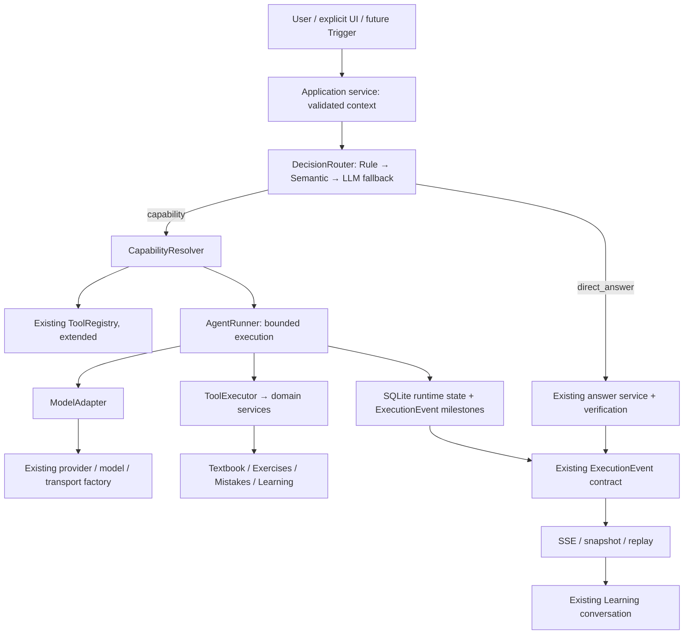

# RFC：Texa 有界 Agent Runtime

状态：架构提案，未实施。日期：2026-09-26。

审计基线：工作区 HEAD `898bec3` 及当前未提交改动；不是仅针对该 commit 的审计。本文只新增设计文档，不修改业务代码、数据库、配置或已有用户文件。以下“现状”来自源码和现有测试阅读；未运行在线模型、迁移、桌面应用或测试，不把历史测试报告作为本次验证结果。

## 1. 决策摘要

Texa 应增加一个小型、持久化、有界的执行内核，逐步接管模型驱动的工具执行。保留现有教材检索、EvidencePack、答案验证、练习、错题和复习领域服务。

核心决策：

1. **DecisionRouter 选择语义能力，CapabilityResolver 选择候选工具，AgentRunner 执行。** 三者不合并。
2. **直接回答保留独立快路径。** 它继续拥有 LearningTask、验证及 ExecutionEvent，但不为普通问答启动工具循环。AgentRunner 自身也允许零工具完成。
3. **新 Runtime 的 task/run/tool call 以 SQLite 为权威。** 现有系统并非全部 SQLite：LearningTask、pending action、ConceptMemory 等仍是 JSON。采用新任务分流，不在 P0 全量迁移旧任务。
4. **延续 ExecutionEvent V1。** `run.created` 等是 `payload.lifecycle` 的语义值，不加入现有顶层 `type` 枚举，不建立第二条 Agent 事件总线。
5. **保持 task 与执行尝试的区分。** 一个 task 可以有多个 AgentRun；暂停关闭当前 run 的事件流，恢复创建新 run，以 `resume_of_run_id` 关联。同一 task 的预算不会因恢复自动重置。
6. **工具写操作继续确认后执行。** 模型不能授予权限；领域存储的幂等收据负责防止重复副作用，Runtime 状态本身不能证明领域写入是否成功。
7. **P0 只验证内核。** 不切换生产聊天，不实现模型循环、Goal、Scheduler、Plugin 或 MCP。P1 先路由影子评估和快路径；P2 才接入有界多步骤。

这次请求授权的是设计。实施涉及架构和数据库变更，应在后续实施任务明确授权；本 RFC 不代表已经执行迁移。

## A. Current-state audit

### A1. 可复用基础与真实缺口

| 区域 | 源码位置与事实 | 复用方式 / 缺口 |
|---|---|---|
| Provider / Model | `llm/types.py` 定义 ProviderSpec、ModelSpec、ResolvedModelRole；`registry.py` 注册供应商/模型；`configuration.py`、`profiles.py` 保留角色与用户配置；`factory.py` 注册 transport，检查 provider/model/transport 能力 | 保留配置优先级、角色拆分、缓存与工厂。在此层加 ModelAdapter，不在业务分支判断供应商 |
| 能力声明 | 当前 Capability 有 text、vision、reasoning、streaming、system_prompt、token_usage、local | **没有** tool_calling、structured_output、parallel_tool_calls、context_window。不能因为底层用 ChatOpenAI 就宣称任意配置支持工具调用 |
| 工具定义 | `backend/tools/registry.py` 已有 ToolSpec、ToolContext、ToolResult、ToolRegistry | 扩展此 registry，避免第二个注册中心。当前 `call()` 只检查 read_only/allow_write，未统一校验完整输入/输出 schema，也不负责持久化 |
| 工具 schema | `backend/tools/learning_tools.py`：search_textbook 使用 JSON Schema；许多其他工具仍用 `{"query":"str"}` 一类简写 | 只有经过 canonical schema 和权限元数据补齐的工具才进入新 Runtime allowlist，不能全表自动注册 |
| 工具执行 | `backend/services/tool_orchestration.py`：规则选工具、总预算、单工具超时、required outputs、压缩结果；只有数学 verification_request 能触发一轮补偿 | 可复用领域 handler 和校验策略；不能把此函数直接称为模型 Agent loop。规则目前直接写 concrete tool name，应迁成 capability 决策 |
| 超时 | `_run_bounded()` 启动 daemon thread，超时只是停止等待 | 不代表 handler 已停止。不能据此安全重试写操作；新执行器需要取消契约、在途上限和未知结果处理 |
| 主聊天 | `backend/api/chat.py` 承担 scope/context 准备、任务、工具桥接、graph、验证、事件与提交；`graph/main_graph.py` 是 plan → retrieve → chapter/generate → feedback | 已有业务编排大量留在 Router。按接入路径小步移到 services，不一次重写整个 chat.py；保留 generator 和事实边界 |
| 现有 Fast Path | `graph/intent_classifier.py:is_fast_path_eligible`、`graph/planner.py:plan_node` 可跳过 plan LLM | 这是“跳过规划模型”，**不等于**完全跳过检索/工具的 direct-answer fast path |
| 指代与学科路由 | `session_context.py`、`session_ledger.py`、`resolver_*`；`subject_routing.py`；`textbook_scope.py` | 指代解析、学科范围和能力路由是不同职责。保留前两者，不能再加一套会话解析器或让 capability Router 改写 Ledger |
| semantic resolver | `backend/services/semantic_resolver.py` 是 opt-in LLM 指代消歧，只能选择有限候选或 clarify | 它不是 embedding router。只复用其“有限候选、严格输出验证”的原则，不将其改成大杂烩 Router |
| LearningTask | `backend/services/learning_task.py`：required inputs/outputs、verification、checkpoints、active_run_id、commit_outcome、恢复隔离 | 数据保存在 `PROGRESS_PATH/learning_tasks/*.json`，不是 SQLite；run 不是独立实体，里程碑通常只保留最近 40 项，checkpoint 最近 30 项 |
| execution effects | `backend/services/execution_effects.py`；`backend/main.py:lifespan` | 已有答案提交后的 durable effect queue、领域收据、冻结结果和启动 worker。队列保存在 task JSON；目前只支持 chat_feedback / visual_feedback，不能未经迁移变为任意工具写队列 |
| pending actions | `backend/services/pending_actions.py` | JSON 存储。confirm/reject 检查领域收据，新增错题/练习会话有稳定 ID，概念复习有 operation_id。复用领域幂等语义，逐步增加 Runtime 绑定 |
| ExecutionEvent | `backend/services/execution_events.py` | V1 身份、递增 seq、固定 6 种 type、公开摘要、先持久化再发出。适合继续扩展 payload；不是任意事件字符串协议 |
| SSE 与所有权 | `owned_stream.py`、chat/figures/mistakes API | HTTP response owns producer；断连关闭/中断 task，旧 run 不可覆盖新 run。P2 保持此行为，后台脱离连接运行留到 P4 |
| 学习状态 | `learning_state.py`、`learning_state_reducer.py`、`learning_state_bridge.py` | SQLite learning_events 重建 learning-state JSON 投影，含 active_goal、guided_progress、concept_states、next_action；聊天曝光不是掌握证明 |
| 前端执行 UI | `hooks/useChat.ts`、`utils/chatActivities.ts`、`api/client.ts`、`components/chat/ExecutionTrace.tsx` | 已有身份/序号过滤、回放、输出累积与执行轨迹。React 是投影；无需新增 Agent 页面 |
| 输入/确认/恢复 | `LearningTaskGate.tsx`、`LearningTaskActions.tsx`、`LearningTaskResume.tsx`、`LearningTaskEffects.tsx` | 保留组件位置。增加后端 authoritative snapshot 和审批详情；当前 Actions 内局部状态不能成为重启恢复依据 |

### A2. 持久化清单

所有路径均应通过 `config.DATA_DIR/PROGRESS_PATH` 解析，不能写到源码目录或 Electron 安装目录。

| 存储 | 表 / 文件 | 当前权威及限制 |
|---|---|---|
| 会话 SQLite | `conversations/_conversation_events.db`：conversation_events、conversation_messages、conversation_imports、conversation_ledgers；见 `backend/conversation_memory.py` | append-only 消息事件与可重建消息/Ledger 投影；JSON 是兼容窗口，保留游标分页与稳定 message ID |
| 学习事件 SQLite | `progress/learning_events.db`：learning_events；`memory/learning_events.py`，schema v2 | 跨领域活动事件；不替代错题/练习事实表；LearningState 由其重建 |
| 错题 SQLite | `progress/mistake_book_{book}.db`：mistakes；`memory/mistake_book.py` | JSON blob 加索引字段；add_if_absent 已幂等，普通 update/review 没有通用 operation receipt |
| 习题 SQLite | `progress/exercise_bank_{book}.db`：exercises、exercise_import_batches、exercise_practice_sessions；`memory/exercise_bank.py` | 练习会话、作答与进度可持久化；record_session_answer 在同一事务写题目和 session，按 session/exercise 防重 |
| Task / Approval | learning_tasks/*.json、pending_actions/*.json | 本地原子 JSON，进程内锁；无跨进程 SQL claim、无完整 run/tool-call ledger |
| 旧学习领域 JSON | ConceptMemory 的 concept_memory.json；StudyMemory 的 progress/quiz_history/weakness/chat_history；spaced_repetition.json | 保留现有领域权威，部分操作已有永久收据；不随 Runtime 上线强制迁移 |
| 教材 | `ingestion/document_ir.py` 的 canonical_document.jsonl、ingestion_report；索引 manifest、lexical、Chroma | 继续 staged index 发布、active version 和 provenance 校验；不是 Runtime 数据库的一部分 |
| 备份 | `backend/data_backup.py`、`utils/storage_manifest.py`、`utils/sqlite_migrations.py` | 备份已对 SQLite 用 backup API；新 DB 放 progress 可进入扫描。仍须验证 Runtime/领域多库快照与收据一致性，不能把逐文件备份称为全局事务快照 |

### A3. Built-in 工具可行性

以下是领域能力评估，不表示这些工具已经全部存在。

| 目标工具 / capability | 当前实现基础 | 建议 |
|---|---|---|
| search_textbook / textbook.search | 已有同名工具，调用生产 retrieve_node、support gate、EvidencePack | 首批。补充多教材 scope 与版本绑定；不能再从 ToolContext 的单个 book_name 静默退化多书范围 |
| read_textbook_section/page / textbook.read | `CanonicalBook/DocumentBlock`、load_canonical_book；章节及图上下文服务 | 需要小型 read service：按稳定 block/section ID 和页码范围读取、邻接补全、预算及 provenance。不是现成的统一 page tool；标明物理 PDF 页与印刷页区别 |
| get_figure / textbook.read | `FigureLearningService.get_figure/build_context/evidence_sources/asset_path` | 可薄封装。返回受控 asset ref、图注、上下文和缺失状态；看图作答仍须独立视觉角色支持 |
| search_mistakes / mistake.search_related | MistakeBook.list_all/get_due/get_weak_points；API 内还有列表过滤 | 先有限范围的结构化/文本搜索；提取必要的纯过滤逻辑到 service。不承诺已有语义相似搜索 |
| get_mistake_detail / mistake.search_related | MistakeBook.get | 可薄封装，校验 book/subject/id 归属，图片走受控资源引用 |
| save_mistake / mistake.manage | propose_add_mistake → PendingActionStore → add_if_absent | 首批写工具候选，必须审批、冻结题干和稳定 operation ID，保留 OCR 原文与用户修订 |
| update_mistake / mistake.manage | MistakeBook.update | 后置至操作收据、expected_revision、差异预览完善后，不能直接开放任意 blob 覆盖 |
| get_learning_state / learning.inspect | LearningStateService.get_state | 可薄封装；该方法会写可重建投影，READ 定义为“不改变用户领域事实”，应声明 cache_write，而非谎称零文件写入 |
| get_mastery_by_concept / learning.inspect | reducer.concept_states、evidence_event_ids、mastery_band | 返回证据和 unknown/weak/stable；不要把规则分档包装成准确掌握概率 |
| get_recent_learning_activity / learning.inspect | 现有 get_recent_progress、LearningEventStore.list_recent | 可薄封装，保留范围/时间窗/截断说明；当前先限量读取再按天过滤，summary 是读取样本内计数，不能声称时间窗全量统计；P0 选其一作为单工具接入样本 |
| get_recent_exercise_results / exercise.inspect | ExerciseRecord.practice_history、PracticeSession.results | 可用，但目前没有完善的全库历史查询接口。先支持指定会话/有限题目，跨会话汇总补一个查询 API |
| create_exercise_set / exercise.create_set | search_exercises、propose_practice_session、create_practice_session_once | 定义为“从已有题库选题并创建 PracticeSession”，不做 LLM 临场编题。不使用容易误解的 exercise.generate |
| create_review_session / review.manage | get_due_mistakes、build_review_plan、ConceptMemory queue；前端 MistakesPage 的 reviewSessionItems/index/results | **缺少后端持久复习会话**。P2 首批只返回复习建议/入口；持久会话另立小型领域变更，未完成前不注册 create 工具 |
| record_exercise_result / exercise.record_result | PracticeAnswerService.answer_session、record_session_answer_with_status | 第二批写工具。已有练习核心事务可复用；跨库错题/learning event 补写仍须完善收据，不把服务整体称为 exactly-once |
| 数学计算 / math.verify | symbolic_math、verify_math_result 和受限 AST | 继续复用，保证结果校验。不要因为新列表未点名数学而丢掉已有能力 |

额外发现：`backend/api/agent.py:/tools/call` 目前直接调用 registry 并接受 allow_write；`/actions/*` 自行执行确认。Runtime 上线工具路径时必须把这些入口转为统一命令适配器或限制为旧 allowlist。否则“唯一执行者”只是名义上的。当前未见该入口等于已允许任意写工具；风险在于以后注册写 handler 后产生绕过路径。

### A4. 既有验证资产

保留 `tests/test_execution_events.py`、`test_execution_model.py`、`test_execution_outcomes.py`、`test_execution_effects.py`、`test_learning_task_state_machine.py`、`test_chat_execution_parity.py`、`test_tool_orchestration.py`、`test_agent_tools.py`、`test_learning_state_v1.py`、练习/错题/图与检索测试。

`evaluation/tool_calling_eval.py` 目前以 concrete expected_tools 评估规则和确定性数学；可保留为旧路径回归，不足以验证新 capability router。`learning_task_lifecycle_eval.py` 也不等于真实模型答案质量。前端已有 executionLifecycle、useChatContract、client、LearningTaskEffects 测试，应成为协议兼容门槛。

## B. Target architecture



建议新增模块，名称供实施时微调，职责不能混合：

| 模块 | 职责与依赖 |
|---|---|
| `backend/services/decision/` | contracts、rule_router、semantic backend、fallback、capability resolver、trace。依赖只读 context provider、工具元数据与 ModelAdapter；不执行工具，不直接写领域状态 |
| `backend/services/agent_runtime/` | contracts、SQLite store、runner、execution adapter；负责所有模型 tool-use 的执行、预算、审批、恢复。依赖注入 registry/model adapter/domain provider，不导入 FastAPI DTO |
| `backend/tools/registry.py` | 唯一 canonical 工具目录；逐步扩展 ToolSpec，旧 public_dict 由兼容映射维持 |
| `backend/tools/*` | 薄 handler，调用服务公开 API；不调用后端 HTTP Router，不复制业务状态机 |
| `llm/adapter.py`（建议） | canonical 模型消息/action 与 provider wire format 相互转换；绑定当前 role/profile、capability 检查、流片段聚合和 thinking 过滤 |
| 现有 graph / verification | 检索、章节准备、EvidencePack 和答案生成继续使用原实现。工具步骤与最终答案生成共享输入边界，不建立平行回答产品 |
| API / frontend | API 只提交命令、读取快照、传输事件；前端只消费后端事实 |

“唯一执行者”指所有 Agent 工具调用的授权和派发，不要求把已有手工 CRUD 页面统统绕经模型。UI 明确编辑错题仍调用领域应用服务；该服务同时被 Runtime 薄工具调用。禁止 UI 或 provider adapter 直接调用 tool handler。

上下文准备分两段：先校验明确 UI action 和当前资源归属，随后在确有自然语言指代时复用 Resolver/Ledger。Capability Router 接收解析结果而不是重复解析历史。选中页面是上下文提示，不能压过用户明确新对象；教材/学科的硬范围由 scope policy 决定。

P2 的接入不能在外层完成工具检索后再无条件跑一遍完整 `run_graph_stream()`。保持两条明确路径：旧任务继续原 graph；Runtime 任务将现有检索/章节准备作为受控步骤，将现有 generator 的 ContextPack、EvidencePack、教学 prompt、thinking/citation 处理提取为可复用生成边界，模型调用交给 ModelAdapter。最终 finish 使用同一生成与验证规则，而不是建立第二套提示词和回答规则。若前序工具已取得证据，按当前问题和版本重新组装最终 EvidencePack，避免重复检索；确有新问题维度时才再取证。

模型的 tool-decision 响应正文不自动成为最终答案。Runtime 区分 action selection 和 answer output；只在答案阶段发布正文 delta，且将未验证正文视为草稿，验证后提交 final。不能先展示模型的工具参数、隐藏推理或“操作已成功”再等待真实执行。

## C. Canonical contracts

以下为概念级契约；JSON 字段均要有字节/数量/深度上限。`required`、`optional` 和具体字段类型在实现时用 typed model 固化。业务 Capability 与 `llm.types.Capability` 应分别命名为 DomainCapability 与 ModelCapability，避免撞名。

### C1. DecisionContext

```text
DecisionContext {
  request_id, learner_id,
  trigger: {kind: user|ui_action|goal|schedule, id?, explicit_action?},
  input: {message_ref?, text, resolved_query, speech_act},
  application: {
    route, selected_subject, selected_book_ids[], selected_chapter_ids[],
    current_mistake_ref?, current_exercise_ref?, practice_session_ref?,
    attachments[{id, kind, status, provenance_ref}], explicit_selection_revision?
  },
  conversation: {id?, turn_id?, ledger_revision?, context_pack_ref?, resolution_status},
  scope: {allowed_book_ids[], subject, answer_mode, scope_policy_version},
  state_refs: {learning_state_revision?, task_id?, goal_id?},
  constraints: {allowed_permissions[], required_inputs[], required_outputs[], budgets},
  context_version
}
```

客户端提供的 ID、route、explicit_action 都不是授权证明。服务端验证白名单 action、目标归属与版本；审批授权另有持久 consent。Router 输入默认不加载完整教材、错题库、全部会话，也不提前实例化 Chroma。

### C2. DecisionRouter / DecisionResult

```text
DecisionRouter.route(context) -> DecisionResult
DecisionResult {
  decision_id, mode: direct_answer|capability|clarify|unsupported,
  selected_capability?, action_intent?,
  candidates[{capability_id, rank, raw_score?, score_kind}],
  confidence: {value?, kind: deterministic|uncalibrated|calibrated, calibration_version?},
  reason_codes[], rule_match?, backend_id, backend_version, policy_version,
  top1_score?, top2_score?, margin?, threshold_profile?, fallback_used,
  required_inputs[], permitted_scope, trace_id
}
```

Router 的返回值**没有 concrete tool name**。route 是无领域副作用决策；trace 由调用方提交。后端可以替换成 LR、LightGBM、小模型等，Runtime 不知道得分算法。原始 similarity 不可直接标注为正确概率。

### C3. DomainCapability / CapabilityResolver

V1 的粗粒度候选控制在约 11 类；action intent 可更细：

| Capability | Action intent 示例 |
|---|---|
| direct_answer | explain / clarify_expression |
| textbook.search | find_definition / find_example / compare_sources |
| textbook.read | read_section / read_page / get_figure |
| mistake.search_related | search / detail / due |
| mistake.manage | create / update |
| learning.inspect | state / mastery / activity |
| exercise.inspect | search / recent_results |
| exercise.create_set | select_existing / start_practice |
| exercise.record_result | record_confirmed_answer |
| review.manage | inspect_queue / propose_review；create_session 尚未启用 |
| math.verify | calculate / solve / verify |

`goal.manage` 只预留 ID，P3 才加入可选候选。不要向模型暴露不可执行的能力。

```text
DomainCapability {
  id, version, description, action_intents[],
  required_context[], allowed_permissions[], semantic_examples[], enabled
}
CapabilityResolver.resolve(decision, context, registry_snapshot) -> CandidateToolSet {
  id, capability_id, action_intent, tool_refs[{id, version, schema_hash}],
  context_bindings, exclusions[{tool_id, reason}], registry_revision, budget
}
```

resolver 用配置映射、schema、可用性、权限和上下文缩小工具集，不再训练 Router。常规只给完成当前能力必要的少量工具；具体上限是可配置 runtime policy，并记录是否截断。若超限，确定性拆分当前子步骤或澄清，不能一次塞全部 schema。

多意图请求保存有界 candidate capabilities。模型只面对当前集合；可以返回 `request_capability(capability_id, reason_code)`，由 resolver 和 policy 检查它是否在已授权候选/允许依赖中。`textbook.search → textbook.read`、`math.calculate → math.verify` 可声明依赖；切到写能力、扩大教材范围必须重新决策/确认。模型不能自行解锁 registry。

### C4. ToolDefinition / ToolRegistry

```text
ToolDefinition {
  id, name, version, description,
  capabilities[{id, action_intents[]}],
  input_schema, output_schema, schema_hash,
  permission: READ|LOCAL_WRITE|EXTERNAL_WRITE|DESTRUCTIVE,
  side_effect: none|derived_cache|domain_write|external_write|destructive,
  timeout_ms, result_budget,
  source: {kind: builtin|plugin|mcp, source_id?, version?},
  idempotency: none|read_retryable|domain_operation_key,
  cancellation: cooperative|transport_abort|non_interruptible,
  retry_policy, provenance_contract, undo_capability?,
  handler_ref  // 仅服务端，不暴露给模型
}
ToolRegistry.register/get/list_metadata/resolve_handler
```

Canonical schema 使用明确的 JSON Schema 子集及严格类型验证，禁止将 `str?` 简写直接发给 provider。P0 利用现有 Pydantic 做 typed input/output 和 JSON Schema 导出；不写一个不完整的“通用 JSON Schema validator”。复杂 schema/provider 限制在 adapter 处理，不能静默忽略 required/enum/边界。

ToolRegistry 管元数据与实现解析，不自行批准调用。旧 `registry.call()` 在迁移后只作为私有兼容层；新的公开执行入口必须是 Runner/ToolExecutor。

source 是实现来源，provenance 是返回数据依据，不能混为同一字段。P0 仅接受 builtin；Plugin/MCP 注册能力此时不实现。

### C5. ToolCall / ToolResult

```text
ToolCall {
  id, task_id, requested_run_id, executed_run_id?, step_index, model_turn_id?,
  provider_call_id?, tool_id, tool_version, schema_hash, candidate_set_id,
  args, args_hash, scope_snapshot, permission, approval_id?,
  operation_key, status, attempt_count, deadline_at,
  result_ref?, error_code?, retryable, started_at?, completed_at?
}
ToolResult {
  call_id, status: succeeded|failed|cancelled|unknown,
  data, output_schema_version, evidence[], verification,
  warnings[], required_outputs_status,
  domain_receipt?, result_hash, produced_at, source_revision?,
  error?: {code, safe_message, retryable}, truncated
}
```

ToolCall 状态：requested → validated → awaiting_approval/ready → running → succeeded/failed/cancelled/unknown；拒绝可用 denied。重试记录 attempt，不能把未知副作用假装 failed 后直接再做。

operation_key 为 task 内稳定逻辑操作 ID，跨 resume 不变；同一 key 搭配不同 args_hash 必须冲突，不能覆盖。相同参数的用户新一次合法操作使用新 key。provider_call_id 只是协议关联，不能作为权限/业务幂等 ID。

完整结果在 Runtime 存储或受控 artifact 中，给模型的是压缩视图；截断必须显式，不允许截断破坏公式/题干/验证结果仍标记 sufficient。教材事实继续进入最终 EvidencePack；学习数据与工具输出作为带 provenance 的不可信数据，不是新指令。

### C6. AgentRun / AgentRunner

```text
AgentRun {
  id, task_id, resume_of_run_id?, root_run_id,
  request_id, trigger, conversation_id?, turn_id?, goal_id?,
  status: created|running|paused|completed|failed|cancelled,
  pause_reason?: input|approval|interrupted|recovery_required,
  decision_id?, candidate_set_snapshot, model_profile_ref?, capability_snapshot,
  policy_version, budgets, consumed_budget,
  checkpoint, current_step, owner_token, revision, seq_high_water,
  output_ref?, verification, error_code?, created_at, updated_at, ended_at?
}
AgentRunner.start(command) -> run snapshot
AgentRunner.resume(task_id, expected_revision, resume_request_key) -> new run snapshot
AgentRunner.cancel/pause(run_id, expected_revision) -> acknowledged snapshot
AgentRunner.approve/reject(call_id, approval_command) -> snapshot
AgentRunner.get_snapshot/list_events(after_seq) -> read-only data
```

LearningTask 是用户这一次学习请求的业务门槛；AgentRun 是一次连续执行尝试；Goal 是跨会话目标。三者不能合并。

LearningTask 的 completed/degraded 继续表示交付质量。AgentRun completed 只表示执行结束，另带 verification/quality；不能借它绕过现有 answer gate。主模型的 `finish` 必须经过 required outputs、引用、数学/单位验证后才提交最终答案。缺关键材料则等待输入，不能自动降级为精确答案。

ModelAction 的有限 union：`finish(answer)`、`call_tools(calls)`、`request_input(requirements)`、`request_capability(id)`。P2 串行执行 tool calls；即使 provider 支持 parallel_tool_calls，也不默认并发。序列化后每一步重新校验预算、授权和 scope。

Checkpoint 包含已完成步骤、规范化模型可见 transcript/ref、结果引用、待审批调用、required inputs/outputs、累计预算、scope/index/schema/model policy 版本。仅记录公开输出和工具协议消息，不保存 hidden reasoning。检查点位于 SQL，不在 React 或 emitter 内存中。

恢复是 `resume(task) -> new AgentRun`，不是在旧 final/error/paused 流后继续追加。旧 run 永远关闭。若恢复时证据/工具版本变化，重验或重新取证，不能无条件重用陈旧 checkpoint。补充材料可有新的 turn_id，仍连接同一 task；沿用现有澄清续接语义。

### C7. ModelAdapter / Provider capability

```text
ModelAdapter.capabilities(resolved_role) -> ModelCapabilities
ModelAdapter.next_action(messages, candidate_tools, response_contract,
                         budget, cancellation) -> normalized ModelResponse / stream
ModelCapabilities {
  tool_calling: supported|unsupported|unknown,
  structured_output: supported|unsupported|unknown,
  vision, streaming, parallel_tool_calls: supported|unsupported|unknown,
  context_window: integer|null,
  capability_source, model_id, transport_id, contract_version
}
```

有效能力是 transport 实现、provider/model 声明和当前 endpoint 配置共同限制的结果。自定义模型未知时保守处理，不能继承“兼容协议”即支持全部功能。context_window 未知时使用配置的保守预算并标明来源，不臆造厂商数值。

| 能力情况 | 处理 |
|---|---|
| native tool calling 已验证 | adapter 转换 canonical schema，聚合完整 tool args 后严格验证；未闭合流式 JSON 不执行 |
| 无 native tools，但已验证 structured output | 可在 P2 提供显式启用的 ActionEnvelope 适配；严格枚举工具和动作，仍经同一执行器 |
| 两者均不支持/未知 | 允许 direct answer；明确 UI 的确定性只读命令可独立执行。需要模型多步骤工具时返回 unsupported 或提示选择兼容 profile |
| vision 不支持 | split 走已有视觉角色；视觉角色也不可用则等待输入/明确能力错误，不把附件路径当已理解图片 |
| streaming 不支持 | 完整响应后转换标准事件；不伪造逐 token 生成 |

不默认解析普通 prose/code fence 猜测工具调用。P0 只定义能力 contract 和 fake adapter，不对现有所有模型批量标注支持，不做在线探测或新增付费请求。已有 provider retry 与 Runtime retry 必须合并预算，避免乘法重试。

## D. SQLite 数据模型与迁移

### D1. 新增 Runtime 存储

建议独立 `PROGRESS_PATH/agent_runtime.db`，隔离于教材索引；使用现有 migration 工具，但每次迁移由显式事务包围，失败回滚，遇更高 user_version 拒绝写入。

| 表 | 关键字段 / 约束 | 阶段 |
|---|---|---|
| runtime_tasks | id PK、LearningTask 兼容 snapshot、status、active_run_id、revision、累计 budgets、created/updated | P0。仅新 Runtime task；不是旧 JSON task 的第二权威 |
| agent_runs | id PK、task_id FK、resume_of/root_run_id、request_key UNIQUE、status、owner_token、revision、seq_high_water、checkpoint_json、policy/decision refs、时间 | P0；partial unique index 保证每个 task 至多一个 created/running run |
| tool_calls | id PK、task_id、requested/executed run、step、tool/version/schema、args_hash/args_json、operation_key、status、attempts、result_json、receipt_json | P0；UNIQUE(task_id, operation_key)。P0 不执行写，但预留字段 |
| execution_events | (run_id,seq) PK、task_id、event_json、created_at | P0；存现有 V1 的持久 milestone，不存另一个 lifecycle 格式 |
| routing_traces | id、request/task/run refs 可空、context refs、scores/decision、policy/backend versions、outcome links | P1；direct answer 也有 trace，不能强制 FK 到 AgentRun |
| runtime_approvals | id、call_id、args_hash、scope/version、decision、actor/authority、expires_at、revision | P2 写工具前；每个具体写调用有独立授权 |
| runtime_outbox | effect/message ID UNIQUE、task/run、payload/ref、kind、state、receipt、attempts/retry_at | P2 生产交付前；用于跨库消息投影、已有反馈副作用恢复，不是另一套 tool dispatcher |
| goals / goal_revisions / goal_run_links | 见 Goal contract | P3；P0 不建空 Goal 表 |

运行期的完整事件不再受 LearningTask.artifacts 中最近 40 项限制。UI 仍可取最近窗口；完整日志使用游标读取。内部持久 trace/result 不得因 UI 截断而丢失收据或恢复依据。

P0 不需要独立 checkpoints、steps、plugins、schedules 等表：checkpoint_json 放 agent_runs，工具步骤放 tool_calls。等真实查询需求出现再规范化。

P2 扩展 runtime_outbox 时，旧 ExecutionEffectsWorker 仍只处理 legacy task JSON；Runtime effect 由同一恢复策略的 SQL backend 处理。每项 effect 归属一个 backend，不允许两个 worker 扫描并派发同一记录。复用既有 `_prepare/_apply` 的领域操作能力时先提取公开接口，不能让新模块依赖私有函数作为长期契约。

### D2. 事务边界

1. 创建 task/run 和 run.created 同一 SQL 事务。
2. 调用模型前 checkpoint + model.started 落库，之后才外部请求；不要持数据库事务等待模型。
3. tool.requested 及冻结 args、预算预占同一事务。验证和审批后，tool.started + claim 落库，再调用领域 handler。
4. 工具完成的 result/receipt、checkpoint、tool.completed 同一事务。提交成功后才向 SSE 发布。
5. 最终 outcome、task 状态、run 状态、final event、待投影 message/effects 同一 Runtime 事务。会话 append_message 使用稳定 message_id，经 outbox 幂等投影。

跨 `agent_runtime.db`、exercise/mistake DB、JSON 的副作用没有全局 ACID 保证。由领域原子操作及同事务收据实现幂等，再由 Runtime 对账。不能用 Runtime 的 succeeded 标志替代领域收据。

seq 由持久 store 的单写者分配，使用 CAS/revision 与 owner_token；所有生产者，包括暂停/取消命令，都经过同一协调入口。P0 只有少量持久事件。P2 的 progress/delta 不保存 payload，但必须保持同一 run 的单调序号与高水位；可先按合并后的流块事务分配序号，性能优化另测，不能让两个 emitter 自行从 0 开始。

SQLite WAL、busy_timeout、foreign_keys 和事务策略显式配置；Runtime 建议使用更强的提交耐久设置并测量桌面延迟。不能靠删除非空 WAL/SHM 解决错误。保持 Electron 单托管后端假设；P0 不承诺多进程分布式 worker。

### D3. 兼容策略

**P0：** 新增隔离 DB schema 和内部执行服务。默认生产入口不接入，测试只写 tmp_path；不迁移用户 JSON，不改旧 task 恢复 worker，不双写 task 状态。

**P1：** Router 可以影子记录，旧 task/graph 保持原权威；快路径仍走已有 LearningTask persistence。路由 trace 不声称自己是执行权威。

**P2：** 先对新建、命中白名单的 task 使用 SQLite runtime backend。通过显式 task storage locator/facade 分发 GET/interrupt/resume/action，先查询 Runtime task 身份，只有未归属 SQL 的 ID 才读 legacy。读取/执行中 SQL 出错不能偷偷 fallback 到 JSON。旧任务继续旧代码，不拷贝最近 40 个事件冒充完整历史。

第一批只接 read-only task；随后完成 SQL outcome/outbox 和 approval 后接写工具。同一个 task 不能中途在 legacy/Runtime 两边各执行一次。P2 上线前要提供匹配该 backend 的 task snapshot，兼容现有前端 LearningTaskState。

历史 task 的批量导入不是 P0–P2 门槛。以后确需导入：备份、只读校验、保留 ID、逐项 import receipt、标记历史截断；进行中的旧任务先由旧引擎收敛，不能通过迁移自动重放模型/副作用。

其余数据库和教材索引保持不变。写工具新增 domain receipt/expected_revision 时只对相应领域做增量迁移，单独验收。不能为 Runtime 合并所有 SQLite 文件。

### D4. 回滚与桌面发布

feature flag 关闭阻止创建新 Runtime task，不把已有 Runtime task 降级交给旧 executor。已创建 task 继续支持读取/取消/安全收敛；无法继续时保留 recovery_required。旧 binary 不认识新 DB 时不能承诺完整继续能力，回滚说明必须如实表达。

更新 storage manifest 组件版本和备份验证；备份恢复后先恢复 task/run 状态及领域收据，再允许新执行。多库备份要在受控写入静止点生成，或明确保存可对账边界；不能盲目重试不确定写入。Electron 路径、打包与退出生命周期是发布验收项。

## E. ExecutionEvent 生命周期

### E1. 继续使用 V1 的原因与限制

V1 顶层 `type` 只能是 progress/state_transition/tool_result/output_delta/final/error；status 也有固定枚举。`advance_execution_run()` 遇 final/error 或 task 离开 running 后关闭；frontend reducer 同样拒绝后续旧流事件。因此不能直接写 `type="run.paused"` 或在旧 run 的 final 后追加 resumed。

规范化语义放在 payload：

```text
payload.lifecycle = "tool.completed"
payload.tool_call_id = "..."
payload.tool_id = "..."
payload.tool_version = "..."
payload.result_ref = "..."
```

使用 operation_id 对齐一个模型操作或工具调用；payload 保存摘要/ref，完整 args/result 留在 SQL。V1 emitter 会压缩字符串与集合，不能用它承载完整恢复状态。

### E2. 映射表

| lifecycle | V1 type / status | 持久化 / 状态含义 |
|---|---|---|
| run.created | state_transition / started | 同事务创建 run；task_status=running，不虚构不存在的 task created 状态 |
| run.resumed | state_transition / started | **新 run** 首事件，带 resume_of_run_id；task_status=running |
| model.started | state_transition / started | kind=reasoning 或 generation；无 task 状态切换 |
| model.completed | state_transition / completed | 仅表示本次模型响应完成；不表示 task 完成 |
| tool.requested | state_transition / running | 冻结调用、绑定 candidate set |
| tool.awaiting_approval | state_transition / running | 工具层等待，先持久化 approval；尚不关闭 run |
| tool.started | state_transition / started | 获得执行权、权限与 args 复验成功 |
| tool.completed | tool_result / completed | result/receipt 与事件同事务 |
| tool.failed | tool_result / failed | 失败原因、retryability；不自动结束整个 run |
| run.paused | state_transition / running | task_status_before=running，after=interrupted / waiting_for_input / waiting_for_confirmation；pause_reason 入 payload；关闭本 run |
| run.completed | final / completed | task_status=completed 或 degraded；answer/effects committed |
| run.failed | error / failed | task_status=failed；一个且仅一个结束边界 |
| run.cancelled | error / cancelled | payload.run_status=cancelled；避免塞入当前 V1 terminal task_status 校验不支持的 cancelled 值，数据库 task 状态仍为 cancelled |

未改动的 V1 status 没有 paused/awaiting_approval，表中的 running 是 transport 标签；UI 应读取 lifecycle/pause_reason 显示“待确认/已暂停”，不是显示还在执行。

取消还有一个现有限制：LearningTask 表目前不允许 running → cancelled。P0 的用户停止只实现 pause/interrupted；明确永久取消 running task 需要 P2 同步扩展 task transition 的后端/前端契约与测试。不要为绕过限制伪造两次任务结果。

### E3. 典型时序

```text
run A created
  model.started → model.completed(call read)
  tool.requested → tool.started → tool.completed
  model.started → model.completed(call write)
  tool.requested → tool.awaiting_approval
  run.paused(waiting_for_confirmation)  // A 关闭

用户批准冻结的调用
run B resumed(resume_of=A)             // 同 task，新 run
  tool.started → tool.completed        // 同一 ToolCall / operation_key
  model.started → output_delta* → model.completed(finish)
  verification
  run.completed                       // SQLite 提交后再 SSE
```

零工具：run.created → model.started → model.completed(finish) → verification → run.completed。

拒绝：先落 approval denied，模型不得执行该 call。可以开启新 run 使用已返回证据解释限制，或明确取消剩余任务；不能把 pending action confirmed 当模型继续所需的全部上下文。

### E4. 必须同步修正的兼容点

1. 当前 `waiting_for_confirmation` 不允许转 running；P2 工具审批续跑必须增加受控 transition，并保留旧 pending action 的“确认后结案”行为，按 task backend/policy 区分。
2. `frontend/src/api/client.ts:isExecutionStreamBoundary` 目前除 final/error 外只识别 waiting_for_input。P2 必须识别 Runtime 的 interrupted/approval pause，避免正常暂停被报“stream ended without terminal event”。
3. reducer 不接受同一 consumer 的不同 run；恢复需新建 consumer 并使用后端确认的 active_run_id，不能取消这个保护。
4. 当前 V1 持久 event 要求 conversation_id 和 turn_id 非空。P0–P2 只面向 conversation-bound run。未来真正的无会话 Scheduler 在 P4 使用同一 ExecutionEvent 家族的版本升级，允许非会话 origin 的空 conversation/turn，双读单写迁移；不要伪造会话 ID。Goal 本身可从 P3 起与 conversation 解耦，并不要求立刻运行后台任务。

SSE 只是传输。事件先持久化、再投递；网络允许重复，客户端按 run_id/seq 去重。GET snapshot 和 milestone replay 不执行工具。进程重启可重建里程碑，不宣称恢复未持久化的逐 token delta；未提交正文应标记为草稿。

## F. Failure model、权限与恢复

### F1. Permission

| 权限 | 默认策略 |
|---|---|
| READ | 通过 schema、scope、预算检查即可自动执行；基础设施 cache 写入不改变学习事实 |
| LOCAL_WRITE | 模型提议先持久 pending approval；明确 UI action 可携带服务器确认的具体 consent。记录来源、参数哈希、目标版本和操作收据 |
| EXTERNAL_WRITE / DESTRUCTIVE | 每次显式批准，展示目标与影响；P0–P2 不注册这类工具 |

审批绑定 tool/version、args_hash、target scope、expected domain revision 和过期条件；编辑题干或工具升级后旧审批失效。拒绝/确认幂等。模型生成“用户已经同意”不构成 consent。

undo 不是简单反向调用：先校验原操作收据和当前 revision。创建记录可在未被依赖时提供撤销；练习评分、SM-2 更新采用新的更正事件，不能靠再扣一次计数回滚。不具备可靠撤销时如实声明，不因此免除确认。

### F2. 故障表

| 故障 | 处理与恢复 |
|---|---|
| provider failure | 记录 model.failed 语义或 run.failed；可恢复网络错误在统一预算内退避，鉴权/不支持不重试。输出尚未提交时可重新生成并明确 replace；已 final 不再生成第二答案 |
| malformed tool args | 完整聚合后校验，handler 零调用；有限次数把结构化错误反馈模型，消耗 step/error budget；超限 fail/clarify |
| unavailable tool | 校验 tool/version/schema/registry revision；允许同 capability、同权限及兼容语义的实现重新 resolve，否则 unsupported。不能偷偷换成更宽范围工具 |
| permission denied | 记录 denied，不执行；返回已获证据或等待用户改目标，不反复诱导批准 |
| timeout | READ 标 failed/timeout，迟到结果不得推进 task；写操作若可能已开始则 unknown/recovery_required，对账后决定，不自动重发 |
| duplicate side effect | stable operation_key + args_hash + domain receipt；同 ID 不同参数报冲突。域事务成功而 Runtime 未落回执时，恢复只查收据/补状态 |
| process crash | 启动将未收敛 run 标 paused/interrupted，已 started 写调用先对账；默认不自动调用模型。冻结 args/result/checkpoint 留存 |
| app restart | Electron 后端先处理恢复与 outbox；前端 GET snapshot 显示待继续/待确认。无 UI 内存也能知道实际状态 |
| cancelled run | 先持久取消/所有权 fence，再关闭 producer；禁止新 tool step。已提交领域写保留收据，取消不代表撤销已发生事实 |
| SQL commit failure / disk full | 不发成功事件，不执行尚未获 durable claim 的写；外部已发生而记录失败时进入可对账恢复流程，不能返回虚假的 completed |
| evidence/index revision changed | 原证据不可直接用于新答案；在同 scope 重新检索/校验，或明确缺失，不扩大教材范围 |
| output schema / provenance failure | tool failed 或 unverified；不向模型注入看似正常的未验证结果，required outputs 保持缺失 |

Runtime 可以保证受控派发、幂等提交和迟到结果隔离，不能一般性保证“每个外部 handler 物理执行恰好一次”。无法强制终止的同步调用必须占有在途额度直至实际退出；不能每次 timeout 再生一条无限后台线程。

每个 run 和 task chain 都有 step、工具次数、模型调用次数、总时间、结果字节和 token/cost 预算；恢复继承已消耗预算。预算值可配置，但不由模型决定；达到预算明确停机，不能把恢复接口当无限循环。

### F3. 领域幂等的实际补齐顺序

先使用 `MistakeBook.add_if_absent`、`ExerciseBank.create_practice_session_once` 和指定 session 的作答原子事务。`PracticeAnswerService` 的跨库学习事件日志不是同一事务，若在核心提交后 crash，重试的 answer_created=False 可能无法补齐活动事件；P2 开放 record_result 前增加稳定事件 ID/领域 outbox 或明确对账补写。

`MistakeBook.review/update`、`LearningStateService.apply_operation` 不应因为“用 SQLite”就被认定幂等；后者目前创建新 LearningEvent ID。需要 operation_id 与 expected_revision 后才能作为可重试写工具。既有 ConceptMemory/SM-2 receipt 保留，不重写成熟评分算法。

## G. Hybrid Router、Fast Path 与 RoutingTrace

### G1. System 0 → 1 → 2

1. **System 0**：显式 UI action、确定的审批/续跑、缺输入、明确资源引用、可靠的本地规则。命中后不调用语义模型。已知 task 在等待输入时，不能被“普通问答”规则绕过。
2. **System 1**：SemanticRouterBackend 对粗粒度 capability 示例/原型向量分类，并结合经验证的 application-state 特征；不是把几十个 tool description 放入向量检索。
3. **System 2**：只有前两层无法可靠决策时，用主模型 adapter 在小规模 capability 候选中输出 decision/clarify。不给工具 schema，不在 Router 阶段执行工具。

embedding backend 优先通过 `config.get_embeddings()` 复用本地 `TexaONNXEmbeddings` 和 interactive query session。单独的能力原型缓存不进入教材 Chroma collection，也不触发重建教材索引。缓存键含 embedding model/graph/tokenizer、capability catalog、样例与归一化版本；版本变化则重建小缓存。

输入过长先保留当前请求与显式 state，避免 512-token embedding 截断静默丢掉末尾纠正。embedding 不可用时确定性 path 仍可用；低置信请求选择 bounded LLM fallback 或 clarify，不能把全部请求无条件转主模型路由。

### G2. 阈值与替换接口

```text
accept iff:
  top1_score >= threshold(profile, capability, backend_version)
  and top1_score - top2_score >= margin_threshold(profile, capability)
  and required_context_present
  and no_conflicting_rule / no_out_of_distribution_signal
else fallback_or_clarify
```

不在 RFC 指定拍脑袋数值。阈值由独立校准集确定，holdout 验证；写能力采用更保守的误路由成本，最终权限门槛仍独立于 Router。

P1 默认 shadow：记录 semantic candidates，不改变旧路径。可先用人工 capability gold cases 验证流程；自动接管前必须有真实 trace 的复核样本。按 conversation/时间划分，防止近重复进入训练/测试两边。不训练 Texa 专用小模型；Jev-like 可行性分析只做数据量、标签质量、错误成本评估。

SemanticRouterBackend 接口返回 score/rank/abstention，不要求 cosine。后续替换 classifier 时只更换 backend 和 calibration profile，DecisionRouter、resolver、Runtime 合同不变。

### G3. Direct Answer Fast Path

满足以下条件才直接回答：问题可由一般知识回答；没有显式教材事实要求；无内部学习状态依赖；无工具/计算验证需求；无缺失关键附件；不违反现有 answer scope。

例：“用简单语言解释极限”，在 general 模式可直接生成；“按当前教材解释极限”必须检索；“我极限部分掌握得怎样”必须读状态；“把这道题加入错题本”必须确认写操作。

选中教材时现有 `decide_answer_scope` 默认保守使用教材。P1 不能只凭问题短或 semantic 相似就绕过它；用户明确 general 模式或既有 scope policy 允许才进入 direct。先复用 generator、ContextPack 和 verify_answer，不新建一套提示词/答案清洗链路。

direct-answer 不创建 AgentRun 工具循环，但继续保留 LearningTask 和现有 execution attempt 身份。AgentRun 是新增工具执行抽象，不能删除旧快路径的可恢复/可追溯基础。另有 Runtime 的零工具 finish，适用于入 Runtime 后发现已有上下文足够的情况。

### G4. RoutingTrace

```text
RoutingTrace {
  id, request_id, task_id?, run_ids[], created_at,
  input: {message_ref?, redacted_excerpt?, normalized_input_hash, resolved_query_ref?},
  application_state: {route, scope_ids, selected_refs, attachment_kinds, state_revision},
  rule_match: {rule_id, rule_version, reason_codes}?,
  semantic_scores[{capability_id, raw_score, rank}], top1_score?, margin?,
  candidate_capabilities[], fallback_used, fallback_reason?,
  selected_capability, action_intent, candidate_set_ref?,
  selected_tools[{call_id, tool_id, version}],
  tool_outcomes[], run_outcome?, verification_status?,
  user_corrections[{message_ref, corrected_capability?, label_status}],
  router/backend/catalog/calibration/policy/model versions,
  latency, usage, redaction_version, retention_policy
}
```

用户要求的 input/application_state 不是无限复制原文。默认本地保存已有 message/artifact 引用、脱敏摘要和结构化特征；真实输入可通过授权本地回放解析，导出训练/评测前再脱敏和人工确认。无会话触发时保存 bounded trigger payload。不得记录密钥、完整模型内部推理、附件原图或无关历史。

决策部分不可被事后 outcome 改写；outcomes/corrections 作为关联记录追加，selected_tool 支持多个调用而非单字段。用户说“不对”不自动成为 gold label。

Eval 分层：capability top-k recall / macro precision / confusion、no-tool overcall、漏工具、scope 越界、写意图误识别、fallback/abstain、候选工具召回、P95 决策时延/成本；执行层独立测 args/schema、完成率、重复副作用与恢复；答案层继续 EvidencePack/Context/真实模型发布门槛。新 score 不能冒充线上答案准确率。

## H. Frontend impact

不改已批准的 Learning/Textbook 页面构图，不新增 Agent/Tool/Plugin 一级导航。

工具过程嵌入 Learning conversation 现有 ExecutionTrace：展示“查询相关错题”“读取教材第 X 节”等实际动作、耗时、失败与来源；后台 schema/类名不作为默认文案。多个 call 用稳定 call ID 聚合，不能只按工具名覆盖。

审批沿用 LearningTaskActions 的位置，增加目标范围、将写入的字段或差异、来源、审批是否过期、确认/拒绝；按钮请求返回 authoritative snapshot。刷新/重启后从服务器读取，不能依赖 initialTask 的一次 useState。approval 状态与工具完成状态分开。

running/failed/completed/paused 分别来自快照及事件；已生成正文不会被阶段标签覆盖。工具局部失败可与已交付 degraded 答案并存。答案提交后的“学习记录待恢复”保留 LearningTaskEffects，不把它显示成答案生成失败。

停止先等待后端 fence 确认，再显示继续。永久取消与暂停在状态上区分；恢复打开新 run consumer，保留同 task 的历史。无可恢复 token 时展示已保存内容和重试说明。

Goal 在 P3 先作为 Learning 上下文中的“当前学习目标/继续”及 Review 的相关入口，不增加独立规划工作台。Tool/Plugin 管理放设置的运行能力区域，只有用户需要配置时出现。

验收覆盖 Electron 启动、停止、重启、审批、断网/后端退出；1280×820、1024×768、760×820 的长文/公式/待审批状态和键盘访问。此 RFC 仅源码审查，没有完成本轮视觉验证。

## I. Goal foundation 与未来扩展

### I1. Goal contract

```text
Goal {
  id, learner_id, title, objective,
  scope: {subject, book_ids[], chapter_ids[], concept_ids[]},
  success_criteria[{id, metric, target, evidence_sources, evaluation_method}],
  target_date?, timezone,
  status: draft|active|paused|completed|cancelled,
  progress: {criterion_results[], evidence_refs[], measured_at, unknowns},
  plan: {version, bounded_steps[], approved_revision?},
  next_action: {capability_id?, input_refs[], prerequisites[], approval_required, reason_codes},
  created_at, updated_at, revision
}
```

这些字段基本合理，但 progress 不是 LLM 自填百分比，plan 不是不可追溯自由文本，next_action 不是可直接执行命令。完成要由 success criteria 的证据衡量或用户明确确认；target_date 无值时不能默认制造期限。

Goal 无 conversation_id 外键要求，task/run 可选关联 goal_id，conversation 只是展示上下文。`GoalService.create/update/pause/measure/get_next_action` 操作领域对象；真正执行仍通过 AgentRunner.start/resume。

现有 learning_state.active_goal 是按 learner/book 事件重建的简化目标投影，LearningTask.goal 是一次请求的字符串。P3 不能把二者无损等同完整 Goal。兼容方式：旧 goal_created 等事件仍可重建旧视图；通过 stable legacy mapping 引入 Goal，缺失 objective/criteria 标 unknown，不能补造历史计划。新 GoalService 是新对象的唯一写入口，以稳定事件 ID 投影到 learning_events/active_goal；避免两套可写目标。

observe → diagnose → plan → execute → measure → replan 是逐步支持的领域流程，不是常驻自治循环。P3 先做持久对象、手工更新、证据测量和建议；不自动调度、不自动改目标、不引入 Planner/Tutor/Critic 多 Agent。

### I2. Scheduler / Plugin / MCP

Scheduler 将来只提交 `RunCommand{trigger, idempotency_key, goal_id?, task_id?, scope, budget}`，或请求 resume。唯一触发 ID 去重、尊重暂停和审批；不自己持有工具循环。设备关闭时是否补跑、时区、missed trigger policy、后台运行与通知，P4 单独设计。

Plugin/MCP 经 adapter 注册 ToolDefinition，认证/连接管理留在 source adapter，Runtime 只用 canonical handler/result。远端 tool description 和输出是不可信数据；版本、schema、权限、可用性要验证。MCP 的执行成功不代表 Texa 领域写入收据成立。

P0 只保留 source enum、trigger discriminator、依赖注入接口；不安装插件、不跑 MCP server、不实现调度器。图中的 Runtime 不依赖上述未来组件。

## J. 分阶段实施

保留 P0–P4 顺序，但明确 P1 shadow 与 P2 生产接入边界。原因是现有 task JSON 和 SSE 的恢复语义不能在 P0 同时全部切换；先证明内核和决策，再接生产多步骤。

### P0：contracts + Registry bridge + SQLite run + V1 events

- **Scope：** 四张 Runtime 表；复用 LearningTask shape 和 V1；一次连续 run 的 create/claim/checkpoint/finish/fail/pause；一个 canonical READ 工具；零/一工具固定执行；fake model/driver；安全启动恢复标记。生产默认关闭，无新用户入口。
- **Touched modules：** 新 `backend/services/agent_runtime/` 最小包；小幅扩展 `backend/tools/registry.py` 和一个工具 typed contract；复用 execution_events；新增 tests。storage manifest 在接入实际 DB 生命周期时登记，不修改旧数据。
- **Migration risk：** 低、可隔离。只在显式注入目录创建新 DB；无历史迁移、无双写。工具 schema 的兼容映射要避免破坏旧调用方。
- **Acceptance：** tmp DB 中从创建到 tool result 到 final 的状态和事件原子一致；新对象能重新打开读取；persist 失败不发成功；旧 run 被 fence；未知/写工具未调用；现有 V1 parser 可读。
- **Tests：** SQL rollback、重复 command、并发 claim、late result、pause/restart、schema/权限拒绝、tool exception/timeout、零工具；既有 execution/tool/state 测试回归。无在线模型。
- **不做：** Hybrid Router、模型循环、production chat 接管、approval 实现、业务写工具、全量 JSON 迁移、Goal/Scheduler/Plugin/MCP、视觉改版。

### P1：Hybrid Router + Direct Answer fast path

- **Scope：** DecisionContext/Result、RuleRouter、可替换 SemanticRouterBackend、bounded LLM fallback、capability catalog/resolver、RoutingTrace；语义路由先 shadow；明确 general 请求的 direct answer 复用既有回答服务。
- **Touched modules：** 新 decision 包；context/scope 准备逻辑的有限提取；config embedding provider；llm adapter 的决策输出支持；evaluation/router 数据集；chat 接入 trace 和已验证快路径。
- **Migration risk：** 新 trace 表，旧 task 权威不变。最大风险是误跳过教材、学习状态或缺输入门槛。
- **Acceptance：** 明确 UI action 不调用路由模型；Router 无 concrete tool name；semantic backend 可替换 fake classifier 而 Runtime 不改；快路径不构造 Chroma/工具集合；scope 不回归；shadow 不改变回答。
- **Tests：** 页面/附件/选书/指代/用户纠正矩阵；no-tool negatives；embedding 缺失；fallback 超时；阈值边界；真实 trace 人工复核及 holdout；Context/RAG 回归。真实付费模型 eval 另行明确授权。
- **不做：** 专用小模型训练、多步骤生产执行、自动写入、Goal、自动调度。

### P2：首批工具 + 有界多步骤 + 生产接入

- **Scope：** P2a 先只读新 task 的 SQLite path、native adapter、串行多步骤、结果注入和最终验证；P2b 再审批和已有幂等写工具；P2c 补齐 record_result/update 所需收据后逐个开放。增加 SQL outcome/outbox、snapshot/replay、统一兼容入口。
- **Touched modules：** runner/store/adapter、现有 tool handlers 与少量 query service、pending actions/execution effects 的 Runtime backend 适配、chat/API command 层、frontend lifecycle/actions、backup/desktop lifecycle。
- **Migration risk：** 中高。双存储分流、跨域副作用、SSE 暂停语义、旧 API 绕过和 token 流恢复必须作为单独切片验收。
- **Acceptance：** 学习状态 → 找题 → 用户确认 → 创建练习的多步骤链可恢复；同一写 call 多次确认/崩溃不重复；零工具 finish；unknown 副作用不能自动重试；已交付答案不因 effect 错误被抹掉；旧任务仍可继续；只暴露候选工具。
- **Tests：** fake provider 多步 transcript 和 malformed streamed args；domain 每个写点后 crash；审批参数篡改/过期；预算跨 resume；provider 能力矩阵；所有旁路拒绝；Electron 退出重启与备份恢复；EvidencePack、Context、答案验证回归。
- **不做：** 重写 SM-2/习题库、模型编复杂计算题、通用 Shell/浏览器、并行工具执行、多 Agent、Goal/Scheduler/外部工具。

### P3：Goal foundation

- **Scope：** Goal SQLite contract、revision/criteria/measurement、legacy active_goal 适配、task/run 链接、学习页上下文入口；用户控制目标与下一步。
- **Touched modules：** 独立 Goal service/store、learning_state bridge/reducer 投影、最小 API/前端上下文；增加 goals/revisions/links。
- **Migration risk：** 中。旧 goal 的含义和缺失标准不能强行补齐；必须保留 legacy mapping 与可重建投影。
- **Acceptance：** Goal 跨 conversation 保持同 ID；删除/切换对话不丢目标；进展来自证据；完成不靠模型一句话；修改目标使旧审批/计划版本可识别失效。
- **Tests：** 多目标歧义、旧事件映射、并发 revision、测量 unknown、进展重建、跨会话链接。
- **不做：** 自动闭环规划、Scheduler、后台长期运行、多 Agent、训练 Router。

### P4：Scheduler / Plugin / MCP 扩展点验收

- **Scope：** 到此再确定无会话 ExecutionEvent 的同家族版本升级、trigger command、tool source adapter 契约与兼容测试。本轮只设计；真实 Scheduler、插件装载和 MCP 连接各需后续独立 scope。
- **Touched modules：** command ingress、ExecutionEvent schema/reader、source adapter 和配置管理边界；不改领域工具/Runner 算法。
- **Migration risk：** 事件版本兼容与外部权限较高。先双读旧/新事件，按新 task 策略单写，不迁移重放旧副作用。
- **Acceptance：** fake scheduled trigger 与 fake MCP tool 通过相同 Runner 和审批预算；相同 trigger 不重复创建；断连/后台策略明确；无会话 run 不伪造 conversation；未知 schema/capability 被拒绝。
- **Tests：** contract tests、版本回放、trigger 去重、source 不可用/卸载、远端超时与权限错误；未来启用真实源前独立安全/功能验收。
- **不做：** 本次立即开发 Scheduler/Plugin/MCP、插件市场、任意外部代码沙箱、分布式 Agent 框架。

## K. Sol handoff

可直接执行的 P0 说明见同目录 `agent-runtime-p0-sol-handoff.md`。P0 的成功定义是“内核可证明、旧路径不受影响”，不是“已上线自主 Agent”。

进入 P2 前最重要的三个门槛：Runtime task 的 SQL 单一权威；写操作的领域收据；暂停/恢复的前后端一致协议。只完成 tool calling API 调通，不足以通过发布验收。
