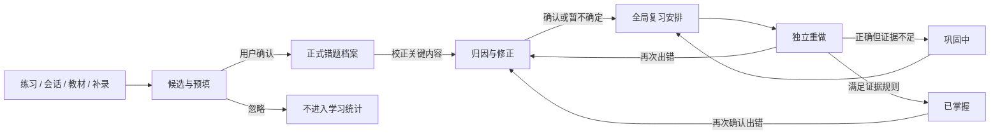

# Texa 错题本重构：产品模型与 Sol 实施方案

日期：2026-09-29。交付性质：产品与工程设计提案；尚未实施页面、API 或数据库变更。

## 1. 产品决策

**错题本负责把一次错误变成可追踪的修正过程。** 它回答：这是什么题、我当时怎么错、应修正什么、后来是否独立做对。全局复习决定什么时候再做；练习负责作答；教材提供题目和知识依据；学习会话提供解释。Goal 可以引用这些对象及其结果，不再生成一套错题任务状态。

默认入口由“录入”改为错题档案。取消现有四 Tab：录入成为随时可用的“补录”动作；列表成为首页；今日复习执行迁入全局复习；统计重构为“错误诊断”。详情成为核心工作页面，不再把全部题干、解答、归因塞进列表展开区。

自动沉淀的目标是**减少重新输入**，不是让模型判定一个人的错误与掌握程度。确定的作答来源自动预填，模型发现的疑似错误进入待确认候选。用户确认收录后才进入正式学习记录；确认收录不要求同时补齐所有归因。

### 1.1 模块职责与交接

| 模块 | 负责 | 与错题的交接 |
|---|---|---|
| 错题本 | 候选整理、题目校正、错误归因、修正笔记、历次作答和掌握证据 | 显示全局复习安排；发起单题重做或指定题集复习 |
| 全局复习 `/learning` | 到期队列、复习会话、间隔调度、恢复 | 读取符合复习条件的错题；提交结果给同一领域服务 |
| 练习 `/exercises` | 题库、练习会话、作答与自评/判定 | 传入题目引用与作答记录；同题再次出错追加到同一档案 |
| 教材 | 原文、例题、习题、概念依据 | 定位到教材页/块；“记录这题的错误”预填题目，仍需用户指出自己的错误 |
| 学习会话 `/` | 讲解、追问、计算与验证 | “记录为错题”携带选定题目、作答、消息引用；详情“问 Texa”回到主聊天 |
| Goal / 任务 | 用户确认目标后的有界执行与进度 | 引用错题 ID 或冻结的题集；只用已提交的结果更新进度，不以打开详情算完成 |

### 1.2 已核对的实现事实

以下来自当前工作区源码与既有批准截图，不等同于本轮 Electron 行为验收。

| 现状 | 工程影响 |
|---|---|
| `MistakesPage.tsx` 默认“录入”，同时管理四 Tab、图片、保存、复习会话 | 需要拆分领域状态，不能只更换布局 |
| `MistakeRecord` 已保留 `ocr_text`、校正题干、`visual_ir`、概念、SM-2、复习历史、revision | 可增量扩展；原始材料与用户版本已有基础 |
| `MistakeBookStore.add()` 默认当天到期 | 新候选不能调用旧 add 后立即进入 Review Queue |
| `PracticeAnswerService` 支持 `add_to_mistake`，用 session + exercise 生成稳定 ID | 已能避免同一次提交重复创建，但跨练习会话的同题还需稳定关联 |
| 全局复习 `LearningPage.tsx` 有错题和概念队列，开始错题复习仍跳 `/mistakes?tab=review&session=1` | P0 必须先接走执行器，再移除旧 Tab |
| 现有错题复习输入 `reviewAnswer`，提交接口只接 ID 与 quality | 旧历史不能被当成保存了答案的独立重做证据 |
| `MistakeQuickCaptureCard` 重复实现图片识别/解题/保存 | 改为共享补录入口；不维持第二套表单 |
| 错题 API 包含概念提取、视觉与解题编排；`overview` 已隔离 due 加载失败 | 分步提取应用服务，保留部分成功，不做一次性大迁移 |
| 图片 pending 文件存在 24 小时清理 | 持久化草稿的图片必须有引用保护，不能继续当临时文件处理 |
| 既有 UI skill 的 product model 将 capture 归在 Review | 本需求明确覆盖这一职责划分；实施时同步修订该稳定说明 |

## 2. Domain model：一份档案，多次错误与重做

不要用一个 `status` 承担全部语义。收录可信度、内容完备度、掌握程度、到期时间是不同维度。

### 2.1 对象与事实归属

| 对象 | 最小信息 | 真相来源 |
|---|---|---|
| `MistakeCandidate` 待收录候选 | ID、来源事件键、题目/作答快照、缺失项、建议、关联档案 ID、待确认/已接收/已忽略 | 系统捕获或用户草稿；不参与掌握与正式统计 |
| `MistakeRecord` 错题档案 | ID、学科、稳定来源引用、当前题目 revision、内容校正状态、归因、修正笔记、掌握投影 | 用户确认内容 + 领域服务投影 |
| `MistakeOccurrence` 错误事件 | 来源 attempt/message ID、时间、当时题目版本与作答、错误判定依据 | 已确认作答/用户声明；同一事件仅计一次 |
| `MistakeAttempt` 重做记录 | attempt/session ID、原始答案或作答说明、结果、是否看提示/答案、判定来源、时间、题目版本 | 提交后不可被后续编辑题干覆盖 |
| `Diagnosis` 归因 | 错因分类、具体错误步骤、修正做法、概念引用、建议/接受/修改/拒绝、证据引用 | AI 只写建议，用户确认后成为归因 |
| `ReviewSchedule` 复习安排 | item key、下次到期、间隔参数、最近有效结果 | 全局复习使用的同一调度服务；P0 继续存现有 SM-2 字段 |
| `SourceRef` 来源 | type、book ID、exercise ID、session/turn/message/attempt ID、页码/block ID、版本、快照 | 原始对象可定位；删除后仍保留快照并标“来源不可用” |

P0 不引入全站统一 Problem 数据库。已有 exercise 用稳定引用；图片/手输用错题内题目快照。新增结构先限于错题域，复用已有练习结果，不复制另一份可修改的练习答案。

### 2.2 状态与筛选投影

| 维度 | 建议值 | 规则 |
|---|---|---|
| 收录 | candidate / accepted / dismissed | 候选先于正式档案；候选有可靠同题关联时挂靠现有档案 |
| 内容 | needs_correction / ready | 缺关键图表、题干未校对、关键答案冲突时不能标 ready |
| 归因 | missing / suggested / confirmed / deferred | 未知错因允许“暂不确定”；不强迫勾“粗心”才能继续 |
| 掌握 | unresolved / consolidating / mastered | 一次做对进入巩固；满足证据规则才进入掌握 |
| 提醒 | unscheduled / scheduled / due / suspended | 由全局调度投影；不与掌握状态混成同一枚举 |
| 可见性 | active / archived | 已掌握仍可见；归档是用户管理动作，不等于掌握 |

首页提供 **全部、待处理、待复习、反复出错、已掌握** 五个查询筛选，不做五个独立模块。

- **待处理**：未确认候选，以及需要校对、缺关键输入或待处理归因建议的正式档案。每行说具体原因：“确认是否收录”“缺少附图”“确认错因”。归因 deferred 不再反复催办。
- **待复习**：可复习且未掌握的已安排档案；显示“今天到期 / 明天 / 10 月 5 日”，提供“仅看已到期”。已掌握的维护性复习保留在全局队列，并在已掌握行标到期时间。
- **反复出错**：最近三次有效、独立作答中至少两次失败，且最近一次失败之后尚无独立正确记录。少于两次有效作答不判断。建议阈值是产品规则，不是认知测量结论。
- **已掌握**：满足掌握规则或用户明确标记；后者显示“手动标记，未有重做证据”，不计入证据型掌握统计。
- 筛选允许交集：某题可以同时待复习和反复出错；计数不可相加当总数。全部列表按档案去重，关联候选表现为该行的待处理提示。

**掌握的 P0 默认规则（需版本化）：** 最近一次失败后有两次无提示、查看答案前提交的正确重做，第二次至少距第一次六个自然日，且当次已到期；判定来自用户确认或确定性校验，分别标明。模型单独判“正确”、看过解答后的当场重做、只有旧 quality 分值，都不自动构成掌握证据。六日是与现有 SM-2 节奏相容的初始产品阈值，不宣称学习科学上的准确阈值。

已掌握后确认再次出错：追加 occurrence/attempt，转 unresolved，按失败规则重新安排；历史掌握区间保留。看懂解析、浏览教材、采纳 AI 建议不提高掌握状态。掌握也不自动停止低频维护复习。



“重做中”属于 ReviewSession，不写成错题永久状态。关窗口/断开时档案仍保留原状态，恢复会话继续同一 attempt。

## 3. IA 与页面结构

保留主导航的学习、复习、错题、练习、教材、目标。只改错题局部结构，并对外部入口做必要衔接。

```text
错题 /mistakes                         ← 默认进入档案，默认全部，可记住用户筛选
  ├─ 筛选：全部 / 待处理 / 待复习 / 反复出错 / 已掌握
  ├─ 错误诊断 /mistakes/diagnosis       ← 局部次级页面，保留相同范围
  ├─ 补录 → 图片 / 手动                ← 轻量菜单，选择后创建草稿
  │    └─ /mistakes/intake/:draftId     ← 可恢复的校对工作页
  └─ /mistakes/:id                     ← 可直接访问的档案详情

复习 /learning                        ← 现有全局入口保留
  └─ /learning/review/:sessionId       ← 新增共享执行路由，不再回错题页做题
```

上列是目标路由，不是现有 API。静态路径优先声明。P0 详情与旧链接适配必须携带 `book_id`；旧 ID 尚不保证跨库全局唯一，不得只按短 ID 在所有书库中猜测。无教材错题进入独立的未关联教材范围，不强制选择一本书。

### 3.1 首页：可操作的档案清单

```text
错题    [全部学科 / 科目 / 教材范围]                  错误诊断   补录 ▾

全部 38   待处理 4   待复习 19   反复出错 3   已掌握 11
[搜索题干、知识点、错因]               来源 ▾  错因 ▾  排序 ▾
──────────────────────────────────────────────────────────────
□ 等价无穷小替换的适用条件              缺少归因           确认错因 →
  高数 · 极限 · 练习 09/28 · 相减时丢失高阶项
──────────────────────────────────────────────────────────────
□ 二重积分的积分区域                   待复习 · 今天到期   查看 →
  高数 · 重积分 · 最近 3 次重做中 2 次出错 · 09/27
──────────────────────────────────────────────────────────────
□ 矩阵秩与线性方程组                   已掌握             查看 →
  线代 · 无提示重做 2 次正确 · 最近一次 09/28
──────────────────────────────────────────────────────────────
```

数字仅为布局示例。题目标题不得靠剥掉所有公式生成：优先原题编号/用户短标题；纯公式题保留可渲染的首个表达式，不自动生成暗含答案的标题。

每行两至三层：题目身份；知识点/具体错误摘要/来源；右侧一个当前最有用的动作。主状态最多一个，必要时加一个风险提示；完整状态在详情解释。待处理原因优先于掌握徽标，不隐藏历史状态。

默认排序：有待处理项的档案优先，其余最近活动；进入待处理按等待时间，待复习按到期时间，反复出错按最近失败时间。支持显式切换最近新增/最近活动，稳定用 ID 作次级排序。搜索与筛选持久在 URL，返回保留滚动和焦点。初次仅取 30 行，后端游标分页，不能先拉取全部再前端截断。

不在首页另起 KPI 区、图表区或巨大的“新增错题”卡片。批量选择后才显示工具条：确认低风险候选、归档、加入本次复习；含关键缺失项的条目禁止批量确认。正式删除藏在更多操作中，清楚说明影响，默认使用可撤销归档。

### 3.2 详情：题目 → 当时的错误 → 修正 → 后续证据

一列 Reading Canvas，按需展开来源 Inspector。列表点击进入完整详情，避免同时常驻列表、详情、来源三个窄栏。返回列表恢复上下文。

1. 页首：返回、题目身份、状态、一个主动作；来源和日期作为次级信息。
2. **题目**：校正后的正文、公式、必要附图；“对照原图”“编辑题目”。缺页在此明确显示。
3. **我当时怎么做**：原答案/步骤与具体错误点。没有记录就说明“未保留当时作答”，允许补充回忆但标“事后补充”。
4. **应怎样修正**：确认的错因、简短修正做法、知识点；参考答案与完整解析可折叠。正常档案可展开；复习执行中始终遵守答案隐藏规则。
5. **后续重做**：时间、独立/提示、结果、判定来源；点击查看当次答案与当时题目版本。先列最近三次，更多按需加载。

主动作按状态选择：补充关键材料 → 确认归因 → 去复习 / 现在重做 → 查看掌握依据。编辑、归档、手动标记放更多菜单；“问 Texa”“看教材依据”作为内容旁的辅助动作。

“问 Texa”携带选定错题、题目 revision 与问题意图进入主聊天。历史解析只作带来源的上下文，不能升级为本轮教材证据；仍走 LearningTask、EvidencePack 与答案验证。不要在详情增加独立聊天框和另一套 Agent 解题链路。

用户更正关键题干或参考答案时，系统保留旧版本；若影响旧作答可比性，提示重新确认掌握，不能用新答案重写历史结果。标点排版修改不自动清空掌握。无法确定修改影响时要求用户选择是否改变题意。

### 3.3 补录/校对页：围绕内容，不围绕扫描参数

图片/拖入/粘贴 → 自动准备并识别 → 同屏校对 → 保存并安排复习，构成一页内连续流程。手动路径直接进入题目编辑。顶部只显示实际进度与草稿保存状态，不把三步表单锁成必须逐页前进的向导。

- **自动处理**：保留原图，应用方向修正和保守缩放；全图作为默认识别区域。没有可靠题目边界时不静默裁掉边缘；不默认强烈黑白化、锐化而抹掉图形与细线。用户选择图片即表达识别意图，沿用既有模型角色与凭证。
- **裁剪**：在原图上以“调整题目范围”进入；默认可直接识别，也可中止后裁剪。保留图、表、选项、题号和附属条件；可补充下一页。P0 支持一题多张附件，自动拆多题留 P1。
- **识别预览**：宽屏左原图、右校正文本/公式预览；窄屏使用“原图 / 校对”切换并保持编辑光标与滚动。常规态以渲染内容阅读，进入字段编辑时提供文本与公式预览。
- **不确定项**：只依据 OCR/Visual IR 实际返回的问题标注，不伪造字符置信度。有坐标才联动框选，无坐标用问题列表和原图对照。关键缺失项可保存草稿，但不能当作完整题目开始精确解题。
- **高级调整**：置于“识别不清楚？”折叠项；亮度等保留为恢复手段，并提供还原原图。重新识别产生新候选文本，必须由用户选择替换，绝不覆盖已校对内容。
- **归因建议**：题目校对后异步生成知识点与至多 3 个具体错因建议，显示依据片段，逐条接受/修改/拒绝。缺用户作答时只建议考查知识点，并询问具体卡点，不断言“粗心”。
- **完成**：主按钮“保存并安排复习”；若材料未全，主按钮“保存待处理”。答案非必填；尚无可靠参考答案时仍可收录，重做须走自评或显式未验证反馈，不能宣称自动判对。

归因示例：“把相减结构分别作一阶替换，抵消后丢失了决定极限的高阶项。”修正做法：“先看相消结构，再决定需要保留的展开阶数。”比单一“概念不清”更能指导下次行动；分类仍保留以供检索。

## 4. 自动收录与关键用户路径

### 4.1 练习 → 错题

1. 练习提交保留稳定 attempt ID。用户自评失败或确定性判定失败，自动准备候选与完整预填。
2. 结果区显示“题目与本次作答已准备，收录到错题本”，用户一次点击确认；现有显式“转错题”也直接复用同一服务。不让用户重新上传题图。
3. 可在练习提交时提供未默认勾选的“本次错题同时收录”，该次提交即确认，不再弹第二次确认。P0 不静默开启全局自动写入偏好。
4. 稳定 exercise 引用已有关联档案时，追加此次错误事件；不同题目版本需要确认是否仍是同题。正文相似只提示可能重复，不能自动合并。
5. 学科、来源、题目、作答沿用原始信息。只让用户处理缺失信息与归因。练习结果保存成功但错题同步失败时，保留结果并提供幂等重试，不要求重答。

### 4.2 会话 → 错题

用户在问题/答案处选择“记录为错题”，预览将收录的题目、自己的作答、来源消息与参考解析，再确认。没有具体题目的概念问答不强行生成错题，应继续走概念薄弱记录。

模型识别到疑似错误时，只生成 pending action 候选。用户“没懂”、给模型答案差评、模型称用户错误，都不等于已确认的失败作答。模型答案本身有误也不得归入用户错因。关联原 session/turn/message，模型解释标明来源及 verification。

### 4.3 教材 → 错题

从已识别教材题目/练习来源点“记录这题的错误”，预填内容和页码/block 引用，用户补充作答或明确“卡在这一步”。仅浏览例题不会自动增加错题。PDF/Word 批量题目候选继续由既有习题导入和人工校对处理，不在错题本再建导入库。

### 4.4 图片/手动 → 草稿 → 档案

补录可只记“不会做”或卡住位置，无需编造错误答案。OCR 失败仍保留原图与草稿，可手输；模型未配置或网络失败不阻断本地记录。多张图片按顺序关联，已保存草稿跨路由/桌面重启恢复。草稿丢弃与临时附件清理由引用关系决定。

### 4.5 档案 → 全局复习 → 档案

“去复习”只导航到全局队列并应用当前范围；“现在重做”经用户点击创建单题 ReviewSession；批量加入本次复习冻结选中的有效 item key。创建会话不改变原有到期时间。

复习执行先独立作答，再揭示参考/反馈，最后确认结果。结果至少包括不会/错误、部分完成、正确但有提示、独立正确；同时记录是否揭示答案与判定来源，不能只靠一个数字映射掌握。沿用 SM-2 的兼容映射由服务统一负责。

一个提交一次性记入 attempt、更新错题投影与调度；跨存储同步通过可重试收据保障。返回档案显示本次答案、修正建议与下次安排。中途离开不自动判错，恢复同一会话；旧响应不能覆盖新会话。查看答案后再填正确答案可作为学习记录，不作为独立掌握证据。

## 5. 错误诊断：证据、解释、行动

使用连续的阅读文档与短列表，不使用四个 KPI 大卡片、饼图或单一“健康分”。范围与档案一致；默认近 30 天，可对比前 30 天；没有新作答就说明数据不足，不用收录数量下降宣称改善。

| 问题 | 展示方式 | 行动 |
|---|---|---|
| 哪里容易错？ | 按概念/题型列出涉及题目数、错误次数、样本范围，点开具体题目 | 查看对应档案；有到期项才提示去复习 |
| 为什么错？ | 确认的具体错因归并，带 1–2 条原步骤证据；未确认建议另列 | 对照教材关键概念；处理待归因项 |
| 是否改善？ | 同一组题的有效独立重做结果变化；明确次数、分母、提示情况与日期 | 查看对比作答；复查仍反复出错的题 |
| 下一步做什么？ | 按缺材料、到期且反复出错、一般到期排序，最多 3 个具体动作 | 补附图、复习选定题、阅读来源段落 |

示例（非实际统计）：“这组 4 道极限题，前 30 天独立重做 2/6 次正确，近 30 天 5/7 次正确；其中相减结构的 2 道题仍有失败记录。先复习今天到期的这 2 道题。”

统计口径必须返回给前端：

- 错题库本身只有被选入的错误样本。没有全部练习次数作分母时，只能说“收录了 8 道相关错题”，不能说“这个概念错误率最高”。
- 独立正确率 = 同范围有效独立正确重做数 / 同范围已判定有效独立重做数；初次错误、提示作答、仅浏览解析、结果未知分开列。
- 两个窗口的改善比较使用都出现过的同一题组；每个窗口至少 5 次有效独立作答且覆盖至少 3 题，否则只列事实，不生成“正在改善”的结论。阈值是展示门槛，不是显著性检验。
- 同一 attempt 重试不增加计数；一题多个知识点可分别归组，但总题数去重。归因统计只用 confirmed；未确认量单独披露。
- 旧 quality-only 记录保留“历史自评”序列，不能补造独立正确率；手动掌握也不与证据型掌握混算。
- P0 用确定性模板生成文字与链接；P1 才考虑 AI 汇总既有统计事实，不能由模型自由计算比例。

## 6. 布局、密度与状态规范

沿用批准的 Learning / Textbook 构图与 `ApprovedWorkspace.css`。管理清单采用 `workspace-register`，详情采用 `workspace-reading-content`；中性背景、行分隔、现有主题 Accent，只给主操作、选中与语义状态强调色。不新增全站配色或侧栏设计。

| 场景 | 宽度和节奏 |
|---|---|
| 首页/诊断 | 共同左轴线；管理区最大宽度建议 1120px，宽度不足时占可用区；使用现有 32px gutter，窄窗口按共享规则收紧 |
| 档案详情 | 正文沿用 740px 阅读宽度与 16px / 1.9；题目标题沿用 24px 文档角色，段落标题 18px；来源 Inspector 264px 按需显示 |
| 控件/来源 | 沿用 13px 界面、12px 辅助、11px 元数据；状态与错误不能全部降到 11px |
| 列表密度 | 基础行高 64px；含两行摘要时自然增长至约 80–96px，不强迫长中文裁成不可识别的短句 |
| 1280×820 | 清单完整操作列；图片校对在内容可用宽度足够时双栏；详情不强开 Inspector |
| 1024×768 | 行末操作可下移；校对根据内容容器宽度切换，不能仅凭屏幕宽度硬挤双栏 |
| 760×820 | 单列分层行；筛选可折叠，搜索常驻；原图/校对切换；来源为临时覆盖面板，不产生页面横向滚动 |

列表和表单不套重复面板；空白服务阅读，不预留空侧栏。宽屏也不拉长公式行。正文公式只在局部容器必要时滚动，不能撑破整个页面。主操作保持可达，底部工具条不能覆盖最后一段。

| 状态 | 页面行为与文案方向 |
|---|---|
| 全库为空 | 左对齐短说明：“练习中的错误可带着作答一起收录；也可以补录已有错题。”主入口去练习，次入口补录；不放巨大上传框 |
| 待处理为空 | “待处理内容已整理完”，展示去档案/复习的轻量链接，不催新增错题 |
| 筛选无结果 | 展示当前条件与“清除筛选”，不显示全库空态 |
| 加载中 | 局部骨架；切筛选保留现有数据并显示正在更新，返回结果前不将计数写 0 |
| AI 建议失败 | 手动归因可继续；只重试建议，不重跑 OCR 或阻断保存 |
| OCR/缺图 | 原图、校对文本和草稿保留；指出缺少的具体材料；支持补充/手动输入 |
| 保存失败/版本冲突 | 保留编辑稿；重试沿用 operation ID；冲突展示本地与服务端差异，不静默覆盖 |
| 复习/诊断局部失败 | 档案仍可用；计数显示暂不可用，不假装零条；重试对应部分 |
| 来源丢失 | 快照可读，来源入口解释无法打开；不清除错题与历史 |
| 归档 | 不进入日常清单/队列；仍可查询恢复，历史作答不删除 |

键盘要求：全部行操作可聚焦；详情返回恢复行焦点；裁剪具备键盘移动/缩放或数值替代；Esc 关闭临时面板且保留已保存草稿；保存/识别状态用 live region 通知。状态同时有文字，不只靠颜色。

## 7. 工程方案

### 7.1 前端职责拆分

以下为建议新增/调整位置；具体文件名可随实现细化，但依赖边界不可退回大页面。

| 位置 | 改造 |
|---|---|
| `pages/MistakesPage.tsx` | 只装配范围、筛选和档案清单；移除上传、OCR、复习状态机 |
| `pages/MistakeDetailPage.tsx` | 档案阅读与详情动作装配 |
| `pages/MistakeIntakePage.tsx` | 可恢复校对草稿；图片与手动共用 |
| `pages/MistakeDiagnosisPage.tsx` | 证据摘要、口径与行动链接 |
| `features/mistakes/hooks/` | `useMistakeCollection`、`useMistakeDraft`、`useMistakeDetail`；请求/取消/冲突与业务事件放这里 |
| `features/mistakes/` | 类型、筛选/状态投影、来源格式化、列表行、归因编辑、时间线、原图对照；纯逻辑可独立测试 |
| `features/mistakes/components/ProblemImageEditor.tsx` | 取消固定百分比自动裁剪；自动/高级模式，原图与工作图分离 |
| `features/review/`（新增） | `useReviewSession`、执行页面内容、session recovery；承接旧 `useMistakeReview` 与 `reviewSession` 逻辑后逐步删除旧入口 |
| `pages/LearningPage.tsx` | 沿用全局队列构图；接统一执行与结果失效刷新，不另改全页 IA |
| `components/chat/MistakeQuickCaptureCard.tsx` | 改共享 capture action，传 source/草稿 ID；去掉重复大表单和解题保存门槛 |
| `features/exercises/hooks/usePracticeSession.ts` | 传稳定 attempt/source key，显示候选/收录/重试反馈 |
| `App.tsx`、`WeeklyReportPage.tsx`、来源链接 | 新路由与旧 URL 兼容；所有链接带范围；返回路径仅允许本地合法路由 |

领域动作产生一次后端确认后，再失效刷新错题清单、诊断和全局队列；不在 React updater 里发送请求或改 ref。OCR/suggestion 请求携带草稿 revision，迟到结果仅作为旧版本候选，不能覆盖新草稿。

### 7.2 后端服务边界

- `backend/services/mistake_capture.py`：统一来源适配、候选、确定性关联、接收/忽略；调用 storage provider 惰性解析依赖。
- `backend/services/mistake_lifecycle.py`：校正、归因确认、掌握规则、归档；统一处理 revision 与 operation ID。
- `backend/services/mistake_diagnosis.py`：纯规则聚合、统计口径、证据 ID 和下一步；模型建议另走受控建议能力。
- `backend/services/review_session.py`：队列适配、会话冻结、答案揭示、结果提交/恢复。通过 item adapter 调用错题/概念现有调度能力。
- `backend/services/exercise_practice.py`：保留现有作答主路径，错题创建改接 capture/lifecycle；同一次失败不是“初始 occurrence + 重做 failure”两次错误。
- `backend/api/mistakes.py`：新接口只转换 DTO 与错误；旧视觉 LearningTask 接口保持兼容，先抽取本次需要的 OCR/归因逻辑，不顺带重写全部 1600 行。
- `memory/mistake_book.py`：保留旧记录读写与 SM-2 兼容；新增字段默认值不改变旧结果。新增 candidate / occurrence / attempt 存储与唯一键，避免把无限历史全部塞回一个 JSON blob。
- `backend/api/kg.py`、`backend/services/kg_learning_summary.py`：错题部分读取相同 eligibility 与队列 adapter，不能继续直接 `get_due` 把未校对档案算入全局队列。
- 学习事件仍输出已有兼容事件名；新事件带稳定 ID 和关联来源，避免两种事件对同一作答重复提高弱点计数。

**调度只有一个写入口。** P0 不搬迁 SM-2 数据，也不同时新增另一份全局 schedule 表。ReviewSession 服务经 adapter 调用现有调度器，错题本只读它的投影。以后若迁移调度存储，单独评审。

### 7.3 建议接口合同（均为待实现）

| 接口 | 核心合同 |
|---|---|
| `POST /api/mistakes/query` | scope/filter/search/cursor/limit；返回 items、next_cursor、counts、errors、统计口径；候选与档案用 kind 区分 |
| `POST /api/mistakes/candidates` | source key、快照、authorization 来源；幂等返回候选；模型来源绑定 pending action |
| `POST /api/mistakes/candidates/{id}/accept` | expected_revision + operation_id；接收并创建/关联档案，返回 next_action |
| `POST /api/mistakes/candidates/{id}/dismiss` | 幂等忽略；保留来源事件去重，避免刷新又出现 |
| `POST /api/mistakes/drafts`、`PATCH /api/mistakes/drafts/{id}` | 本地持久草稿及附件引用；返回 revision；附件上传由受管接口返回 attachment ID |
| `POST /api/mistakes/drafts/{id}/recognize`、`.../suggestions` | 请求绑定 draft revision；结果保留依据/缺失项/角色信息，失败可独立重试 |
| `GET /api/mistakes/{id}` | 必须提供确定 book scope；返回内容、状态、来源、最新历史与分页游标 |
| `PATCH /api/mistakes/{id}` | 白名单字段、expected_revision、operation_id；区分编辑内容与明确的生命周期操作 |
| `POST /api/mistakes/{id}/actions` | confirm_content / confirm_diagnosis / defer_diagnosis / archive / restore / mark_mastered；后端校验门槛 |
| `GET /api/mistakes/diagnosis` | scope/window/cohort；返回事实、分子分母、证据引用、action，不返任意模型 HTML |
| `POST /api/review/sessions` | queue filter 或显式 item keys；冻结清单，返回 session ID；不改 due |
| `GET /api/review/sessions/{id}` | session revision、当前 item、已确认结果、可恢复草稿 |
| `POST /api/review/sessions/{id}/reveal` | 持久记录答案揭示时间；后端据此判是否独立作答 |
| `POST /api/review/sessions/{id}/results` | operation_id、session/item revision、attempt、result；返回同一提交收据与 next_review |

所有对象 ID 与 scope 服务端校验；列表和动作都不能信任前端传来的 mastered/due 布尔值。重复 operation ID + 同参数返回原收据；同 ID 不同参数拒绝；revision 冲突用 409，关键输入门槛用结构化 422。跨库查询通过 registry 枚举授权本地范围并分页，不扫描所有文件猜对象。

跨 SQLite 存储不能声称一个普通事务覆盖全部库：源作答先安全提交，错题及事件投影用稳定 event key/操作收据重试对账。只有错题与调度确认提交后 UI 才显示“已安排复习”；投影失败显示“作答已保存，错题同步待重试”。无需为此重建全站事件总线。

### 7.4 兼容与数据迁移

这是未来实施步骤；本提案不执行真实库迁移。

1. 用旧记录 fixture 验证加字段的兼容读。旧 `question_text`、图片、原始 OCR、解析、SM-2 与 review_history 原样保留；缺失归因标“未整理”，不把所有历史题重新强制阻塞复习。
2. 旧记录缺校对证据时标 `legacy_unverified` 来源说明，继续原队列；明确存在缺页/关键冲突时才暂停。不能自动声称旧题已人工校对。
3. 旧 quality 历史只作为历史自评，迁移不得伪造 attempt 答案、是否看过提示、首次错误时间或掌握证据。历史日期和时区不明时不补造精确时间。
4. 新候选存独立表，不经旧 add 自动安排。旧已正式收录数据保留原到期；新内容达到门槛且用户确认后才安排。
5. 保留 book ID/旧名称的解析与图片受管路径。教材重命名不改变关联；来源教材删除后可从档案快照阅读。图片保存用附件 ID；不让前端指定任意绝对路径。
6. 草稿/档案持有的原图、工作图与附图不受 pending TTL 清理；失败的 OCR 不删除有引用原图。丢弃后只清理无引用附件。
7. 旧 `/mistakes?mistake_id=...` 转详情；`tab=review` 转全局队列；`tab=review&session=1` 转复习开始页/恢复页，不能在 GET 导航时无条件重复创建会话。
8. 先落地全局执行路径并验证，再删除旧复习 UI。旧 `/mistakes/review` 暂由统一服务代理；旧 quality-only 请求不会生成可用于掌握的虚假独立作答证据。
9. 实施前针对架构/存储变更按 AGENTS.md 确认方案；迁移先跑临时库，备份真实库与附件，给出迁移版本、dry-run、回滚方式。新增表须有唯一键与索引；回滚旧界面不删除新增事实表，也不能使新候选从旧 due 接口漏出。

## 8. P0 / P1 与 Sol 实施顺序

P0 是可上线的最小完整闭环，不等于先交一版漂亮列表。

| 优先级 | 交付切片 | 完成定义 |
|---|---|---|
| P0-A | 候选/正式档案/重做事实合同、稳定来源键、迁移方案 | 旧数据可读、同事件不重复、未确认候选不入队；先评审合同与真实迁移风险 |
| P0-B | 全局复习执行与持久结果 | 从 `/learning` 完成错题重做并恢复；与旧 SM-2 同源；作答、提示、判定来源可追踪 |
| P0-C | 新首页与档案详情、状态筛选 | 默认看档案，关键下一步清晰，原问题/错误/修正/历史可读；旧链接兼容 |
| P0-D | 练习收录与会话显式记录入口 | 自动预填，一次确认；跨会话同题关联；模型只提供 pending action |
| P0-E | 共享图片/手动补录、草稿恢复、建议确认 | 不强制扫描参数；原图与校对并存；缺页/失败可恢复；多张附件不丢失 |
| P0-F | 确定性错误诊断、来源回跳、发布验收 | 无 KPI Dashboard；每条结论有口径与具体行动；Electron 主路径通过 |
| P1 | 教材题目就地收录与更多自动来源适配 | 复用可靠 IR/题目锚点；未识别内容回到人工校对，不靠猜测 |
| P1 | 批量候选整理、重复档案合并与撤销 | 精确关联与模糊建议分开；合并保留全部来源和历史 |
| P1 | 图片多题分割、定位级 OCR 对照、更细错误步骤 | 不损失附图/公式，用户可修正分割与识别 |
| P1 | 跨题型改善比较、可追溯 AI 诊断摘要 | 基于已有作答分母与统计事实；不足就不下结论 |

建议按 A → B → C → D/E → F 切分 PR。C 可先用隔离 fixture 开发，但 B 未验证前不能下线旧复习入口。教材来源引用、详情看原文属于 P0；自动识别教材题目入口是 P1。P0 需要基础单条归档/恢复，复杂批量合并不抢占闭环时间。

### 8.1 必须覆盖的验收场景

1. 同一练习提交重试两次，只产生一个候选/错误事件；另一会话做错同题，关联原档案并新增一次事件；错题与练习都显示同一结果。
2. 候选未确认、OCR 缺图时不会进入新的正式队列；归因未知但题目完整可以显式暂缓归因后复习。
3. 正常拍照/粘贴后无需调参数即可到校对；关键条件与附图保留；重新识别不覆盖人工修改。
4. 模型未配置、超时或建议失败时仍能手动保存；缺关键输入时禁止精确生成，原图与草稿重启后可恢复。
5. 独立作答、答案揭示、提示作答分别持久化；仅读解析或旧 quality 不会升级为已掌握。
6. 已掌握后再次错误重新进入待复习，历史掌握与旧作答保留；用户手动标记有明确来源。
7. 档案、全局复习、练习对同一次提交展示一致；中断恢复、重复点击、迟到响应与版本冲突不会重复计数/更新调度。
8. 旧数据无丢失；旧 deep link、未关联教材、教材重命名、来源删除都能正确恢复或解释。
9. 诊断能逐项追溯题目/attempt，分母与 cohort 正确；样本不足不说改善；局部 API 失败不拖垮档案清单。
10. macOS 与 Windows Electron 分别检查 1280×820、1024×768、760×820；长中文、纯公式题、表格附图、混合状态、空态、键盘焦点、主题均可用。未实测的平台明确标未验证。

测试以状态转换、幂等与历史保真为核心。优先扩展 `test_mistake_book.py`、`test_mistakes_api.py`、`test_mistake_image_lifecycle.py`、`test_exercise_bank.py` 及前端复习/图片相关测试；新增 capture/lifecycle/review service 合同测试。前端运行相关 Vitest、lint、build；后端使用 `venv310` 的 Python 3.10。截图与源码检查分别记录，不拿构建成功代替 Electron 验收。使用隔离演示数据，不为截图写真实学习记录。

### 8.2 可直接粘贴给 Sol 的任务说明

> 按本方案重构错题本，先实施 P0。先核对工作区现有改动与当前 AGENTS.md / texa-ui-system，保留他人改动。提交候选、档案、attempt、调度 adapter 的最小合同及迁移 dry-run/回滚方案；涉及真实数据迁移前按项目约定确认。保持现有主导航和批准的中性 Reading Canvas 语言。先让 `/learning` 能可靠完成与恢复错题复习，再撤掉错题四 Tab。首页是可筛选档案，详情是题目—错误—修正—历史的文档流，补录是共享可恢复草稿，诊断用有分母的事实和可操作建议。复用练习、主聊天、模型角色、LearningTask、EvidencePack 与现有 SM-2，不新增平行 Agent/调度器。自动来源先预填，模型写操作仍经 pending action，用户确认后才收录。每一切片按上述验收场景检查，普通修复、迁移与实测记录写 patch_notes.md；长期职责变更才更新 AGENTS/skill。报告实际验证、源码确认和未验证项，不能宣称未运行的平台通过。

## 9. 本轮交付边界

已完成：当前错题/练习/复习源码核对，批准视觉参考检查，领域模型、IA、核心路径、页面状态与工程交接设计。

未执行：产品代码修改、运行中的 Electron 交互验收、真实模型调用、真实学习库迁移。工作区已有多处 UI 与 patch_notes 修改，本轮没有覆盖它们；新增本文作为可评审实施依据。
