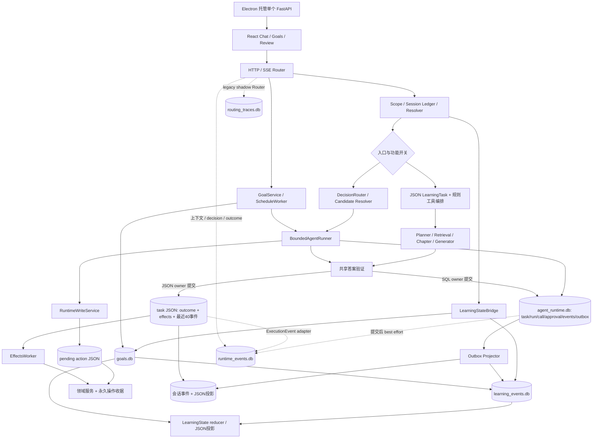
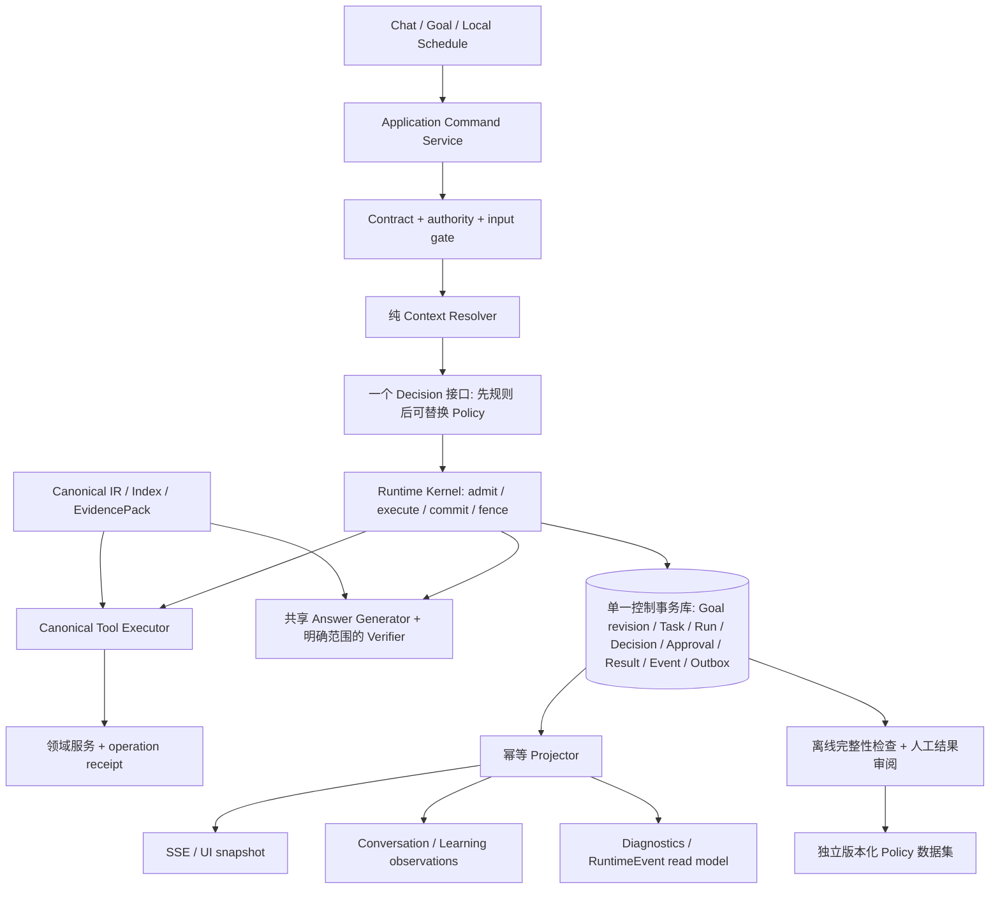

# Texa — Pre-Policy Architecture Audit

日期：2026-09-30。结论：**NO-GO：当前工作区不适合冻结为 Runtime Policy 训练前可信 checkpoint。**

这不是对整个产品可用性的否定。已有 SQL fence、领域收据、EvidencePack 和恢复测试值得保留；阻断点是目标授权、结果验证、状态投影和训练事件的语义尚未闭合。继续增加 Router、fallback 或小模型，会把这些不一致固化进训练数据。

## 1. 范围与证据

- 审计对象是当前工作区，基于 HEAD `d06403e8b03879f9d74c7665411672f1dc0b3206`，包含已有未提交修改和未跟踪的新错题/UI 文件；不是仅审计 HEAD，也不是已打包二进制。源文件指纹见验证目录的 `source-manifest.json`。
- 深入追踪：Chat/Goal ingress、DecisionRouter、候选工具、SQL Runtime、JSON LearningTask、审批/领域收据、outbox、RuntimeEvent、Learning State、前端状态消费和 Electron 生命周期。教材摄取/检索与 Provenance 检查重点是发布及执行交界，不等同于重新验证全部 OCR 或真实教材语义质量。
- 本次没有改动运行代码、模型开关、数据库结构或用户学习数据；只新增审计文档、复现材料，并在 patch_notes 记录验证结果。没有真实模型调用、训练导出、索引重建或依赖安装。
- Python **3.10.21 / venv310**：两批相关回归 **176 + 114 = 290 passed**。前端 **26 文件 / 124 passed**。Electron 单元测试 **7 passed**；第一次回环端口测试被沙箱 EPERM 阻止，经工具审批在沙箱外重跑通过。
- 额外编写 **15 个定向复现断言**，全部复现当前缺口。假模型、临时 SQLite/JSON，包含故障注入和确定性交错；不是线上发生频率统计。`reproduced: true` 表示复现缺陷，不是正确性测试通过。
- 未执行原生 Electron 停止/重启/审批交互、真实模型 Answer Eval、真实定时长期运行、真实数据迁移演练。未声称本次是全量测试、视觉验收或线上答案准确率评估。

复现：从项目根目录执行 `venv310/bin/python docs/validation/pre-policy-2026-09-30/repro.py`。脚本自行使用临时数据目录并禁用 `.env` 加载。完整输出见同目录 `repro-results.json`。

## 2. 当前架构与关键执行链

**默认聊天链**：`_prepare_chat_turn` → Resolver/Bridge → JSON task claim → regex 工具编排 → `plan → retrieve → chapter? → generate → feedback proposal` → 确定性答案验证 → 原子 JSON outcome/effects → 会话投影/领域 effects。SSE ExecutionEvent 与 RuntimeEvent 是不同契约。

**可选 SQL 聊天链**：`TEXA_AGENT_RUNTIME_READ` 开启且 capability、模型能力、scope 等门槛满足 → DecisionRouter → candidate refs → SQL create/configure → 模型选择 call/finish → 固定工具执行器或审批 → 共享 Generator/Verifier → SQL outcome + outbox → 会话与 LearningEvent。代码默认接管关闭；此处是代码默认值，不是读取实际用户进程配置得出的结论。

**Goal 链**：人工创建/启用 → `start_goal` 在 goals.db 激活 → 直接取得 registry 中工具候选 → SQL task create → configure → 写 goal_run_links → 启动线程。这里**不经过聊天 DecisionRouter**。模型的 finish 文本会被共享 Generator 再生成的答案替代。用户确认 Goal 完成与 Runtime 完成是两个独立动作。

**审批链**：SQL call → pending action JSON → SQL approval/pause → confirm approval → 新 run → JSON PendingActionStore 执行领域服务 → 领域收据 → SQL finish_tool → pause → 前端触发 resume。拒绝、过期、未知写入和恢复分布在多处。

**重启链**：JSON task recovery + effects worker；SQL unfinished → interrupted + outbox worker；Goal schedule worker。重启不自动重放未知写入，这一限制正确。恢复能力不代表 Goal 授权与跨库投影已经保持一致。

### 当前 ownership 判断

| 对象 | 实际权威 | 审计判断 |
|---|---|---|
| Goal | goals.db；同时被 LearningEvent reducer 表达为 active_goal | 定义与运行缺少版本绑定；学习投影仍能给出冲突状态 |
| Decision | Resolver/scope、regex 工具选择、Planner、DecisionRouter、模型 action | 各自有合理子职责，但缺少一个记录最终执行选择及原因的统一出口 |
| Execution | JSON LearningTask 与 SQL Runtime，按入口分流 | 通常不双写同一 task；问题是同名状态/结果在两个引擎里语义不同 |
| Tool | 旧 registry/tool orchestration 与 canonical runtime registry | 领域能力重复注册、权限/输出合同分散；不是一个生产决策闭环 |
| Approval | SQL approval + JSON pending action + 领域 receipt | receipt 是已写入事实；两个审批状态源增加恢复窗口 |
| Memory | 领域数据库/JSON、LearningEvent、LearningState reducer、GoalStore | 学習观察可独立；Goal 生命周期不应由学习 reducer 再次决定 |
| Provenance | Canonical IR → chunk/index → EvidencePack；工具 metadata/receipt | 教材链较强；到 RuntimeEvent/反馈版本链接不完整 |
| RuntimeEvent | 独立、可丢弃的异步 SQLite 投影 | 适合诊断元数据；当前不是完整执行事实或训练样本权威 |
| UI | SSE reducer、task snapshot、Goal polling、组件局部 state | 单 run SSE fence 有测试；Goal polling 缺少 revision 顺序约束 |

## 3. Critical findings 与优先级

P0 在本报告中表示**冻结/采集可信训练数据前必须修复**，不表示每个问题都已造成生产宕机。P1 是闭环正确性和恢复缺陷；P2 是范围受限的可靠性债务或可以分步删除的复杂度。

| ID | 级别 | 问题 | 证据性质 |
|---|---|---|---|
| F01 | P0 | 数值验证通过与最终结论无绑定，可产生假正例 | 定向复现 |
| F02 | P0 | Goal 暂停、修改、完成不形成统一的运行授权边界 | 定向复现 + 代码交叉验证 |
| F03 | P0 | RuntimeEvent 可丢失、错误裁剪、混淆 execution 与 user outcome | 定向复现 + 静态链路 |
| F04 | P1 | Goal create/configure/link/launch 非原子，重试无法修复孤立任务 | 故障注入 |
| F05 | P1 | LearningState reducer 将 A 的生命周期应用到 B | 定向复现 |
| F06 | P1 | SQL final 与 SSE snapshot 竞争导致已完成答案流报错 | 确定性交错复现 |
| F07 | P1 | outbox 单条失败阻塞其他会话；失败无持久状态 | 故障注入 |
| F08 | P1 | Goal 成功标准未冻结为输出合同，缺输入状态不可表达 | 合同复现 + 静态链路 |
| F09 | P1 | Decision/执行/版本/provenance 无稳定 join，shadow 标签错误 | 定向复现 + 全仓调用搜索 |
| F10 | P1 | 输入解析阶段直接写 Goal/Memory，绕过运行和幂等身份 | 定向复现 |
| F11 | P1 | 审批 UI 与恢复 API 把 unknown/expired 继续投影为 pending | 静态链路；未做原生 UI 实测 |
| F12 | P2 | 调度只扫描首 100 项，阻塞原因不保存，异常可终止线程 | 静态链路 |
| F13 | P2 | Goal UI 轮询允许旧响应覆盖新 revision | 静态并发分析 |
| F14 | P2 | 超时/容量/错误分类分散，多处 catch-all 隐去实际原因 | 静态链路 |
| F15 | P2 | 测试专用兼容、无消费者抽象和阶段命名进入生产模块 | 全仓调用搜索 |

### F01 — verifier 把“出现支持信号”当作“结论已核验”

定位：[answer_verification.py:79](../backend/services/answer_verification.py#L79)、同文件 221–240 行；[multi_step.py:148](../backend/services/agent_runtime/multi_step.py#L148)。

- `_verified_math()` 只检查任意 `verify_math_result.verification.passed`；不比较最终答案里的 claim、数值、表达式、单位、当前 question 或 tool operation。
- 证据数字路径使用 `any(value in evidence_numbers for value in numbers)`：只要答案里的任意数字在证据出现，就能令整个 numeric check passed。
- 已复现：问题“计算 2 + 2”，答案“计算结果为 999”加一个 passed 工具标记，得到 passed；答案“已知 2，计算结果为 999”加证据“输入为 2”，也得到 passed。

根因是**支持关系缺少对象身份**，不是正则覆盖率不够。公式 check 主要检查 LaTeX 存在/配对，引用 check 主要检查编号与局部重合，均不应被解释成语义正确标签。

最小修复：保留合同完整性检查，但将它与 `claim_verification` 分开；仅在待验 conclusion 与工具校验目标、表达式/结果、单位精确关联时发布 numeric_verified。其他情况一律 unverified。不要为了这一修复发明通用数学证明器。已有 passed 历史不可直接作为训练 reward。

### F02 — Goal authority 没有进入 Runtime admission / resume / commit

定位：[goals/execution.py:118](../backend/services/goals/execution.py#L118)、[goals/execution.py:131](../backend/services/goals/execution.py#L131)、[goals/service.py:18](../backend/services/goals/service.py#L18)、[goals/service.py:56](../backend/services/goals/service.py#L56)、[chat.py:1624](../backend/api/chat.py#L1624)、[store.py:600](../backend/services/agent_runtime/store.py#L600)。

- 修改 objective/scope/criteria 后只 interrupt；旧 task 和 checkpoint 仍存在。`resume_goal` 校验当前 Goal revision，却不比对 task 创建时的 Goal revision；resume 原样复制旧 checkpoint。已复现“新目标”下实际恢复“旧目标”。
- 通用 Chat resume 接受任意 `rtask_`，不验证 origin 与 Goal active 状态。已复现 Goal paused，但 task 又变为 running；实验替换传输层以避免真正调用模型，状态跃迁使用真实服务代码。
- `measure(user_confirms_completion=True)` 不 interrupt run。已复现 Goal completed 与 Runtime running 同时成立。当前 UI 通常在 task terminal 时才显示完成按钮，因此这一子项主要暴露于 API/竞争请求。
- `_start_lock` 仅覆盖 start，不覆盖 pause/update/resume/approval；“先更新 Goal，后找 links fence”的顺序仍有并发窗口。

根因：`origin.id` 只是标签，不是可校验的授权版本；GoalStore 与 RuntimeStore 各自提交，Runtime 只认识自己的 owner token。owner fence 不能替代 Goal contract fence。

最小修复：任务绑定 goal_id、批准的 contract revision/hash；所有入口统一检验 origin 和授权，关键变更使旧任务失效，用户需为新契约启动新任务。暂停和完成都 fence；批准写入也走同一检查。需要崩溃一致性时，把 Goal 控制状态与 Runtime 控制状态放入同一事务边界；这属于后续需审批的窄范围迁移。

### F03 — RuntimeEvent 还不能承诺事实完整性或 outcome 真实性

定位：[runtime_events.py:150](../backend/services/runtime_events.py#L150)、[runtime_events.py:197](../backend/services/runtime_events.py#L197)、[runtime_events.py:247](../backend/services/runtime_events.py#L247)、[runtime_events.py:273](../backend/services/runtime_events.py#L273)、[store.py:134](../backend/services/agent_runtime/store.py#L134)、[chat.py:1439](../backend/api/chat.py#L1439)。

- queue full 丢事件；写入失败三次后仍 `task_done()`；`flush()` 只保证队列已消费，不保证落盘成功。故障注入确认 flush 正常返回而事件库为空。
- SQL commit 后才发 RuntimeEvent；进程在两者之间退出时无 durable audit outbox。源 execution event 仍可能存在，但没有补投协议。JSON 最近 40 条里程碑不能补回任意长历史。
- parent 来自进程内 `_last_event`，不是持久因果关系；丢入队事件也推进 parent。重启/淘汰后重新从空 parent 开始；随机 event_id 无 source seq。缺失尾事件无法仅靠 `parent_present` 检出。
- retention 按 `(session_id, turn_id)`；Goal 同一 origin 的 turn_id 恒为空。已复现：run1 完成、run2 正在运行，在其他 session 最新事件触发裁剪后，两次 run 的事件一起删除。注释中的“保留 unfinished turn”不适用于此情形。
- 任意 `final` 自动发 `user_outcome`；默认聊天 done 还再发一条。final 也可表示输入/确认边界，不等于真实用户接受或学习达成。Goal 未经人工完成也会生成 user_outcome。
- `replay()` 是对元数据的有损折叠，不是执行状态机重建，更不是模型输出可再现。文档已承认事件不是训练样本，但当前命名仍容易被下游当成 reward。

根因：将 UI/执行通知流投影成训练审计流，却没有独立的事务事实、采集完整性和 outcome 定义。

最小修复：以已提交事实的 `(run_id, source_seq, event_type)` 构成稳定事件身份；同事务写事实/待投递记录，支持幂等补投。run/episode 为裁剪单位，保留缺口和完整性标志。execution_result、delivery_result、user_feedback、goal_completion 分离；没有用户反馈就是 unknown。旧 RuntimeEvent v1 保留为诊断，禁止自动提纯为金标。

### F04 — Goal 启动分段提交形成无法自动收敛的孤儿

定位：[goals/execution.py:108](../backend/services/goals/execution.py#L108)、[goals/store.py:175](../backend/services/goals/store.py#L175)。

顺序是激活 Goal → create SQL task → configure → link → launch。configure 成功后 link 失败，重试同 request_key 会在“已有 answer_state”处分支返回，既不补 link 也不启动 worker。故障注入复现 task running、links 为空，Goal 页面不能发现它。若 UI 换 request_key，还可能再建一项孤立执行。

根因：幂等只覆盖 create 行，没有覆盖完整启动用例；持久 running 与实际 worker admission 不是同一协议。

最小修复：原子提交 contract + link + dispatch intent，worker 认领持久 dispatch；或在迁移前为显式 create/configure/link 状态提供可重入补齐，不以 `answer_state exists` 作为成功终点。重启恢复须检查未链接 task。

### F05 — Memory 投影错误地拥有 Goal 状态

定位：[learning_state_reducer.py:73](../backend/services/learning_state_reducer.py#L73)、[learning_state.py:118](../backend/services/learning_state.py#L118)。

reducer 只有一个 active_goal 槽位；goal_paused/goal_completed 不匹配 event.goal_id，直接修改当前槽位。已复现同书创建并启用 A、B，再暂停 A：SQL B 是 active，学习投影 B 是 paused。服务只在 SQL active goal 数量 >1 时清空/澄清，因此只剩 B 时无法纠正。`guided_session_resumed` 也可独立把投影改回 active。

根因：原先“每本书一个目标”的 reducer 被保留在支持多目标的架构里，形成第二个生命周期权威。

最小修复：Goal 状态唯一读取 GoalStore；Memory 只投影按 goal_id 归属的观察与进度。不再从无归属事件推断当前 Goal 已暂停/完成；旧无法归属记录保持 legacy/unknown。

### F06 — 已提交 final 与传输读取不在同一版本

定位：[chat_binding.py:223](../backend/services/agent_runtime/chat_binding.py#L223)、[store.py:240](../backend/services/agent_runtime/store.py#L240)。

SSE 先读 snapshot，再读 events；两次读取之间 final 提交，则 batch 含 final，snapshot.output 仍是 None。238 行访问 answer 报 TypeError。定向交错复现：数据库 completed，流只输出一个前序事件，随后异常。`_snapshot` 内多个 SELECT 本身也没有显式只读事务，存在跨 revision 混合视图风险。

根因：事件与状态是两个独立读取，却被假定来自同一提交。

最小修复：在一个只读事务返回 snapshot、high-water 和不超过该 high-water 的事件；或 final 以 event 对应 run 的已提交 output 为准重新读取并验证版本。传输错误不应撤销持久 outcome；客户端重连能重新取回 final。

### F07 — outbox 有重试，却没有失败隔离

定位：[outbox.py:14](../backend/services/agent_runtime/outbox.py#L14)、[chat_binding.py:45](../backend/services/agent_runtime/chat_binding.py#L45)、[lifecycle.py:22](../backend/services/agent_runtime/lifecycle.py#L22)、[store.py:584](../backend/services/agent_runtime/store.py#L584)。

drain_once 对单项 append 异常立即退出，worker 两秒后从首项再试；学习事件投影在该 drain 之后。已复现坏 session0 令 session1 永远不被调用。`attempts` 只在成功 complete 时加一；失败原因、retry_at、poison 状态没有持久记录，UI 可见“完成”却历史仍缺失。

根因：把整个批次当作重试单元，跨会话故障不能隔离。

最小修复：按条持久 attempts/error/next_retry，跳过未到期或阻塞项，继续其他项；使用稳定收据保持幂等，显式显示 projection_pending/blocked。异步 outbox 应保留，不能简单删除。

### F08 — Goal contract 与缺输入状态尚未落地到执行合同

定位：[goals/execution.py:105](../backend/services/goals/execution.py#L105)、[contracts.py:31](../backend/services/agent_runtime/contracts.py#L31)、[multi_step.py:99](../backend/services/agent_runtime/multi_step.py#L99)、[generator.py:189](../graph/generator.py#L189)。

Goal success_criteria 仅拼入问题字符串；创建 RunCommand 未传 required_outputs，已复现持久 task.required_outputs 为空。**不是完全没有答案验证**：共享 Generator 会从文本派生通用 required outputs；但派生发生在回答阶段，没有把 Goal criterion IDs/验收关系冻结回 task contract。

SQL action 只有 call/finish；close mapping 没有 waiting_for_input；task.required_inputs 恒为空。需要另一页、文件或用户决策时，这条执行链只能失败或生成“请提供材料”的完成答案，不能可靠表达阻塞输入。UI 展示 waiting_for_input 不等于后端可进入这个状态。

最小修复：启动前冻结最低输出合同及 criterion 引用，区分“本次执行产出”与“用户目标达成”；增加唯一、结构化的 missing_input 边界及恢复数据校验。无法自动测量的 criterion 保持 unknown。底层 verify_answer 空合同/空答案得到 passed 的实验只是库函数风险，不能据此声称生产 Goal 发布空答案。

### F09 — 记录的 decision 不一定是执行原因，版本链也不齐

定位：[chat.py:844](../backend/api/chat.py#L844)、[chat.py:895](../backend/api/chat.py#L895)、[decision/router.py:84](../backend/services/decision/router.py#L84)、[decision/trace.py:53](../backend/services/decision/trace.py#L53)、[goals/execution.py:48](../backend/services/goals/execution.py#L48)、[chat_binding.py:163](../backend/services/agent_runtime/chat_binding.py#L163)、[llm/agent_adapter.py:54](../llm/agent_adapter.py#L54)。

- RoutingTraceStore.record 的 ID 在聊天中被丢弃；全仓搜索 `append_outcome` 只有定义和测试调用。表存在，但 production decision → outcome join 没有接通。
- DecisionRouter(shadow=True) 的规则命中直接返回默认 `shadow_only=False`。已复现。legacy RuntimeEvent 还另写一条 shadow_router decision，未明确哪条是 executed action。
- Goal 不经过 capability Router，直接把 registry 候选交给模型；默认聊天还由 regex 编排/Planner 决策。SQL model.completed 只表示模型步骤结束，投影丢弃实际 action_kind/候选与排除原因；不能从 RuntimeEvent 还原行为策略。
- RuntimeEvent allowlist 有 tool_version，但 execution adapter 不复制它；SQL 工具检索没有独立记录最终 EvidencePack refs 的 audit 点；Goal 缺少 input/context/decision 快照。legacy chat 的部分版本与 chunk refs 不能补齐这些入口。
- SQL 聊天投影没有传 `context_versions`，而反馈服务从 assistant message 读取 versions。`generate_answer` 每次读取当前模型配置，resume 也重新构造 adapter；运行没有冻结模型/profile、prompt、验证器和 Router 配置指纹。工具和教材版本冻结较好，不能代表模型路径也已冻结。

根因：把“若干组件各自写 trace”当成一个决策事实模型；版本配置不是 Run 的输入。

最小修复：每次被实际采纳的选择只写一个 DecisionRecord（decision_id、observation_ref/hash、admissible actions、chosen action、owner/policy/config version）；每个执行/拒绝/结果明确引用它。shadow 单独存，永不成为执行事实。输入正文不必进入 RuntimeEvent：可引用本地受控内容存储，训练导出再人工审阅。

### F10 — Resolver preparation 内发生不可回放的领域写入

定位：[chat.py:383](../backend/api/chat.py#L383)、[chat.py:614](../backend/api/chat.py#L614)、[learning_state_bridge.py:149](../backend/services/learning_state_bridge.py#L149)、[learning_state.py:213](../backend/services/learning_state.py#L213)。

`_prepare_chat_turn` 尚未 claim Runtime/LearningTask 就调用 bridge。bridge 直接 apply_operation 创建/启用 Goal、恢复学习、记录薄弱点；传入 identity 只有 conversation，没有 turn/request operation key。重复同一创建目标 bridge 请求可生成两个 active goals，已复现。错误被折成 bridge.error 或降级 rewrite，运行状态不能表达已部分写入。

这里用户自然语言可能已经授权了相关学习操作；问题不在于再加确认框，而是**解析和执行混为一体，重试没有同一操作身份**。

最小修复：Resolver/Bridge 返回纯 command proposal；由统一应用命令服务依据明确用户意图执行，绑定 request/turn/operation key 并记录结果。resume 不再次执行原始 preparation 副作用。需确认的模型写入继续沿审批边界。

### F11 — unknown / expired 审批被折叠成普通 pending

定位：[locator.py:21](../backend/services/agent_runtime/locator.py#L21)、[write_service.py:44](../backend/services/agent_runtime/write_service.py#L44)、[chat_binding.py:72](../backend/services/agent_runtime/chat_binding.py#L72)、[LearningTaskActions.tsx:22](../frontend/src/components/chat/LearningTaskActions.tsx#L22)。

public_task 将 succeeded → confirmed、rejected → rejected，其余 → pending；unknown write 同时使 confirmation_required=true。UI 给出普通确认/拒绝按钮。无 receipt 的 unknown 确认会 409，已 confirmed 的 approval 拒绝也 409；过期 approval 不改变 task waiting_for_confirmation。任务因此可能长期停在一个 UI 无法解释/解决的门槛。

根因：批准、执行状态、领域事实被压成一个 pending status；SQL/JSON 两套审批记录需要互相修复。

最小修复：SQL 统一 approval authority，JSON 只作为 legacy 适配；公开 pending/expired/executed/reconciliation_required 和允许动作。未知结果继续禁止自动重放；无收据提供明确“需对账/终止该运行”状态，而非再次要求同一确认。

### F12–F15 — 其余稳定性与复杂度

| ID | 根因与定位 | 最小处理 |
|---|---|---|
| F12 | ScheduleWorker.tick 只 `list(limit=100)`，不是按 due 查询；RunDenied/Conflict 全部 continue，无 blocked reason；due 解析和 GoalStore 初始化位于相关 try 外。[execution.py:173](../backend/services/goals/execution.py#L173) | 直接查询到期 active schedules；记录每次 trigger 的 pending/running/blocked/result 与下一次时间；持久调度身份和运行链接，单项异常不能杀死 worker。无需新调度平台 |
| F13 | setInterval 可重叠请求，旧 response 无 revision guard；页面切换 cancelled 只能阻止旧页面，不能阻止同页乱序。[GoalsPage.tsx:84](../frontend/src/pages/GoalsPage.tsx#L84) | 串行 poll + goal/task revision 和 run_id 检验；状态来自后端，组件不要保存第二份权威。需补实际 Electron 乱序/审批交互验收 |
| F14 | legacy `_run_bounded` 每次创建 daemon thread，无共享并发上限；FixedRunner slots 是每个 runner 的局部预算；model slots 全局；多个 catch-all 把 timeout、无能力、版本变化、bug 折成同一错误。[tool_orchestration.py:195](../backend/services/tool_orchestration.py#L195)、[runner.py:15](../backend/services/agent_runtime/runner.py#L15)、[multi_step.py:87](../backend/services/agent_runtime/multi_step.py#L87) | 合并有界执行/取消/错误分类 primitive。超时表示等待结束，不声称底层工作已停止；保留 stale commit fence。记录 typed failure，不连锁 fallback |
| F15 | `DomainCapabilitySpec` 无生产消费者；`BoundedFallback` 无生产实例；fake MCP/schedule 位于生产服务；`run_offline` 实际被生产调用；TypeError 为 test double 重发模型调用。[decision/contracts.py:68](../backend/services/decision/contracts.py#L68)、[extensions.py:1](../backend/services/agent_runtime/extensions.py#L1)、[planner.py:213](../graph/planner.py#L213) | 删除空抽象；测试 harness 移入 tests；重命名事实不符接口；模型接口在适配层确定一次，测试使用该接口，不在业务层捕获 TypeError 后重试 |

## 4. Defensive design / 历史债务处置

| 对象 | 标记 | 理由与边界 |
|---|---|---|
| DomainCapabilitySpec、无调用的 BoundedFallback 包装 | **DELETE** | 没有真实生产消费者；不要为未来策略保留两套接口 |
| `register_fake_mcp_read_tool`、`submit_fake_schedule` | **DELETE from production / MOVE to tests** | 它们验证合同，不是运行能力；测试保留，生产模块移除 |
| Planner/generator/feedback 为旧 test doubles 的 TypeError 二次调用 | **DELETE** | 调用内部 TypeError 也会触发重发，掩盖缺陷并污染 attempt 计数；使用显式 adapter |
| Planner JSON 解析失败后默认第一章 | **SIMPLIFY** | 空章节或清晰解析失败优于任意选择 `chapters[:1]`；仅保留有明确范围和依据的同书检索退路 |
| Regex selection、DecisionRouter、Planner、模型 next_action | **SIMPLIFY / MERGE ownership** | Resolver 只解析指代；Router 只选受控工作流；Planner 的教材内部步骤是执行细节；实际 action 有唯一事实出口。无需把四者强塞进一个类 |
| SQL approval 与 PendingAction JSON 的双生命周期 | **SIMPLIFY / MERGE** | 领域 receipt 保留，SQL pending action 统一；legacy 走翻译适配，停止新双写 |
| JSON LearningTask 与 SQL task/run 长期并行写引擎 | **DEPRECATE active legacy path in stages** | 不删除历史学习数据。先明确训练/能力范围并停止新增旁路，再将 chat/visual/figure 作为同一 Runtime 的步骤接入；旧记录只读 |
| RuntimeEvent v1 与 routing_traces 独立 best-effort 数据链 | **DEPRECATE as training authority** | 保留诊断用途；单一事务事实投影出事件/诊断/训练候选，停止独立创造 outcome |
| 每层重复 tool schema parse/version check | **SIMPLIFY** | 保留 ingress parse、执行前 frozen version 校验、输出 parse；模型 adapter、proposal handler 不反复做同一次强制转换。版本与权限的时间检查不是冗余 |
| `finish.answer` 先生成再丢弃、再次调用 Generator | **SIMPLIFY** | action 阶段输出 finalize 意图即可；保留唯一共享答案生成和验证边界，避免两个“答案”语义 |
| Goal.plan 空 steps/version、legacy_goal_projection 测试用分支 | **DELETE / DEPRECATE** | plan 无执行消费者时从活跃合同移除；历史投影保持只读迁移工具，不能成为第二种 Goal 定义 |
| 语义 Router、calibration、bounded LLM fallback、启发式排序质量 | **DEFER TO RUNTIME POLICY** | 先冻结 observation/action/outcome 和人工 holdout；暂不建立规则 → embedding → LLM 的多重兜底 |
| 自动自由规划、多轮补偿、插件 loader、MCP 接管 | **DEFER TO RUNTIME POLICY / 后续产品决策** | 当前关键问题是确定性控制边界；这些不应为 checkpoint 增加状态空间 |
| SQL 唯一键、owner fence、预算跨 resume 累计、领域 operation receipt | **KEEP** | 分别处理重复请求、迟到结果、预算逃逸、跨存储重复写入，已有真实故障窗口与测试 |
| unknown write 禁止自动重放 | **KEEP** | 无回执不意味着未执行；交给模型“判断重试”会扩大写入风险 |
| EvidencePack、同书降级、索引 staged activation、版本前后校验 | **KEEP** | 对应真实教材损坏/切换及事实边界；不要为 minimal 删除保真机制 |
| 会话完整事件历史、窗口投影、Ledger rebuild | **KEEP with explicit projection semantics** | 保持学习历史，不以截断持久层减少复杂度；重建需报告 provenance/完整性 |
| 单条领域输出、permission、input gate、postcondition 验证 | **KEEP** | 职责不同；简化验证层数不能取消最末发布边界 |
| effect/outbox 延迟投影及重试 | **KEEP / MERGE runner** | 提交与领域 IO 存在客观跨库窗口；保留幂等 outbox，统一重试记录与故障隔离 |
| legacy model env/profile 兼容、SQLite 非空 WAL 保护 | **KEEP at adapters** | 前者有显式用户配置兼容要求，后者保护现有数据；都不能当作“历史包袱”直接删除 |

## 5. 推荐 target architecture

这不是把所有业务表都迁入一个巨大事件溯源系统。只合并**执行控制的事务边界**；教材、向量库、错题、练习、SM-2 继续由领域服务拥有，跨库写入使用 outbox/receipt。

| 层 | 唯一职责 | 不应做什么 |
|---|---|---|
| Goal | 用户批准的目标契约及版本、人工达成状态 | 不直接驱动 IO、不从回答措辞宣告达成 |
| Resolver | 将当前请求与有界上下文转成明确 observation | 不写 Goal、Memory，不执行旧历史指令 |
| Router / Policy | 在 admissible action set 中选择一个 action，返回 decision | 不持有执行状态，不自己 fallback 执行 |
| Runtime | 唯一状态转换、预算、审批、输入门槛、取消 fence、结果提交 | 不决定教学正确性，不把网络超时当未执行 |
| Tool executor | 校验冻结契约并执行一次有身份的操作 | 不创建新的 Goal，不把 tool success 当 answer correct |
| Verifier | 检查 output contract 和有绑定的 claim 支持 | 不能将未检查结论标为 verified |
| Domain Memory | 保存学习事实和领域收据；投影可重建 | 不重定义 Goal/Run 生命周期 |
| Provenance | 用不可变引用连接输入、索引、工具、claim、结果 | 不以笼统 source 名称替代 evidence/receipt identity |
| RuntimeEvent | 已提交事实的版本化读模型 | 不从 UI 文案猜测用户 outcome、不成为额外状态权威 |

保留 Task 与 Run 的区分：Task 保存目标合同/累计预算，Run 保存一次执行与 ownership；Goal.completed、Run.completed、Answer.verified、Effect.applied、Delivery.delivered 分开定义。这些不是可随意合并的冗余状态。

Policy 输入应固定为：observation_ref/hash + task/goal contract version + scope + required/missing inputs + 可执行动作及权限 + 预算/恢复状态。Policy 输出只允许 action + 结构化 args 或 missing_input/finalize。运行权限、用户审批、版本一致性、事实落盘永远留在 deterministic kernel，不能训练成模型自由判断。

## 6. Runtime Policy readiness

| 数据/性质 | 当前状态 | 能否直接作为可信训练源 |
|---|---|---|
| SQL call / args / tool version / domain receipt | 有稳定主键和事务事实，局部较可靠 | 只能逐项审阅；还需 Goal authority、decision join 和完整 episode |
| JSON execution milestones | 最近 40 条，outcome 可恢复但全过程有界 | 否，不能假定历史完整 |
| RuntimeEvent v1 | 脱敏、字段有界，但会丢失/错误裁剪/重命名事实 | 否，仅诊断或未标注研究素材 |
| Decision | 多决策源、shadow 混淆、生产 outcome 未回填 | 否，behavior policy 不明确 |
| Outcome / reward | completed 是执行/发布状态；数值 verifier 有假正例 | 否，禁止以 completed/passed 构造正例 |
| Goal outcome | 人工确认独立存在，criteria 未冻结，可能有活跃旧 run | 否，需精确链接批准版本与证据 |
| Provenance | IR/index/EvidencePack 本体有链路；事件出口丢字段 | 部分具备，不能声称端到端 replay |
| 用户反馈 | assistant message 可绑定，但 SQL 路径版本元数据不齐 | 仅人工审阅候选；Goal 答案反馈也不能借用不存在的会话消息 |
| Replay | SQL/JSON 部分状态可恢复；RuntimeEvent 元数据可折叠 | 不能重建全部原始决策输入及完整状态转换 |
| 可重复生成模型答案 | profile/prompt/config 未全冻结；外部模型非确定性 | 不可承诺，也不应作为控制流 replay 的定义 |

可信 episode 至少需：稳定 origin/goal revision/task/run；明确 decision_id 与动作集合；执行及工具结果/receipt 引用；使用的模型、prompt、router、verifier、schema、index 版本；唯一 terminal reason；投影与输入完整性；独立用户反馈/人工 label。正文可保留在本地受控存储并通过 hash/ref 关联，不要求把敏感正文放进事件表。

重放分三种验收：①仅用持久事实重建控制状态；②用录制工具结果重放决策/验证；③真实模型与教材质量评测。前两项通过不证明第三项通过。当前最强的是部分控制恢复测试。

## 7. 最小 remediation plan

### M0 — 先明确冻结对象，立即可做，不改变能力

1. 将此次源指纹作为 audit baseline；现有 RuntimeEvent/routing traces 标明 diagnostic、training eligibility unknown，不清空或重写历史数据。
2. 声明唯一训练采集入口和受控配置。若暂只准备 SQL Runtime，则 legacy/visual/figure 数据显式排除，不能把它称为“整个 Texa 已完成训练冻结”。不提前打开语义 Router 或额外 fallback。
3. 从这 15 个复现中提取正确行为回归；基线合同测试用于检测契约变化，不再把“快照没变”解释为架构正确。

### M1 — 修正实际闭环，不做外围重构

1. F01：去掉无绑定 numeric passed；结果标签区分 complete、supported、verified、unknown。
2. F02/F04：Goal contract revision 贯穿 create/resume/approval/commit；所有入口复用同一命令服务；完成/暂停/变更 fence；create/configure/link/dispatch 可恢复。
3. F05/F10：Resolver preparation 纯化；Goal 状态单一权威；显式用户操作有幂等 command ID。
4. F06/F07/F11：一致版本读取、outbox 逐项失败隔离、unknown/expired 审批可见且动作明确。
5. F08：冻结最小输出合同和可恢复 missing_input gate。不引入开放规划，也不要求自动评判所有学习目标。

验收：每个相关提交边界注入失败；重复 command、旧 run 晚到、变更/暂停/审批并发、相同 scope 多 Goal、重启后恢复均得到唯一事实。测试必须断言 SQL/JSON/UI 投影的最终一致，而不只验证方法返回值。

### M2 — 使采集数据可解释、可补全

1. F03/F09：同事务提交 Decision/Result/事件或 durable audit outbox；稳定 source sequence 和按 run 保留；projection 可重复构建，永久失败标记 incomplete。
2. 冻结模型/profile 的非敏感指纹、prompt/router/verifier/schema/index 版本；shadow 与 executed decisions 分开；将真实 outcome 从自动 final 投影移走。
3. 离线 episode checker 拒绝：缺父决策、缺 terminal、未知写入未对账、失效 Goal 契约、混版本、错误裁剪、未核验标签。该 checker 做确定性数据完整性检查，不新增 LLM judge。

### M3 — 小范围收敛与冻结验收

1. 按债务表删除无消费者抽象、搬走 fake adapters、取消为 test doubles 的模型重发；将 legacy 入口留作只读兼容/受控过渡。不要同时重构检索、UI 或全部存储。
2. 补 F12/F13 调度/轮询边界；在 Electron 验证开始、停止、断线、关闭重启、审批过期、未知写入、结果已提交但投影失败。
3. 给选定生产路径做代表性真实模型及教材验证；付费/数据出境评测另按项目约定授权。本审计未执行这些调用。
4. 对真正验收后的提交打 checkpoint；记录支持范围、已知限制、配置指纹和数据集采集版本。

M1/M2 可按少数闭环提交推进。**统一 Goal/Runtime 控制事务库、数据库迁移、停止 legacy 新写入属于后续架构变更，需单独批准后实施；本次报告没有实施它们。** 不建议为了先开训而在现有双写之上继续叠加恢复层。

## 8. 冻结判定

**当前：NO-GO。** 15 项定向复现覆盖验证、授权、状态/投影、合同及采集缺口；其中 verifier 空合同实验仅证明底层函数风险，未等同于生产发布行为。复现数量不等于独立根因数量，问题按 F01–F15 归并。

**达到 CONDITIONAL GO 的条件**：P0 全部修复，拟采集路径的 P1 闭环缺陷全部修复；有可补投事实日志、episode 完整性门槛和人工 label；范围明确限定到验收路径，未接入 legacy/visual 等来源不混入数据集。

**达到 GO 的条件**：选定生产路径及 Electron 恢复/调度/审批全部验收，授权、决策、执行、结果与投影只有明确的权威来源；审阅后的真实模型/教材结果支持采集范围。GO 表示可以开始可信采集，不表示模型答案准确率已经被证明。

最优先的工作是减少独立状态权威和无因果链接的日志。不要先训练一个策略去学习当前偶然的 fallback、假通过和状态漂移。
