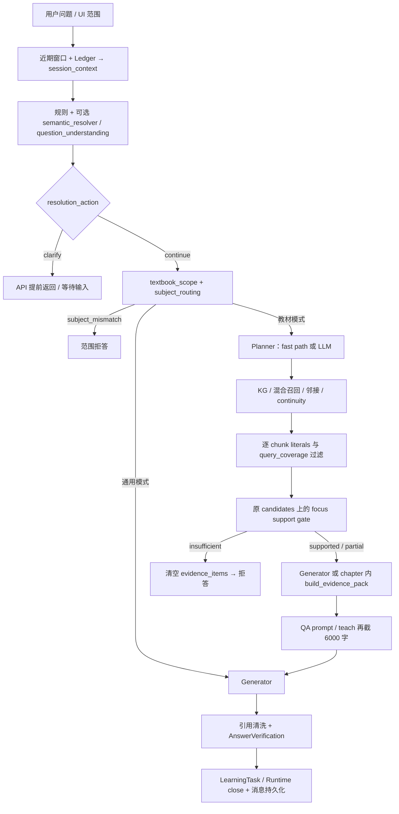
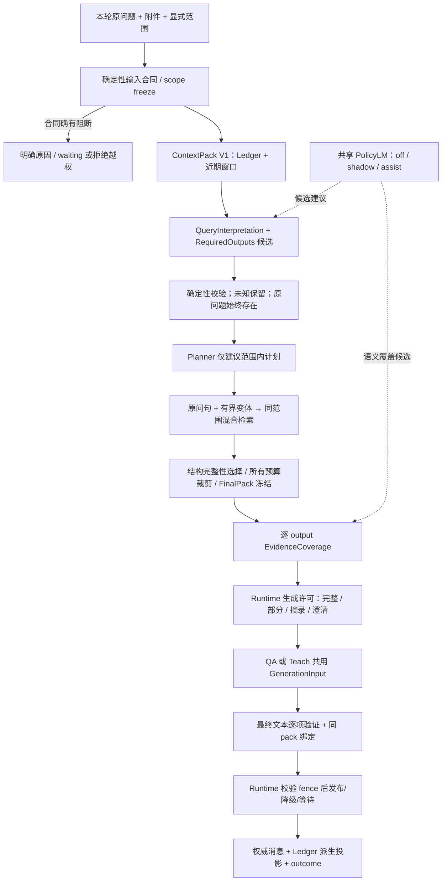

# Texa Semantic Runtime / Evidence Gate / Context continuity 设计与 Sol 实施交接

日期：2026-10-05（Asia/Shanghai）。状态：**架构提案，未实施、未批准生产启用**。对象：6-Sol。

本轮只阅读当前工作树并新增本文，不修改业务源码、AGENTS、配置、正式数据、索引或旧评测基线；没有运行真实模型或 Electron 验收。HEAD 为 `d36767f32690506b3697340bb6eaa948395dbcf0`，存在大量未提交修改，以下定位以当前工作树和函数名为准，不能用 HEAD 代表被审查版本。

沿用 [业务链路审计](business-chain-audit-2026-10-05.md) 对 A01–A06 的已确认结论及其隔离 witness；不重新宣称复现，不扩展为线上发生率。本文补充的是实现边界和演进方案。参考 [RuntimeEvent V1](runtime-event-v1.md)、[Policy V0](contracts/runtime-policy-v0.md)、[理解接口](question-understanding-interface-2026-10-04.md)。本文中的新 schema、函数、开关和阈值均是拟议合同，不代表当前已经存在。

## 1. 决策摘要

1. 撤销语义启发式的最终拒答权。前置阶段只冻结合法范围、验证输入合同；理解不确定保留原问句进入同范围检索。**未知不等于不支持，检索不到也不等于教材不存在该事实。**
2. 从 `retrieve_node` 移走最终 sufficiency 判定。建立唯一 `prepare_grounded_generation`：完成所有证据选择、裁剪、prompt 空间分配后冻结 FinalEvidencePack，计算逐项 coverage，再生成。所有正文入口复用这个边界。
3. 以同一个 `RequiredOutputs`、`pack_id`、`visible_text_hash`、本轮 E-id 映射贯穿 Gate→Generator→AnswerVerification→Runtime close。不是把旧 focus gate 换一个位置。
4. 在已有 Session Ledger 和 ConversationContextPack 上增量形成 **ContextPack V1**。语义理解看到最近 1 轮高保真片段、最多 5 轮有界结构，不接收整个 RuntimeState；生成器继续最多 2 轮原文投影。
5. 未来 0.8B 是共享 PolicyLM 角色，同一权重按 task contract 做局部判断。它提出候选，Runtime 校验和裁决；不增加 Agent loop，不自动扩范围、不写状态、不授予 verified。
6. 先修证据身份和发布真实性，再撤掉旧 gate 的错误阻断，再接 ContextPack 和 shadow PolicyLM。迁移单元必须能同时证明“减少错误拒答”和“不增加假成功”。

## 2. 当前 pipeline 与准确定位



图展示业务分支，不表示 API 中每一行的严格执行顺序。Runtime 接管路径另经 `textbook_tool → multi_step._generate_answer`，仍复用 generator，因而共享部分缺陷。

| 位置（当前源码） | 实际职责与问题 | 设计裁决 |
|---|---|---|
| `backend/services/session_context.py:838` `build_resolution_trace`；`:940`；`backend/api/chat.py:1355` | unresolved_reference、semantic/understanding clarification 会前置退出；不是“教材不支持”，但会让可检索问题失去检索机会；理解结果还参与 state_after 推进 | 分开 semantic uncertainty 与 deterministic missing input；模型 clarify 仅候选，不直接终止；保留澄清不推进语义状态 |
| `backend/services/textbook_scope.py:159`、`:200`；`subject_routing.py:138` | 在主检索前做少量 lexical/KG 查找；anchor/literal 缺失可变成 subject_mismatch 或通用模式。命名为 deterministic 并不使此语义推断具备确定性 | 只保留显式 mode、资源/权限/范围合同；学科建议与词法未命中降为 hint。auto+已选教材默认同范围检索，不能自动切通用 |
| `graph/planner.py:112`、`:265` | 同一 target_chapters 混合用户授权范围与模型建议，A03；Planner 同时承担 intent、章节选择、IO、模型调用 | 先分 `authorized_scope` / `retrieval_plan`，校验建议子集；本轮不重写整个 Planner |
| `graph/retrieval_node.py:705`、`:1168`、`:1199`、`:1276` | query / support_query / focus 各自理解问题；A01、A02。门槛把候选清空，A04；显式 focus 提前返回丢其他请求项，A06 | 共享 QueryInterpretation；保留召回排序与结构邻接，去除语义负证据硬过滤；最终 gate 后移 |
| `graph/evidence_pack.py:103` | 9000 字默认、1800 字/条、按 chapter 字符串限额；items 不含 clipped text，fingerprint 是原文；A04/A05 | 保留可控预算/去重/来源，增加精确可见正文绑定，按 book+index+chapter 身份限额；不能拿原文 hash 代替可见 hash |
| `graph/generator.py:138`、`:149`、`:318`、`:434` | has_textbook_evidence 先消费旧 support；legacy/compact 分别组 Pack；tool sufficient 可整体放行 | 只消费新的 GenerationInput 与 Permit；工具按 output 供给证据，不整体证明教材事实 |
| `graph/chapter_subgraph.py:110`、`:159`、`:167` | 再建 Pack，正文又 `content[:6000]`；部分 E-id 元数据对应正文可能已不可见 | teach 的 6000 限额必须进入 FinalPack 编译；此后禁止字符串二次截断。这是源码确认的 A04 同类暴露面，未单独实测 |
| `backend/services/answer_verification.py:37`、`:87`、`:143` | 分项抽取弱；生产 E-id/text 未连接；引用二字/符号重叠、LaTeX 存在不等价于事实或数学正确；tool_context_pack 未用于数值绑定 | 分开 output fulfillment / citation binding / factual support / mathematical checks；未知必须可表示 |
| `graph/conversation_context.py:81`、`:188` | 已有最多两轮、2800 字默认/5000 上限、历史非证据边界；seed 在解析后生成，不能充分帮助此前的理解；原文直接限长，无显式 span 完整性 | 复用渲染与边界；增加解析前 ContextPack builder 与解析后投影，原文片段带截断标记 |
| `backend/services/evidence_continuity.py:56`；`graph/retrieval_policy.py:18` | 上轮 sources 重用已存在；同 intent 可判无需新 facet；缺少版本时部分检查容许匹配 | 重用仅作候选加速，不继承支持度；本轮 outputs 变化必须重新 coverage；身份未知不能安全 reuse |
| `backend/services/decision/policy_contracts.py`、`policy_projection.py`、`agent_runtime/multi_step.py` | V0 候选冻结、严格 action_id、scope/fence/预算和 outcome 可复用；V0 不是通用语义任务 schema | 不修改冻结 V0 含义，新增 task-discriminated 合同与适配器 |
| `backend/services/decision/router.py:56`、`decision/semantic.py:31` | 已有规则能力路由与 LocalPrototypeBackend 的相似度排名/校准；它不是自然语言事实理解，也不是新的 PolicyLM | 保留工具候选准入与 shadow 比较基础；`no_safe_route` 只表示没有工具路线，不得升级为教材不支持或阻断普通同范围检索 |
| `backend/services/runtime_events.py:34`、`:65` | 内容受限 allowlist、best effort、有轮转，不是完整 Policy 训练轨迹 | 复用关联链，显式版本化扩展字段；不能直接塞 observation 正文或声称日志已足够训练 |

可复用资产：Canonical IR 邻接及版本身份、生产混合检索、来源定位、append-only 会话、Ledger rebuild/CAS、Context Eval 分层、模型角色工厂、受限数学工具、Runtime 的 owner/run fence/revision/receipt、Goal 的独立 origin。它们无需因 PolicyLM 而重建。

## 3. 目标 pipeline 与三层权责



### Pre-retrieval：合同与理解，不裁判教材事实

- **可 hard-block**：未授权资源、明确选择的资源/章节 ID 不存在、资源不可读且无同范围可用后端、明确 textbook mode 却未选择资源、空请求/协议无效、已由附件清单和任务合同证实缺少必要输入、旧 run/owner/权限失效。
- **不可 hard-block**：未知 intent、低 rule strength、口语、parser 失败、小模型超时、anchor 缺失、subject score、未解决指代。保持 scope，在有界候选中检索；若纯“它呢”无任何候选，记录 `no_resolvable_query` 的不确定性，不能伪造检索成功或教材缺失，转局部澄清。
- “按附表算”不意味着 parser 可直接认定附表不存在：先查本轮附件/明确来源；可能在教材中则允许同范围查找，仍找不到才报告缺输入。确定存在多个附件而无法选择，是 ambiguous，不是 missing。
- 用户范围必须冻结为稳定 ID 集、索引版本、answer_mode 和来源规则。明确自然语言限制可形成约束候选；无法唯一映射时使用已授权范围的安全交集，必要时澄清，不能扩大。
- `QueryInterpretation` 产生语义建议；当前原文、数字、单位、否定、条件始终保留。Runtime 验证原文 span 和候选 ID，不能把通过 schema 当作理解正确。

### Post-retrieval：只在最终可见 Pack 上评估支持

- 区分 `retrieval_health=ok/degraded/unavailable` 与 coverage。后端故障不是“教材不支持”。
- 先生成不可变 FinalEvidencePack；完成所有单条、章、总长、模型窗口限制。finalized 后任何证据文本/顺序/编号变化使 coverage 与 permit 失效。
- 对每个 output 的对象、关系、条件、结论/反证建立证据映射；多片段可联合支持，不要求每片段复述题目全部参数。
- PolicyLM 可提出覆盖与矛盾关系，Runtime 检查引用区间、版本、scope、依赖与决策合法性。引用存在不证明语义蕴含；无法判断记 ambiguous。
- Gate 限制**可以断言什么**，不只是二元拒答。partial 可回答支持部分；ambiguous 可给有引用的相关摘录/澄清，不能把候选结论包装为精确答案。

### Post-generation：结果验收与发布

- 对最终去 thinking、LaTeX 处理、引用清洗后的文本做验证，后续任何正文变更须重验。验证告知文字属于 Runtime 生成的控制附注，不当作答案事实重复验证。
- 分项存在、引用身份、引用与 claim 绑定、公式等价/条件/单位/数值计算分别记录。结构 passed 不得上升为 mathematical verified。
- Runtime 对照 gate 的 allowed claims、缺项与 permit，再合并后置结果；Gate supported 不是答案 verified。
- SSE 正文仍可流式显示为“生成中”，未经验证不得发出完整成功/verified；确定性失败可保留有明确状态的草稿，但不得提交为已验证结论。停止/迟到流不得提交旧版本。

## 4. ContextPack V1：schema、边界和生命周期

### 4.1 单一语义视图，两个投影

新名称 `texa.context-pack/v1` 区别于当前 `conversation-context-v1` 渲染版本。不是新的会话数据库，也不是整个 Ledger 的序列化。建议纯合同放 `graph/context_contracts.py`，应用投影放 `backend/services/context_pack.py`，生成渲染继续使用 `graph/conversation_context.py`。

以下为类型草案；实现用 strict schema，额外字段拒绝。范围校验的权威副本在 Runtime，模型接收的 scope 仅为只读语义投影。

```typescript
type ContextPackV1 = {
  schema: "texa.context-pack/v1";
  pack_id: string;                   // 内容+策略版本的摘要
  basis: { ledger_revision: number; through_turn_ref: string | null };
  current_request: { text: string; content_hash: string; truncated: boolean };
  recent_turn: null | {
    turn_ref: string;
    user: TextSlice[];
    assistant: TextSlice[];
    answer_status: "verified" | "unverified" | "degraded" | "unknown";
  };
  active_topic: null | { entity_refs: string[]; status: ResolutionStatus };
  active_entities: Entity[];         // <= 12
  recent_relations: Relation[];      // <= 8
  open_threads: OpenThread[];        // <= 4，只是对话未决问题
  compact_turns: CompactTurn[];      // <= 4，加 recent 总计 <= 5
  summary: null | {
    text: string; source_turn_refs: string[];
    status: "extractive" | "reviewed" | "unverified";
  };
  scope: {
    scope_ref: string; answer_mode: string;
    subject_ref: string | null; book_refs: string[]; chapter_refs: string[];
    source_policy: string;
  };
  uncertainty: { code: string; candidate_refs: string[] }[];
  completeness: { omitted_turn_count: number; truncated_fields: string[] };
};
type ResolutionStatus = "resolved" | "ambiguous" | "unknown";
type TextSlice = {
  text: string; source_ref: string; start: number; end: number;
  full_source_hash: string; exact: boolean;
  omitted_before: boolean; omitted_after: boolean;
};
type Entity = {
  id: string; label: string; kind: string;
  mentions: { turn_ref: string; role: "user" | "assistant"; span_ref: string }[];
  first_turn_ref: string; last_turn_ref: string;
  status: ResolutionStatus; superseded_by: string | null;
};
type Relation = {
  id: string; subjects: string[]; predicate: string; objects: string[];
  source_refs: string[]; origin: "user" | "assistant" | "derived";
  status: ResolutionStatus; factual_authority: "none";
};
type OpenThread = {
  id: string; question_excerpt: string; source_ref: string;
  entity_refs: string[]; status: "open" | "needs_clarification";
};
type CompactTurn = {
  turn_ref: string; entity_refs: string[]; request_excerpt: string;
  relation_refs: string[]; unresolved_refs: string[];
};
```

`answer_status=verified` 只是历史状态提示，不赋予历史事实证据权。Entity/Relation 的 origin 不能丢。OpenThread 不等于 Runtime task、不持有 active run，也不允许自动恢复 Goal。不存在的数据填 null/unknown，不能从 Assistant 的猜测补成用户已确认条件。

默认预算建议：语义 pack 文本字段总计 4000 字符，上限 6000；最近轮约占 60%，其余优先结构字段，summary 最后；这是离线起点，非 0.8B 能力承诺。真正接模型时以其 tokenizer 同时限输入 token 并预留输出空间，超限删低相关项，不砍必需范围/边界字段。不完整原问题不用于完整 outputs 判定；保留原文独立检索，标 extraction partial。

最近轮优先保留用户原文、被指代的 Assistant 列表项/公式及上下句，TextSlice 保持逐字一致；不声称限长前缀是高保真全文。超长内容用有边界的摘录/必要摘要并标记缺口，不能截断 LaTeX、否定或条件。最多 5 轮是上限，不是每次固定装满。

**理解投影**可使用 1–5 轮；**生成投影**继续最多 2 轮相关原文 + 引用的结构信息，并沿用历史非证据声明。新独立问题不继承旧主题/约束；若是否独立尚不确定，只提供有来源的备选，不默认继承。不把 run_id、budget、SSE、job、工具全文放进 ContextPack；这些只留内部 envelope。

### 4.2 生命周期

1. 准入时读取权威消息近期窗口 + 同 revision Ledger；Ledger 缺失/陈旧才按现有路径 rebuild。模型不读取全历史。构建 `CP-before`，此时尚未采用本轮理解结果。
2. 从 CP-before 与原问题构建候选实体、当前原文 spans；运行当前 resolver 或 PolicyLM，返回 candidate interpretation。
3. Runtime 验证候选、保留原问题条件，生成 `CP-resolved` 的派生投影；这一步不隐式写 Ledger。歧义保留候选集合，不以最高分强猜。
4. 写入用户消息后，沿现有 ledger revision/幂等边界提交已接受的 state_operations；clarify 不推进 topic/constraints。明确用户纠正使旧实体/关系 superseded；模型建议不得删除已确认事实或输入。
5. 回答发布后，新增 Assistant artifact 只做引用对象，来源为 assistant、非教材证据。重试/恢复用同 turn 身份，重复完成不得重复实体或 turn。
6. scope 切换清除不兼容继承约束与 active evidence；保留权威历史。恢复时核验 ledger revision、scope、source version；不匹配则重新派生，不能混用旧 pack。
7. 更远历史只保留有来源的结构摘要；默认从 Ledger 抽取，不新增后台模型总结任务。某远程 turn 被明确点名时通过权限校验定点读取并计入同一预算；取不到就 unknown。

证据连续性是独立内部对象 `EvidenceContinuityRef`，包含 book/index/chunk/content hash，不能把正文塞进 ContextPack。reuse/delta/full 仅是检索策略；本轮重新 hydrate、scope/version 校验、裁剪、coverage。旧 `supported` 不继承，缺失版本不默认安全；E1 在不同 pack 中互不等价。

## 5. RequiredOutputs / FinalEvidencePack / EvidenceCoverage 合同

### 5.1 RequiredOutputs 是语义任务合同，不是关键词清单

```typescript
type RequiredOutputsV1 = {
  schema: "texa.required-outputs/v1";
  contract_id: string; question_hash: string; interpretation_ref: string;
  extraction: "complete" | "partial" | "unknown";
  uncovered_question_spans: { start: number; end: number }[];
  inputs: {
    id: string; kind: "parameter" | "attachment" | "assumption" | "source_fact";
    origin: "user" | "source" | "tool";
    source_ref: string; status: "provided" | "missing" | "ambiguous";
  }[];
  outputs: {
    id: string; request_spans: { start: number; end: number }[];
    description: string; entity_refs: string[];
    kind: "definition" | "enumeration" | "comparison" | "explanation" |
          "formula" | "derivation" | "numeric" | "application" | "open_answer";
    critical: boolean; dependencies: string[];
    obligations: {
      id: string; role: "object" | "relation" | "condition" | "conclusion" |
                        "method" | "list_completeness" | "unit";
      description: string; source_policy: "textbook" | "user_input" | "tool";
    }[];
    verification_methods: string[]; // 白名单，含 unsupported/unknown 路径
  }[];
};
```

确定性 parser 可抽取编号/表达式/单位/附件 ID，不能凭“有一个灵敏度词”断言 outputs 完整。语义抽取候选必须保留未消费原句；不允许用最大 4 dimensions 截掉第 5 问。初始上限建议 16 outputs、每项 8 obligations，超限返回 partial 并建议拆分，不静默截掉用户交付项。模型/规则声明 complete 仍是候选，未编号复杂多问无可校验分项时保持 partial，整体不能 verified。

QueryInterpretation 的最小字段：`original_query_hash, reference_status, entity_spans/candidate_refs, intent_hints, required_outputs_ref, retrieval_variants[], unresolved_spans[]`。一个实例传给 Planner、Retrieval、Gate，禁止各层重新抽 focus 再覆盖语义合同。变体只帮助检索；回答针对原问题和已接受指代，不针对改写问题。

### 5.2 最终可见证据必须有唯一身份

```typescript
type FinalEvidencePackV1 = {
  schema: "texa.final-evidence-pack/v1";
  pack_id: string; scope_ref: string; outputs_contract_id: string;
  budget_policy_version: string; renderer_version: string;
  rendered_text: string; rendered_hash: string;
  items: {
    evidence_id: string;             // pack 内 E1...；外部键为 pack_id+E-id
    source: { book_id: string; index_version: string; canonical_hash: string;
              chunk_id: string; block_ids: string[]; chapter_ref: string };
    visible_text: string; visible_hash: string;
    segments: { source_start: number; source_end: number;
                visible_start: number; visible_end: number }[];
    source_content_hash: string;
    completeness: "complete_unit" | "excerpt" | "condition_missing";
  }[];
  omissions: { source_ref: string; reason: string }[];
};
type EvidenceCoverageV1 = {
  schema: "texa.evidence-coverage/v1";
  pack_id: string; rendered_hash: string; outputs_contract_id: string;
  status: "supported" | "partial" | "missing" | "ambiguous";
  by_output: {
    output_id: string;
    status: "supported" | "partial" | "missing" | "ambiguous";
    obligations: {
      obligation_id: string;
      status: "supported" | "partial" | "missing" | "ambiguous";
      refs: SupportRef[];
      method: "structural" | "exact_source" | "deterministic_math" |
              "semantic_assist" | "unknown";
      assurance: "deterministic" | "semantic_provisional" | "unknown";
      reason: string;
    }[];
  }[];
};
type SupportRef = (
  { namespace: "evidence"; evidence_id: string;
    visible_start: number; visible_end: number } |
  { namespace: "user_input"; input_id: string; content_hash: string;
    start: number; end: number } |
  { namespace: "tool"; receipt_ref: string; result_hash: string;
    input_binding_hash: string; result_field: string }
) & { relation: "supports" | "contradicts" | "context_only" };
```

正文只在本轮受控内存/已有授权任务资产中使用；不加入普通 sources/UI/RuntimeEvent 日志。`source_content_hash` 用于溯源，`visible_hash` 用于当前支持验证，不能互相替代。E-id 去重按 `(book_id,index_version,chunk_id)`，章限额按 `(book_id,index_version,chapter_ref)`；若相同正文跨书合并，必须保留所有来源身份与 scope。

SupportRef 三个命名空间不可混用：用户参数只能满足题设输入义务，不能证明教材定理；工具 receipt 只能支持其已绑定的运算/本地业务事实。工具和用户输入也须冻结为 generator 实际可见的投影，其 hash 计入 GenerationInput 摘要；不可引用被工具结果压缩丢掉的数值。ContextPack/Assistant 历史永远不是第四种 support namespace。

先按 output 选择完整定义、条件、表头/行、例题题干和公式单元，再分配额度。使用 Canonical IR 单元边界，不截半个公式后仍称完整。最多一次对**已经召回的候选**做确定性重排/重新分配；不添加动态多轮补检索。最终冻结前的 pack 都是 draft，绝不记 supported。预算仍放不下时输出 partial/missing 和 `budget_omission`。

`rendered_hash` 应对应 generator 实际证据 section 的精确 UTF-8 内容；prompt 编译器先预算 system/原问题/工具/上下文/输出 token，EvidencePack 使用剩余额度。header/metadata 若用于 coverage 就必须出现在可见证据中并计预算。调用适配器核验 messages 中 evidence section 与该 hash 一致，不允许适配器/模板继续裁剪。若供应商窗口不足则重新编译再 gate，不能静默截断。

### 5.3 Coverage 语义和 Runtime 许可

| 状态 | 定义 | Runtime 可授权行为 |
|---|---|---|
| supported | 每个必需 obligation 在最终可见证据/合法输入中有明确绑定，条件和依赖满足，未决对象/冲突已处理 | 允许针对所有 outputs 生成；semantic_provisional 仍不是最终 verified |
| partial | 至少一部分已支持，另外部分确定缺失/只覆盖子项，且不靠歧义掩盖 | 生成支持部分+逐项缺口；完整交付 false，task degraded；必要输入缺失则等待 |
| missing | 在本次最终 Pack 内无可用支持，或某关键依赖确定不可用 | 返回本次检索/资料缺口；不称“教材绝无此内容”；允许用户补充输入/显式更改模式 |
| ambiguous | 对象未决、证据冲突、抽取不完整、语义蕴含未知，无法可靠判定 | 同范围继续已安排的检索后，局部澄清或只展示可绑定摘录；不猜对象、不输出精确结论 |

聚合规则：所有必需项 supported 且 extraction 完整才 overall supported；存在未解决的 critical ambiguity 优先 overall ambiguous，同时保留已支持项；其余有支持有缺口为 partial；全部确定缺失为 missing。`unavailable` 单独在检索健康字段，不塞进 coverage 四态。通用回答/纯本地进度工具没有教材义务时 gate 为运行层 `not_applicable`，不得伪造 supported coverage。

`GenerationPermit` 由 Runtime 生成：`input_hash, pack_id, contract_id, allowed_output_ids, allowed_claim_mode(full/partial/quoted_context), forbidden_exact_output_ids, missing_items, verification_ceiling`；与 owner/run/revision 的绑定留内部，模型只接收内容约束。证据有反证可支持“纠正用户前提”这个 output；用户前提不是 required fact，不能因教材否定它就判 missing。

**无小模型时的诚实边界**：字符串匹配、排名或角色 metadata 不能证明一般语义蕴含。确定性可处理精确来源摘录、完整结构列表、受限公式/工具输出及已标注关系；其余标 ambiguous/semantic unknown，允许 `quoted_context` 或有明确限制的部分回答，不把 unknown 做成全局拒答，也不标 verified。把相关内容交给生成模型讨论与宣称已证明支持是两件事；最终未知状态必须保留。若产品需要更高完整解答率，使用受控复杂 case 强模型辅助，仍不把其自评当真值。

### 5.4 A01–A06 的共同验收例

问题：“16. 写出二阶测量系统的方程、灵敏度、固有频率、阻尼比和阶跃响应。”

应形成 `o1 方程 / o2 灵敏度 / o3 固有频率 / o4 阻尼比 / o5 阶跃响应` 五项；16 是题号 metadata。有初始条件/参数则存 user_input 依赖；公式证据不要求重复参数。假设最终 E1 有方程、E2 有前三个参数定义、阶跃响应片段因预算未入 Pack：o1–o4 supported（按实际绑定方法标 assurance），o5 missing，整体 partial；不能因“灵敏度”命中标整个任务成功。

如阶跃响应公式只在原始 chunk 的第 1801 字之后，则其 refs 不能建立；全量候选中的支持不可继承。PT100 与 PT1000 用明确型号边界核对；型号出现在用户问题只约束特定型号事实，不排除通用方法。

若生成 `$U=I/R$` 引用支持 `$U=IR$` 的 E2：E2 存在仅通过 citation identity；符号相同不能通过 formula equivalence。多次引用 E2 要逐 occurrence 检查 claim，不只检查首次出现前 220 字。精确数值要求与本题输入、表达式、单位和结果绑定的计算 receipt；别题 tool success 无效。

## 6. AnswerVerification V2 与发布合同

建议沿原文件演进，新增版本化结果而非第二验证服务：

```text
VerificationResultV2
  input_ref = {contract_id, pack_id, permit_hash, final_answer_hash}
  per_output[] = {
    output_id, fulfillment: complete|partial|missing|unknown,
    checks[]: {kind, status: passed|failed|unverified|not_applicable,
               answer_span_refs, evidence_refs, tool_receipt_ref, reason_code}
  }
  structure_status / citation_status / factual_status / math_status
  complete_delivery: boolean
  release: verified|unverified|degraded|blocked
```

- 文本事实：精确引用、正确来源及有验证依据的关系可以确定性核验；自由改写的一般蕴含可能 unverified。模型裁决通过只标 semantic_provisional，不生成确定性证明。
- 数学：仅在受限解析/等价/求导积分/代入等已有工具可覆盖范围内验证，必须检查定义域、假设、操作和本题输入。随机代入可找反例，不能当全域等价证明。公式无法解析记 unverified，不执行任意 Python。
- 数值/单位：使用本题规范化输入摘要、表达式摘要、结果、精度/容差、单位变换与 tool receipt 逐项核对。单位可以合法转换，不要求原单位字符串出现；阈值由计算类型定义，模型不得指定。
- 引用：合法 E-id + 当前可见正文 + claim 对齐分别检查；缺映射是合同损坏，不能跳过通过。教材模式没有来源不得 `not_applicable` 掩盖；unknown E-id 清洗后仍保留验证失败事实。
- 新增 unsupported 结论即使不在 RequiredOutputs 中也需检查；否则模型可通过完成五个请求项后附加错误公式逃逸。claim 抽取不完备则 completeness unknown，不能完整 verified。
- Runtime 只在每个必需 output 完整、必要检查 passed、scope/fence/pack 身份一致时赋 verified。语义 provisional 可以交付但结果 unverified；缺必需项为 degraded；关键输入缺失沿现有 waiting；协议/身份损坏 blocked。新 release 字段映射到现有 task status，不立即迁移状态枚举：verified→completed，其余可交付→degraded，关键输入→waiting_for_input，执行失败→failed。
- `verification.passed` 旧布尔不能继续把 degraded 当完整成功；兼容投影必须给出 full_success=false。`completed` 的 UI 文案也不能等价于“数学正确率保证”。

## 7. regex / focus / support 处理清单

| 现有部分 | 保留 / 降级 / 移动 / 删除 | 具体规则 |
|---|---|---|
| 输入编号、LaTeX token/定界符、单位格式、显式资源 ID | 保留 | 只证明结构合法；数字语义身份不从 substring 推定 |
| `_retrieval_query_for_intent`、intent classifier | 降级 | 提供 query variant/软路由；始终保留原问句召回，错分 intent 不清空候选 |
| `_extract_query_focus`、`_FOCUS_TERM_ALIASES`、`_focus_coverage`、relationship heuristic | 降级后退出 gate | 迁移期仅作排序/诊断 baseline；禁止以缺匹配拒答或证明 supported；禁止继续加教材专属 patterns |
| `_supports_query_literals` | 删除其全 chunk 一票否决用法 | 用已确认的 identifier/label 结构匹配辅助过滤确定不兼容的型号事实；对通用方法不施加全部参数出现要求 |
| 题干/公式/列表/表格/例题邻接与角色排序 | 保留 | 结构恢复和召回启发式，不是事实充分证明；避免父标题隐形支持 |
| `_assess_evidence_support` 与 `evidence_items=[]` | 移动并替换 | 旧函数只保 shadow diagnostic；正式裁决用 final pack × outputs；不因 heuristic insufficient 清空候选 |
| scope 内 `_definition_anchor` / literals / subject suggestion | 降级 | 提示/检索变体；删除自动 subject_mismatch/通用切换的拒答权 |
| 当前 semantic/understanding `clarify` | 降级 | semantic uncertainty 候选；由 Runtime 根据同范围检索结果与真实缺输入选择澄清 |
| `derive_required_outputs` | 保留结构部分，替换语义权威 | 通用 fallback output 不等于完整分项；未覆盖原句显式保留 |
| `_citation_semantically_supported` | 删除最终通过权 | 可保低成本诊断，不能以 bigram/符号交集判事实或公式正确 |
| 前一轮 `active_evidence_support` | 删除继承裁决权 | 可作历史诊断，reuse 后必重验本轮 final pack |

## 8. PolicyLM：API、任务族、权限与渐进接入

### 8.1 接口和模型角色

```text
PolicyService.propose(PolicyRequest) -> CandidatePolicyDecision

PolicyRequest = {
  schema: texa.policy-task/v1,
  task: {kind, version},
  observation: task-specific projection,
  context_pack: task-specific subset | null,
  allowed_candidates: Runtime-generated bounded values,
  output_schema_version
}
CandidatePolicyDecision = {
  task_kind,
  status: proposed|ambiguous|unknown,
  selection_or_annotation: task-specific union,
  confidence: optional uncalibrated score,
  reason_code: enum
}
```

内部 envelope 另持 observation ID、scope digest、run/revision、deadline、预算 reservation、模型/提示词版本。模型无需看到这些执行控制字段。禁止自由 rationale/chain-of-thought 持久化；unknown/ambiguous 是合法成功返回，不算 provider failure。

| PolicyTask | 最小输入 | 输出候选与准入限制 |
|---|---|---|
| query_resolution / reference_resolution | 原问题、CP 近期对象及 spans | 选择已有 entity/ref 或原句区间；ambiguous 可返回候选集合 |
| intent_required_outputs | 原问题、已接受指代、任务标签白名单 | 原句 span + output kind + 义务候选，未消费 spans 显式列出；不增加题设 |
| query_rewrite | 原问题、已解析 refs、术语候选 | 有界改写用于附加召回；原查询并行保留；数字/单位/否定/条件改变则拒绝变体；禁止改变权威请求 |
| context_relevance | 原问题、<=5 turn/实体候选 | 返回 relevance 排序 ID；不能删除 Runtime 必须保留的 scope 或最近明确纠正 |
| evidence_coverage | 一个 output/obligation + final 可见证据候选 | E-id/span 的 supports/contradicts/context_only/unknown；不直接授予 verified |
| failure_classification | 受限 error code/阶段/结果摘要 | 固定 taxonomy；不能宣称用户已授权 retry 或自动收费 |
| candidate_action_ranking / next_action | PolicyObservation + Runtime 已准入 actions | 只选/排序 ID；工具参数、审批、预算不由模型创造 |
| goal_context_state | 已确认 Goal 契约的有界投影、近期 outcome | 进展/缺口/建议候选；完成、暂停、变更由 Runtime 合法转换处理 |

“AllowedCandidates”不要求每种任务都只能输出 action_id：action/reference 是有限 ID 选择；extract 是原文区间标注；rewrite 是受限派生文本；coverage 是可见区间关系标注。它们属于不同 discriminated union，不能给宽泛 `dict` 绕过 V0 的冻结动作合同。query_rewrite 不能证明自然语言等价，因此无论校验多严格，都只是附加召回。

通过 `llm` registry/factory 新增独立 `policy` 角色；不在业务分支写供应商判断。一个加载的端侧模型共享推理服务，不等于每请求都运行全部 tasks。独立角色未配置时用当前路径，**不得自动回退到回答模型**。现有两个理解适配器迁移为兼容 wrapper，由统一调度器选一个调用入口，避免同时重复调用。

### 8.2 Runtime 永久保留的权力

scope/权限/confirmation、预算与超时、run fence/owner/revision、幂等和事务、破坏性写入、合法状态转换、最终 verified、任何不可逆执行。模型返回内容只能作为数据，不可成为工具指令或 Ledger mutation。

准入顺序：严格 parse（重复 key/额外字段拒绝）→ task/enum/span/候选 ID → scope 和冻结输入摘要 → 当前 run/fence/revision → 预算 → 采用候选或规则 fallback → 执行前再次检查。stale run 不执行 fallback；schema 通过不表示语义正确。所有可能扩大范围的建议拒绝，只有用户明确改变范围才能新建合法快照。

shadow 也耗资源，应独立受限但计入本轮总额度。初始建议最多 1 个理解调用 + 1 个有界 coverage batch；复杂分批也必须共享额度，未处理项 unknown。action selection 可替换已有一次选择，不增无限循环；0/1 action 保留 forced/no-model 路径。任务 taxonomy 是能力目录，不是执行清单。

强模型 fallback 仅在复杂多问、持续多候选歧义、证据冲突等显式条件触发，最多一次，且 Runtime 有预配置的角色/数据发送授权/费用预算；不用模型自己的低 confidence 独立触发。不满足条件就保留 unknown/局部澄清，不静默收费。超时、断网、无模型均不剥夺同范围检索机会。

### 8.3 Observation → candidate → decision → outcome 与 Dataset

- 区分 `candidate_decision`（模型建议）、`accepted_decision`（Runtime 采用）、`outcome`（实际运行/用户反馈）。shadow 分歧不是模型错误标签，规则也不是金标。
- 沿现有 RuntimeEvent `context/decision/execution_result/feedback` 建 parent 链；新增有限字段如 `policy_task_version, observation_ref, decision_ref, final_pack_hash, output_contract_hash, candidate_set_hash, comparison_code` 需单独 allowlist/schema 兼容审阅，当前 writer 不支持任意增加字段。
- 事件只写 hash/数量/版本/枚举/安全引用，不写 CP 正文、教材正文、prompt 或工具输入。SQL Runtime 的 authoritative decision/outcome 事务仍是执行凭据，best-effort event 不能作为执行准入或完整 replay 依据。
- Dataset 建立单独受控导出：用授权业务资产引用重建、脱敏、人工审阅并冻结 observation/candidates/decision/outcome 的完整版本。原始可见 excerpt 必须可重建且 hash 相符，否则缺记录样本排除；不能拿新索引补成当年的证据。
- `user_feedback=unknown` 不补正向标签；任务完成不是 decision_correct。保留 negative、歧义、超时、fallback、被拒候选及 outcome 缺失案例标识，分别统计，不把不完整日志当失败或成功。
- A10 的旧冻结 source digest 不修改；本轮行为变化需要新候选 manifest、独立差异评审，再追加新合法基线。旧 20 个 gate failure 不能以改 hash“修复”。

## 9. 具体接线与两套执行路径

### 9.1 文件与依赖方向

| 模块 | 最小改动入口 |
|---|---|
| `backend/api/chat.py` | 调用应用层 request preparation；不继续承载新语义/coverage 业务规则；沿原 SSE/任务准入和响应 DTO |
| `backend/services/context_pack.py`（新）+ session_context/session_ledger | 构建解析前投影，兼容 resolved_query/speech_act/state_operations；按 revision 提交已接受变更 |
| `graph/context_contracts.py`、`graph/evidence_contracts.py`（新） | 纯合同与校验，无 FastAPI/存储/模型 IO；graph 与 services 共用，避免 graph 反向依赖 API |
| `graph/planner.py` / `graph/state.py` | 接受 immutable interpretation/outputs/scope refs；retrieval_plan 单独字段；禁止模型覆盖授权 scope |
| `graph/retrieval_node.py` | 返回 scoped candidates + retrieval health；保留 KG/混合/邻接与候选发布用依赖注入；不提前宣布 sufficient |
| `graph/evidence_pack.py` + `graph/evidence_coverage.py`（新） | 编译最终可见 pack、hash/map、按 output 评估；coverage 接收已校验的语义候选，不自己创建模型 client |
| `graph/generation_input.py`（新） | `prepare_grounded_generation(request, candidates, prompt_profile, tool_inputs)` 生成 frozen GenerationInput/permit；唯一组装边界 |
| `graph/generator.py` / `chapter_subgraph.py` | legacy/compact/teach 共用 GenerationInput；禁止私自 re-pack 或再截断；所有内容发布复用 finalize 验证 |
| `backend/services/answer_verification.py` | V2 分项 checks，接收 final pack map 与数学 receipt；复用现有受限工具，不以 API DTO 依赖 graph |
| `agent_runtime/textbook_tool.py`、`multi_step.py`、decision projection | 工具输出是版本化候选/pack artifact；主 generator 从同一编译器冻结本轮 pack。不得沿用工具旧 support 或在 tool 内裁剪后错误声称完整；V0 冻结输出合同若改变需新版本适配 |
| `backend/services/learning_task.py`、Goal service/runner | 将 contract/pack/verification ref 贯穿 checkpoint 与 close；Goal 仍独立 origin，关键输入等待/审批不被模型绕过 |
| `llm/configuration.py` / factory / registry | policy 独立角色，复用能力注册/凭证保护，不默认调用 answer role |
| `evaluation` / RuntimeEvent | 新行为候选基线和 task 级 trace；保留旧契约和审阅历史 |

编译服务应返回 immutable 值而非偷偷修改 state；LangGraph 节点显式返回更新。`GenerationInput` 含 context 投影、原问题、outputs、FinalPack、typed tool inputs、coverage、permit。模型调用前验证输入摘要，结束后验证同一个对象，不能重新从全量 candidates join。

teach/summarize 的章节准备保持 `chapter` 先于正文 generate；在调用教学 LLM **之前**运行 gate，教学产物不是下一次生成的教材证据。摘要缓存/quiz appendix 不能绕过同一引用与后置检查。当前用不到的后台出题逻辑不趁机重构。

Runtime 的 `has_generation_support` 改为逐 output 权威来源匹配：进度数据库能支持进度问题，计算工具能支持绑定的计算，均不能支持教材定义。一般 QA 显式不要求 textbook coverage，但其数学/required inputs 验证仍适用。

### 9.2 过渡期：无 0.8B

```text
冻结 scope / 输入合同
→ CP-before + 当前 resolver（规则仅提候选）
→ 保留原句；结构 parser + conservative outputs（不完整明确标记）
→ 原 Planner/fast path，建议范围取授权交集；失败仍用原句
→ 有界原句/已有变体同范围召回与结构邻接
→ 最终 prompt 预算编译 + frozen Pack
→ deterministic coverage（无法证明则 ambiguous）
→ 支持项回答 / 部分回答 / 有来源摘录与局部澄清
→ 逐项后验 → Runtime 如实发布
```

不为了“零拒答”改成无限生成，不为了“零风险”把全部 unknown 变成硬拒答。无语义模型的能力限制必须在结果状态和评测中可见。原 Planner 仍可能调用现有回答角色：本阶段不增加这种调用，失败降级为原问句召回，不把它当新的 Policy 角色自动 fallback。复杂输出抽取若复用现有 Planner 响应，需独立版本字段并标 semantic_provisional，不能以规划 JSON 证明完整覆盖。

### 9.3 未来端侧：先 shadow 再按 task 接管

```text
相同 CP / scope / candidates
→ Rule/current baseline 与 shadow PolicyLM 比较（shadow 不写状态、不选工具）
→ task 分层校准及人工审阅
→ assist 只接管通过门槛的任务族
→ ambiguous/unknown/无效返回保留规则和原句召回
→ 必要且已授权复杂 case 一次 stronger-model proposal
→ deterministic validation / FinalPack gate / 后验 / Runtime close 不变
```

不一次替换所有 tasks。先 reference/intent，再 outputs/relevance，再 coverage，最后评估 action ranking/Goal state。coverage task 可以逐 output 看较小的完整证据单元，但候选必须来自冻结 Pack；分批没看到必要联合证据时只能 unknown，不把局部判断汇总成 supported。

## 10. 分阶段 migration plan 与回滚

每阶段单独 PR/交接包；以下是未来执行计划，不是本轮修改授权已执行。涉及数据库结构、索引切换、依赖重装或付费/数据出境，须按 AGENTS 另做具体方案及授权。本设计优先通过纯合同、内存对象和现有 checkpoint 扩展落地，不需要教材重建或数据库迁移。

| 阶段 | Sol 交付与依赖 | 阶段完成条件 | 回滚边界 |
|---|---|---|---|
| M0 固定见证 | 保存当前工作树相关文件摘要，复用 A01–A06 witness；为 scope 自动切模式、teach 6000 裁剪、五项 outputs 加入口级 case | 新候选冻结；不改旧 gold/hash；明确每个 case 预期 | 只增加测试/设计，无生产变化 |
| M1 身份闭环 | FinalPack/visible map + 所有生成入口唯一编译器；A05 fail-closed；兼容旧 sources 只做 UI | QA legacy/compact、teach、Runtime 都消费同一 pack；截断后 map/hash 一致；missing map 不通过 | 可回到上一安全适配器；旧无 map checkpoint 标 unverified 并重建，不能恢复假通过 |
| M2 输出与后验 | RequiredOutputs V1、Coverage V1 四态 shadow、Verification V2；先完成逐项数学/citation 真实性 | A04–A06 witness 转成预期失败/降级；unknown 不能 full_success；上线前覆盖所有调用入口 | 保留旧 wire 投影，不保留旧宽松判定；无能力项保持 unverified |
| M3 gate 原子切换 | 撤销 scope lexical/semantic 硬拒；Planner scope clamp；旧 literals/focus 仅排序；final gate 正式接管 | A01/A02 等价问法可检索，A03 不越界，同时不存在新的假 verified | gate、generator、verifier 按同版本 bundle 切；不得出现“旧 gate 已关、新 gate 未启用”窗口 |
| M4 continuity | CP-before/CP-resolved、1–5 轮理解投影、2 轮生成投影；revision/纠正/独立问题/版本失效 | 局部指代与模糊状态正确，20/40/80 层级负例不回归，历史不作事实证据 | 退回原 2 轮 renderer；保留新的 scope/Pack/verification 安全边界，不回滚权威会话事件 |
| M5 Policy shadow | 独立 policy role、task union、统一 adapter、comparison 与有限 trace；更新新候选 manifest | off 零 client IO、shadow 零业务差异、超时/停止安全；新基线审阅通过 | 关闭 policy tasks；不动 Rule 路径，不改 Runtime action 权限 |
| M6 分 task assist | 按本节矩阵进行真实模型校准，reference→outputs→coverage；复杂 fallback 显式配置 | 各任务/长度/负例门槛独立满足，Electron 可降级运行 | 逐 task 退 shadow/off；旧 run 继续冻结版本或 fenced 中断，禁止中途换合同 |

M1–M3 构成最小安全发布单元；M1/M2 可先以内测/shadow 部署，但不能声称目标架构已落地。M4 可独立开发，依赖 M3 安全边界上线。M5 不阻塞无模型过渡路径。

版本与恢复：checkpoint 存 scope/contract/pack/compiler/verifier 版本及摘要；内存可见正文在进程丢失后按冻结 index/chunk/span 重建并验 hash。重建失败不使用新索引同名章节冒充，返回 checkpoint stale 并要求在新版本下重新执行。禁止自动重跑已收费调用；原 task/turn 与 fence/幂等契约保持。历史已完成消息不因新 verifier 重写。

回滚不能等同于重新开启已知不安全的 A04–A06 passed；紧急止损可停用受影响的精确答案发布、保留检索与带状态摘录。不得回滚数据库、教材、用户记录来适配代码开关。

## 11. 测试矩阵、命令与发布证据

### 11.1 必须独立报告的样本族

| ID | 样本与故障注入 | 必须断言 |
|---|---|---|
| S01 | 前置/后置定义、语序、口语、同义表达、无标准问句 | 相同 scope 均进入检索；允许候选排序不同，必需事实最终覆盖不丢；低 confidence 不拒答 |
| S02 | `16.` 题号；PT100/PT1000；用户参数跨片段；题号与年份并存 | 标签不变参数；型号事实不能串；方法证据不需包含所有参数 |
| S03 | Planner 提示/返回别章、未知章节、空章节；subject anchor 缺失 | 不扩大 scope、不自动切通用；原问题同范围检索；明确资源不存在才 hard-block |
| S04 | 五项无编号多问、一个 focus 命中、长问题超过抽取额度 | outputs 不静默丢项；extraction partial 禁止 complete_delivery |
| S05 | 事实在1800字后/最后一条；多书同名章；表头与条件跨块；teach超过6000 | Gate 精确依据实际 messages 可见文本；丢事实即降级；不靠增加预算使样例侥幸通过 |
| S06 | 生产 build→prompt→verify，E-id 元数据无 text、跨 pack E1、同 E 多次引用 | 缺映射/旧 pack 不通过；每个引用 occurrence 检查；全量 raw text 不能补救 clipped 支持 |
| S07 | U=IR/U=I/R；定义域不同等式；单位换算；工具算另一题；receipt 成功但结果改写 | 数学与结构分离，绑定本题；无法判等为 unverified；只有授权受限解析 |
| S08 | 正确前提/错误前提/是否成立配对 | 反证可入 Pack，可支持纠正；不把 C04 未知根因直接归类已解决 |
| C01 | 它/这个/那东西/刚才那个；同轮显式新对象；多个候选 | 最近信息高保真；unknown/ambiguous 合法；不强猜、不因解析失败称教材不支持 |
| C02 | 第2项/前者后者；用户纠正；返回旧 topic；独立新问 | 被引用 artifact 可定位但不是证据；纠正优先；独立问题不继承旧约束 |
| C03 | 上一轮 Assistant 错误、历史嵌入指令、伪造引用 | 历史只作带引号的数据；不能覆盖本轮事实/scope；不进入 EvidencePack |
| C04 | 1/2/3/5轮局部连续性，20/40/80轮完整会话，超长上轮 | pack 大小有界，不随会话线性增大；保留最近否定/公式；窗口/摘要缺口显式 |
| C05 | reuse/delta/full；同 intent 换 facet；切书/换索引/未知版本 | 每轮重做 coverage；版本未知不继承 supported；失效只清派生状态 |
| R01 | graph同步/SSE、legacy/compact、teach/summarize、Runtime/Goal | 共用合同且无旁路；chapter 先于正文；Goal origin 独立 |
| R02 | 停止→恢复、双提交、late Policy response、scope/revision 变化 | 旧决策不执行；恢复不重写用户消息；无自动重付费/重写 |
| R03 | vector 不可用但 lexical 可用、全不可用、未配置/超时 Policy | 同范围降级；health 与 support 分开；off 不实例化模型/非必要 IO |
| P01 | 重复 JSON key、未知候选、超长输出、注入工具/扩大 scope | candidate 被拒，合法规则 fallback；不能通过模型 confidence 提权 |
| P02 | shadow 判定与 baseline 相反、0/1候选、budget耗尽 | shadow 无业务副作用；forced 无模型调用；有限 task 数 |
| P03 | event 丢失/轮转、缺业务源、旧 baseline digest | 不伪造 outcome/标签；不完整数据不入金标；旧 gate 不被覆盖 |
| D01 | Electron dev 与打包端身份、离线模型缺失、教材未准备、退出恢复 | API行为与桌面显示状态一致；无 silent general fallback；未测平台明确 not_run |

覆盖七类 intent：定义、列举、比较、原理、推导、应用、跨章节；不能只测“传感器”语料。至少包含数学及另一门专业课的受控样例，再接原审计真实教材 case。断言来自人工标注的必要事实/范围/预期状态，不能从新 parser 生成测试期望自证。

### 11.2 初始放行标准（提案，实施前冻结）

- 确定性安全 witness 零容忍：scope 扩大、旧 run 写入、非本轮证据绑定、裁剪不可见事实仍 supported、错误公式仍 verified、unknown 被完整通过，任一项失败即阻塞对应阶段。
- S01 建议每类 intent 至少 10 个不同 base case、每个 4 种句式，共至少 280 个变体；同一 base 跨变体分组统计，不能当 280 个独立事实。关键成对不变量必须全过，语义未知与语义正确分别记。
- 小模型上线按 task × 任务长度 × 方法 × 关键负例分层；每 task 建议至少 100 个独立人工审阅样本，其中 >=30 ambiguous/negative。初始采用门槛：有定义金标的 candidate precision >=98%，歧义保留召回 >=95%，授权违规为0；高召回查询变体另看 gold evidence recall 与 false clarification，不用 precision 代替。样本不足保 shadow。
- 上述数字是工程试运行起点，不能外推 0.8B 线上准确率；报告分母、置信区间与失败个案。即便 100 例零错，统计上也不足以证明事故率低于1%；高风险权力因此永久不交给模型。
- 20/40/80 轮分别报告 Resolver、最终 Pack、Answer 层和 correction/artifact/clarification/continuity/standalone 子集。任何安全回归不能由总体均分抵消。
- 真实模型 Answer Eval 和桌面测试是独立门槛；stub pass、schema pass、检索 recall 都不能替代。性能记录 p50/p95、超时率、调用数和实际端侧机型；未测前不许承诺延迟。

### 11.3 Sol 验证入口

以下是**未来执行命令**，本轮未运行。首先核验解释器确为 Python 3.10；`venv310/bin/python` 不存在/版本错误则按环境约定修复，不用系统 Python 随意替代。用临时数据根和禁止外网的 harness，参考原审计 `docs/validation/business-chain-audit-2026-10-05/isolated_checks.py`；禁止测试默认落到 Electron 正式 userData。

```bash
./venv310/bin/python --version
./venv310/bin/python -m pytest -q tests/test_evidence_pack.py tests/test_evidence_support_gate.py tests/test_answer_verification.py tests/test_question_understanding.py tests/test_sensor_refusal_regressions.py
./venv310/bin/python -m pytest -q tests/test_conversation_context_pack.py tests/test_evidence_continuity.py tests/test_context_safety_failures.py tests/test_context_v3_regressions.py tests/test_conversation_followup.py
./venv310/bin/python -m pytest -q tests/test_agent_runtime_textbook.py tests/test_agent_runtime_chat_binding.py tests/test_runtime_policy_v0.py tests/test_runtime_events.py
```

新增测试建议按合同落在 `test_final_evidence_coverage.py`、`test_context_pack_v1.py`、`test_policy_tasks_v1.py`、`test_generation_boundary_integration.py`，避免只 mock 整个入口返回成功。S05/S06 必须捕获真实 prompt compiler 输出，再走真实 verification；有限 stub 只替代模型/外部 IO。

旧 `test_policy_dataset_v0.py` 在 A10 source gate 被挡的结果单独保留，不归零也不绕过；新 manifest 经审阅后另跑。每阶段保存 code hashes、contract versions、case IDs、case级结果、scope/index refs、prompt evidence hash、校验摘要；不写问题/教材/模型响应正文到诊断 artifact。必要人工样例在受控评测数据集中管理。

Electron 验证顺序：隔离 profile 启动开发端→教材模式定义/五项多问/追问→部分答案状态与引用定位→切书→停止恢复→断模型/断检索→打包端同样最小回归。只有实际验证过的平台可放行；本轮 Windows、安装包、端侧 0.8B 均未验证。

## 12. 本轮边界与给 Sol 的执行约束

**本轮范围**：A01–A06 的统一语义/证据/后验合同；textbook_scope 的语义越权；ContextPack 局部连续性；所有现有正文生成入口防旁路；PolicyLM 未来角色与数据接线；相关测试、恢复与部署边界。

**不趁机重构**：完整 Agent Runtime/Goal 状态机、开放自主循环、会话数据库/全历史存储、Notes 产品与草稿机制、习题—错题—SM-2 工作流、摄取/OCR/图组修复、正式教材索引切换、前端导航/视觉重做、供应商迁移、端侧权重选择/下载/训练、远程长上下文管理。

A07 习题独立生成链路在后续接共享 GenerationInput/Verifier 时必须消除旁路，但习题业务编排/库迁移仍按既有审计独立包处理，不能借本方案宣布已修。A08/A09/A11 继续由原执行手册处理；本轮只处理与新 trace 有关的隐私边界。C04 仍是待定位真实案例，本文提出反证测试，不替它定根因。

现有 AGENTS 关于最多两轮生成上下文继续遵守；未来 1–5 轮只用于有界理解投影。query rewrite、共享 policy role、新 gate 状态是在本文提出的长期约束变更，实施后才更新 AGENTS；普通修复、版本和验证写 patch_notes。本轮不修改这些约定文件。

Sol 开始时先重读本文件涉及的工作树 diff，确认没有并行改动改变函数接线；按 M0→M1→M2→M3 做最小安全发布单元。不要从增加 regex 或安装小模型开始。每个提交必须能说明：哪个候选/状态是谁决定的、基于哪一份真正可见输入、失败如何降级、恢复是否仍使用同一合同。
