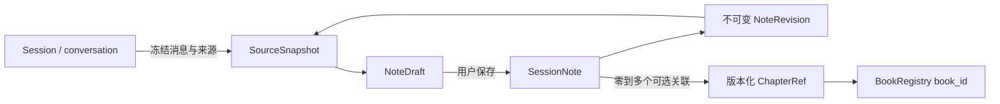

# Session → Note：P0 工程 handoff

日期：2026-10-02。执行对象：6.1 Sol。状态：设计提案，尚未实现、迁移或进行功能验收。

本文基于当前仓库源码阅读。文件路径均相对仓库根目录；“新增 / 应当”表示提议，不表示已有能力。此次仅新增本设计文档，不调用真实模型、不修改业务代码或用户数据。实施涉及新增存储结构，应依 AGENTS.md 在取得实施授权后进行；不能把阅读此 handoff 当作执行迁移的授权。

## 1. 产品决策与 MVP 范围

**Note 是用户拥有、可独立阅读和编辑的一级学习资产；Session 是其来源，Chapter 是可选关联，生成任务只是生产草稿的过程。**

用户点击“整理为笔记”，系统将选定会话中的知识、条件、推导、例题、纠错和未解决问题整理成结构化文档。笔记应该离开聊天上下文仍能读懂：补全指代、保留公式条件和关键推导，把错误尝试标为错误，把未决问题保留为未决。不能只是“用户问了什么、助手回答了什么”的流水摘要。

P0 提供：

- 会话主动生成、长会话范围选择、生成进度与取消、预览、逐块编辑、明确保存。
- 独立笔记列表、详情、编辑草稿恢复、来源检查、归档与恢复。
- 多条笔记来自同一会话；每次生成冻结来源；正式笔记保存不可变版本。
- 无模型时仍可阅读、编辑已有笔记；生成失败可从同一会话快照转入手动整理草稿。
- 教材与版本化章节关联；无教材的一般问答也能生成笔记。

不做：自动在每次回答后生成、自动合并笔记、重新解题补全答案、笔记向量索引、自动写 Memory / Goal / 错题 / 掌握度 / SM-2、基于笔记出题、章节笔记生成、复习计划、通用文档编辑器、多人协作。

“Session 结束”在 P0 是用户认为本次学习告一段落并主动整理，**不新增会话结束状态，不关闭会话，也不阻止后续提问**。

本文的 Session 特指主聊天持久化 conversation。现有练习会话、错题复习会话拥有各自领域 ID，不能直接当成 conversation_id；P0 不直接从它们生成 Note。解题、纠错、复习等结构倾向指主聊天中的内容类型。未来接入其他 Session 来源须增加显式 source adapter，不能伪造聊天历史。

## 2. 已核对的现状及直接影响

| 现有实现 | 源码依据 | 设计影响 |
| --- | --- | --- |
| 主聊天 Session 对应 conversation，没有独立 Session 表、类型和结束字段；标题取首条用户消息 | `backend/conversation_memory.py`：`_conversation_snapshot`、`_conversation_title`；`backend/api/chat.py` 会话接口 | 产品称 Session，API/内部来源继续使用 `conversation_id`，不新增另一套会话主键 |
| SQLite event log + `conversation_messages` 为权威历史；JSON 最近窗口为 40 条；普通分页最多 200 条；`load_full_history` 最多 5000 条 | 同文件：`_connect_events`、`load_message_page`、`load_full_history` | 禁止用前端已加载消息、JSON、Ledger 或单次 `load_full_history` 作为全会话笔记输入 |
| 消息具有 ID、turn、正文、sources、answer_mode、delivery_status、LearningTask 等；部分回答补全时保持同一消息 ID；scope 可被重分类，turn 可被移到另一 conversation | 同文件：`append_message`、`reclassify_conversation`、`split_turn_to_conversation` | 消息 ID 不等于消息版本；必须冻结内容、hash 和原始位置；来源回看需处理移动和变化 |
| BookRegistry 已有独立 `book_id`、展示名与别名 | `utils/book_registry.py` | 用 `book_id` 做教材关联，保留生成时展示名，不以书名作长期主键 |
| 章节普通输出主要是 title/page/subsections；章节重点中的 `chapter_001` 由列表下标生成 | `backend/services/book_chapters.py`；`knowledge/chapter_highlight_source.py:_load_chapter_refs` | 不把 `chapter_001`、标题字符串或下标当稳定章节身份 |
| Canonical IR 有 `DocumentBlock.block_id`、section_path、页码；教材 provenance 含 chunk、canonical_hash、index_version、原块及坐标 | `ingestion/document_ir.py`、`graph/evidence_pack.py`、`tests/test_provenance_contract.py` | 复用教材来源契约；Note block 是派生知识结构，不能伪装成 Canonical 原文 block |
| 引用还有 `CitationProvenance`，区分模型对齐、部分对齐、仅附来源 | `frontend/src/types/index.ts`、`backend/conversation_memory.py` | “可追溯到回答”“回答引用过教材”“该笔记结论被教材支持”不能合并为一个可信标签 |
| RuntimeEvent 是无正文、尽力写入、会轮转的元数据审计；ExecutionEvent 是运行/UI 协议 | `backend/services/runtime_events.py`、`backend/services/execution_events.py`、`docs/runtime-event-v1.md` | 运行审计仅记录操作引用与状态，不能用来存笔记、回放正文或充当教材证据 |
| LearningTask 管一次任务契约与验证；公开 artifacts/执行记录有边界和截断 | `backend/services/learning_task.py` | 不把完整笔记塞进 LearningTask artifacts；笔记整理也不伪造新的聊天 turn |
| JobManager 已支持持久化后台作业、取消、完成竞态和重启中断 | `backend/job_manager.py`、`backend/main.py:_recover_jobs`、`knowledge/chapter_highlight_jobs.py` | 复用后台作业设施，新增有界内容整理 service；不再建 scheduler 或 Agent Loop |
| 错题已有修订、草稿、候选、来源、作答事实及幂等操作；Goal 有独立版本存储 | `memory/mistake_book.py`、`memory/mistake_lifecycle.py`、`backend/services/goals/store.py` | 复用版本/CAS/幂等原则，不复用错题或 Goal 的业务状态机 |
| 已有 Markdown/KaTeX、来源面板、Inspector、统一视觉角色；“LearningNoteFont”只是阅读字体能力 | `frontend/src/components/chat/MarkdownMessage.tsx`、`ChatMessage.tsx`、`contexts/InspectorContext.tsx`、`layouts/ApprovedWorkspace.css` | 抽取来源展示复用；不复制聊天组件实现第二套公式渲染；当前并没有可直接接入的 SessionNote 资产 |
| 本地数据根来自配置，备份覆盖 progress 并以 SQLite backup API 复制数据库 | `config.py`、`backend/data_backup.py`、`utils/storage_manifest.py` | 新笔记放入 PROGRESS_PATH 下的权威数据库，必须纳入桌面备份与恢复验证 |

不能为了最少改行数接受的旧设计：最近窗口当完整历史、序号当章节 ID、全篇 Markdown 当唯一存储、仅留临时 E-id、依赖运行日志保存学习资产、浏览器 localStorage 当草稿权威源。

## 3. Session / Chapter / Note 关系

- 一个 Session → 0..N 份笔记；不加 `UNIQUE(conversation_id)`。允许不同时间、不同范围或不同整理重点产生不同笔记。
- P0 一份新笔记恰有一个来源 Session；来源模型使用 `origins[]`，校验 P0 长度为 1。未来合并时可扩展为多个，当前不接受多 Session 请求。
- 一份笔记 → 0..N 个 ChapterRef；同章节可关联多 Session、多笔记；不要求 Session 本身绑定唯一章节。
- 关联来源由来源证据提议，用户可以修改“归入哪个章节”。**分类关联不自动成为事实证据**。更改分类不改写历史来源。
- Note 有自己的 ID、标题、版本、更新时间；不继承会话标题变更，也不随教材改名或章节重排重写正文。
- 来源 Session/教材以后被删除或不可读，Note 正文及保存的来源快照仍可读；不级联删除 Note，不自动跳到同名教材。快照是笔记的一部分，UI 应明确“来源片段随笔记保存”。

### 3.1 章节身份：先做可靠引用，不做全库章节迁移

新增共用的只读 `ChapterReferenceResolver`，返回：

| 字段 | 规则 |
| --- | --- |
| `chapter_ref_id` | 根据下面的版本锚点生成的确定性标识；不是无条件跨版本稳定的 Chapter ID |
| `book_id` | BookRegistry 的稳定 ID；无法确定时关联处于 unresolved，不猜测 |
| `canonical_hash` | 指向生成时 Canonical IR 版本；有 IR 时必填 |
| `heading_block_id` | 能确定章节 heading 时使用；配合 canonical_hash 定位 |
| `section_path_snapshot`, `title_snapshot`, `page_start/end` | 保留可读位置，展示/恢复用，不单独作为身份 |
| `legacy_locator` | 无 Canonical heading 时保存元数据快照 hash + 原路径/页码；不得声称已获得稳定章节 ID |
| `resolution` | `exact / legacy / unresolved`；运行时另返回 `current / historical / unavailable` 可用性 |

同书、同 IR、同 heading 才能去重为相同 chapter_ref_id。更换 IR 后不按章节序号或相似标题静默重绑定；保留历史关联，用户选新章节时增添/替换分类关联，但原来源不变。未来稳定 Chapter 实体出现时可建立 alias 映射，不需要重写 Note 内容。P0 章节筛选使用确切版本化引用，标注历史版本；不承诺跨教材版本自动聚合。

## 4. 数据模型

以下为领域合同，放在领域模块，API DTO 单独转换。ID 使用完整 UUID 或带类型前缀的等长随机 ID；时间使用带时区 UTC。`schema_version` 与用户内容 `revision` 分开。

P0 请求大小合同：标题 1–200 字、abstract 最多 500 字、tags 最多 20 个且每个不超过 40 字、正文最多 300 个 block、整份可编辑内容 JSON 最多 512 KiB。超限返回字段错误而非截断保存；来源包采用第 5 节独立预算。这些是可版本化的资源边界，不是推荐笔记长度。

### 4.1 SessionNote 与 NoteRevision

| 字段 | 含义及约束 |
| --- | --- |
| `id`, `schema_version` | 独立 Note 身份，P0 schema=1 |
| `status` | `active / archived`；生成失败、待保存不是正式 Note 状态 |
| `revision` | 单调递增；正式保存或归档变更以 expected_revision 做 CAS |
| `title`, `abstract` | 用户可编辑；abstract 可选、用于列表，不是正文替代品 |
| `subject`, `tags[]` | 分类信息，可为空；不写回 Session |
| `origins[]` | P0 一条 `kind=session`：conversation_id、title_snapshot、source_snapshot_id、选择范围、截至时间 |
| `chapter_refs[]` | 前述可选分类关联，保存版本锚点与标签快照 |
| `blocks[]` | 有序结构化内容；block_id 在用户编辑/排序后保持 |
| `source_snapshot_ids[]` | 引用不可变来源包；现有版本必须能独立解释自己的来源 |
| `quality` | 来源警告、覆盖报告、结构校验版本、待核实块等，不使用“正确率”字段 |
| `created_at`, `updated_at`, `saved_at` | 首次创建与当前版本保存时间 |
| `generation` | 可空；job_id、模型/角色标识、prompt/policy 版本、生成时间；无 API key、endpoint 凭证或 prompt 正文 |

`NoteRevision` 保存上述完整内容快照、note_id、revision、change_kind、saved_at。P0 提供当前版本读取和历史版本只读接口，复杂 diff 和一键恢复 UI 后置。已保存版本不被后台重新生成修改。

### 4.2 NoteBlock：统一积木，语义角色独立

| 字段 | 合同 |
| --- | --- |
| `block_id` | 稳定 ID；模型临时 ID 在校验后由服务规范化，不能与教材 block_id 混用 |
| `type` | P0：`heading / paragraph / list / equation / callout` |
| `role` | 可选：`concept / method / derivation / example / correction / conclusion / open_question`；这是内容语义，不决定模板 |
| `group_id` | 可选，把题干—条件—推导—答案归为一个例题/推导单元；仍是平面有序数组，无无限嵌套 |
| `data` | 按 type 区分：heading 的 text/level；paragraph 的 markdown；list 的 ordered/items；equation 的 latex/annotation；callout 的 markdown/tone |
| `source_ref_ids[]` | 指向本 Note 来源快照中的消息记录；等价于可追踪的 source_message_ids，但同时携带版本与角色 |
| `evidence_ref_ids[]` | 可选教材来源引用，必须来自该块引用消息的已持久化 sources，使用 note 内唯一 ID |
| `authorship` | `generated / user / mixed`；服务端根据生成或编辑动作维护，不信任模型声明 |
| `source_alignment` | `traceable / needs_review / user_added`；只表达当前文字与来源的关联状态 |
| `verification` | `not_checked / source_warning / needs_review` 及结构化原因；不因用户保存而变成“已验证正确” |

块应小到来源有解释力，大到能阅读：一条结论、一段推导或一个题干；不能把整篇正文塞在一个 paragraph 再挂上全会话来源。不同来源的列表项需要单独追溯时拆成多个块。表格 P0 用 paragraph 内的 GFM table，完整表格作为一个来源单元；以后再增加 table 类型。

LaTeX 原样保存语义，不使用 HTML 作为正文权威格式。公式、矩阵、等号链使用 equation 或 Markdown 数学语法，沿用现有安全渲染。`group_id` 允许用户整体移动例题，也允许逐块调整；删除题干或条件后提示检查组完整性。

### 4.3 SourceSnapshot 与 SourceRef

SourceSnapshot 是**生成输入的不可变物化版本**，属于笔记数据，不依赖 RuntimeEvent 保留期限。完整保存被选择的可见消息，单独记录哪些消息进入生成、哪些被排除及原因。排除占位文本与失败碎片不能伪装成“已整理”。

| 对象 | 必须保存 |
| --- | --- |
| 来源包 | id、conversation_id、会话标题/范围快照、captured_at、conversation event watermark、选择的 turn/message 集合、有序输入 hash、范围与排除清单 |
| 消息来源记录 | source_ref_id、原 conversation_id、message_id、turn_id、原顺序、消息内容 hash、冻结正文、role、created_at、delivery_status、answer_mode、evidence_support_status、必要 LearningTask verification/required_inputs 与引用对齐状态 |
| 教材来源记录 | note 内 evidence_ref_id、父消息 source_ref_id、原 E-id、book_id（可解析时）、book_name 快照、chunk_id、index_version、canonical_hash、source_block_ids、source_locations、原有支持片段与来源状态 |
| 生成覆盖记录 | 每个纳入消息/语义段 → 对应输出块，或“寒暄/重复/已纠正旧说法/未解决/无学习内容”等明确处置；该映射是覆盖审阅辅助，不是准确率证明 |

不复制整本教材；仅保存原回答已经持久化的证据片段与定位。缺失的历史证据片段保持 unknown，不从当前索引抓取一个同名片段冒充旧证据。图片题若只有临时图片且无足够可读题干，保留“缺少题干/附图”警告，不新做 OCR 或猜补图片；P0 不新增图片上传/附件所有权系统。

`E1` 等编号只在原回答内有效：两条消息的 E1 必须映射为不同 evidence_ref_id。正文展示编号由 Note 当前引用顺序生成，存储不依赖显示序号。

模型只能返回输入中分配的来源 token，服务端映射为 source_ref_id/evidence_ref_id，拒绝越界引用。题干可来自 user 消息；答案必须追溯对应 assistant 消息。用户提问中的假设不能被转换为已成立定理；旧错误和后续纠正必须关联两侧消息。

生成的实质内容块至少需要一个合法消息来源；纯组织性标题可以没有。无法指向原会话的模型补充内容不得作为正常知识块发布。用户手动新增文字遵循独立的 user_added 规则，不能通过客户端修改 authorship 绕过生成校验。

人工编辑后规则：

1. 修改块内容保留历史来源关系，但将 source_alignment 置 needs_review；不继续展示原来的来源对齐承诺。
2. 用户新增块允许没有来源，标为 user_added；不自动挂全会话 ID。
3. 用户可选择原消息重新关联，但关联行为不证明数学正确。保存动作不提升 verification。
4. 仅重新排序不改变对齐状态。历史版本保留编辑前的文字、来源与状态。

### 4.4 NoteDraft

包含 draft_id、kind（generation/edit/manual）、source_snapshot_ids、可编辑内容、draft_revision、base_note_id/base_note_revision（新笔记为空）、job_id（可空）、parent_draft_id（重试/重生成）、生成候选及其 hash、published_note_id/revision、时间戳。

草稿编辑状态为 `preparing / editable / published / discarded`；后台执行状态直接读取 JobManager 的 queued/running/cancelling/completed/failed/cancelled/interrupted，不再维护另一套运行状态机。生成失败仍保留来源包，可重试或创建 manual 草稿。每次重试/重生成创建新的 draft/job，复用不可变来源包；不将终态 job 改回 running。

编辑草稿自动持久化，正式 Note 只有用户点击“保存笔记/保存修改”才提交版本。首次保存后草稿变 published，不再接受 PATCH；继续编辑需创建新的 edit draft。

### 4.5 存储方案

新增 `PROGRESS_PATH/session_notes.db`，与当前权威 SQLite 存储模式一致。采用六张业务表即可：

| 表 | 职责 |
| --- | --- |
| `session_notes` | 当前正式资产投影、可筛选字段、status/revision；正文可存有 schema 的 JSON |
| `note_revisions` | `(note_id, revision)` 唯一的不可变文档快照 |
| `note_drafts` | 草稿、草稿 revision、job 绑定、候选发布/正式保存回执 |
| `note_source_snapshots` | 冻结来源包；正文不进列表查询；可被多个草稿/版本引用 |
| `note_relations` | Note ↔ 来源 Session / 教材 / 版本化 ChapterRef 的查询投影，随正式保存事务更新 |
| `note_operations` | operation_id、规范化请求 hash、结果回执；生成申请与保存幂等 |

Note 和其 revisions、关系投影、草稿 published 标记、保存操作回执在同一事务提交。对 Session/Book 使用软引用，无跨库级联外键。数据库版本迁移复用 `utils/sqlite_migrations.py`，登记 `session_notes:1`，新版本无法识别时拒绝写入。归档不删除来源与版本；P0 不提供物理删除。失败临时草稿可由用户丢弃，已被正式版本引用的来源包不得自动清理。

列表采用 `(updated_at, id)` 复合游标；不拉取全部正文后排序。P0 搜索标题/abstract/tags，按 subject/book_id/chapter_ref_id/conversation_id/status 筛选；正文全文检索后置。

## 5. 生成生命周期与失败语义

### 5.1 从 Session 发起

入口位于会话标题操作区“整理为笔记”，历史会话菜单也提供入口；不把操作伪装成用户发出的聊天问题。

点击先做无模型调用的 preflight：当前会话、可用轮次、截止范围、未完成/缺输入警告、已有草稿/笔记、预估分块与预算。默认选全部可整理内容，用户可以调整完整 turn 范围；切分例题时默认包含相关追问和纠正。

若正在生成回答，默认操作不可直接提交，提供“等待回答结束”或明确选择“只整理之前已完成的轮次”。后端仍验证选区，不依赖前端按钮。已经停止但含半截答案的轮次可以作为未完成问题记录，不当完整结论。空会话/只有寒暄时解释原因，不调用模型。

### 5.2 冻结输入

新增 conversation 层公开只读快照接口：在同一个 SQLite read transaction 中按 seq 分页读选区，获取该事务可见的 event watermark 与所有消息 payload，再物化来源包。不得仅记录 max(seq) 后重新读取可变消息，也不能逐页打开新的读事务造成版本混合。

复用既有 scope 规则；所有被 scope 或质量规则排除的范围进入清单。严格校验现有 conversation_id，不能调用“无效 ID 自动变新 ID”的便利函数吞掉错误。

读事务完成即释放，不持锁等待 LLM；模型只读物化快照。后续会话新增、恢复、重分类、拆分不改变本次输入。展示“整理至某时刻”；有后续消息时显示“会话有新内容”，不自动重生成。

preflight fingerprint 比较选区的消息集合、正文和相关来源/验证字段，不把无关后台活动更新时间当内容变化。用户选定的截至轮次保持不变；确认期间新增的后续轮次不会悄悄进入选区。event watermark 用于审计定位，不能替代输入内容 hash。

### 5.3 有界生成

由 `SessionNoteGenerationService` 作为内容变换用例运行：

`读取快照 → 按完整 turn/语义段分块 → 抽取知识单元及来源 → 组织结构 → 确定性校验 → 草稿可编辑`。

短 Session 一次结构化生成。长 Session 使用预先计算的固定分块计划，逐块抽取，再一次汇总；无自主规划和工具循环。跨块保留父问题、纠正目标和来源 token；不得截断公式、题干或错误—纠正关系。无法在预算内保全时，要求缩小范围，不默默删掉前文。

P0 默认上限：最多 8 个抽取批次 + 1 次汇总；整次 10 分钟；每次模型调用超时不超过 90 秒且受剩余总时长约束；不自动无限修复/重试。每次输入/输出 token 上限依已解析模型能力及项目配置预检，未知 context window 时采用经过配置的保守 ceiling，不能把未知当无限。计划中写明采用的预算版本与估算，超预算在首次模型调用前返回 needs_range_selection。超大单个 turn 同样拒绝静默截断。来源物化默认设置 8 MiB 文字/JSON 上限，超过即要求用户选区，不截掉尾部后继续。

生成复用现有回答模型角色、profile 优先级、`llm/factory.py` 与 `utils/thinking_filter.py`。无新增供应商分支，无第二套聊天 endpoint，不调用主 QA graph 重新回答整个会话；不触发检索、概念记录、错题写入等聊天副作用。历史指令和工具输出作为带来源的数据，不能执行。章节重点生成可参考 job 接入方式，不能复用其 OCR 输入、HTML 文件和缓存身份来存 Note。

### 5.4 校验门槛

硬错误阻止发布生成草稿：JSON/schema 不合法、块 ID 重复、空正文、类型不支持、未知消息/证据引用、来源越出冻结范围、未过滤 thinking、内容超预算。无合法学习内容返回 no_learning_content。P0 使用严格 JSON 解码/校验，不 eval；不依赖某供应商一定支持 structured output。

软警告保留并允许预览：来源回答 degraded/unverified、仅附教材来源但没有段落对齐、缺题干/附表、来源冲突、公式疑似损坏、部分内容只有用户自述。不能由生成器宣布这些问题已解决。

数字、公式、单位及条件尽量逐项与冻结消息比较；“新出现/无法支持”的结果转为待核实，不编造工具验证。现有 `answer_verification.py` 的通用检查可抽出复用，但不要套用以当前 QA 问题为 required_outputs 的整体状态机。校验仅保证结构、引用有效和可检测的一致性，不证明语义归纳或数学正确。

生成覆盖报告逐项检查是否纳入关键条件、纠正、未决问题；程序验证所有输入都有处置、输出来源合法，人工黄金集验证这些处置是否合理。不能用“来源 ID 全合法”代替内容质量验收。

### 5.5 Preview/Edit → Save

- 生成结果作为 editable 草稿展示，默认阅读预览；切换编辑可增删/排序 block、改标题/章节/标签、编辑 Markdown/LaTeX、选择来源。
- 不展示半截 JSON 或未经校验的流式文字。生成阶段显示阶段和批次进度，不伪造精确百分比。
- 编辑变更先在本地 state，约 800ms debounce 以 expected_draft_revision 自动保存后端草稿；串行写入，陈旧响应不得覆盖新输入。离开时 flush，失败显示“有未保存修改”，提供重试/复制；Electron 关闭也需覆盖未保存状态。
- “草稿已保存”与“已加入笔记”明确区分；正式 Note 的当前版本不被草稿自动保存修改。
- 正式 Save 必须等待当前本地编辑 flush 完成，然后提交 draft_id、expected_draft_revision、base_note_revision、operation_id。后端读取草稿、复查引用与当前修改 hash，事务落 Note/Revision/关系/回执。
- 有待核实内容时，预览持续展示具体警告；Save 需要用户明确“保留待核实标记保存”，提交绑定当前草稿 revision 与警告集合的 acknowledgement。内容/警告改变后旧 acknowledgement 失效。标记在正式笔记中继续显示。
- 网络超时后重发同 operation_id 返回原 Note/revision；同 operation_id 不同请求返回 conflict。保存后跳详情，不再二次“确认写入”。直接 UI Save 就是用户授权，不必再塞进聊天 pending action。
- 同一 Session 再次进入时提供“打开已有笔记”“继续草稿”“生成另一份”。P0 重生成始终创建新草稿，旧笔记/人工编辑保留；不实现后台覆盖或智能合并。

### 5.6 JobManager、崩溃与并发

使用 job_type=`session_note_generate`。Job input/result 仅存 snapshot_id、draft_id、候选 hash、版本等引用，正文存在 Notes 库。相同 operation_id 幂等；相同 Session、来源 hash、选区、生成配置的活跃申请复用同一 job/draft，数据库唯一约束保证双击/多窗口不会启动两次。

跨 `jobs.sqlite3` 与 Notes 库不能假装有单库事务。采用可恢复发布顺序：

1. Notes 库先保存申请回执、预分配 job_id、来源包和 preparing draft，之后用该 job_id 幂等建立 JobManager job；未完成启动不自动产生模型调用。
2. worker 校验通过后，将候选完整持久化到 draft 的内部候选区，附 candidate_hash，暂不可编辑。
3. 调用 JobManager `complete_job`，result 写 draft_id/candidate_hash。该原子 CAS 是生成完成与取消竞争的裁决点：取消先赢则不能发布；完成先赢则取消返回已完成。
4. 仅匹配 completed 回执的候选可以原子转换为 editable。崩溃发生在 3 与 4 之间时，恢复流程只补发布，不再次调用模型。
5. 每个 attempt 有独立 job/draft。发布只允许 preparing → editable 一次；后续迟到回调不能覆盖已编辑/丢弃/已保存草稿。

沿用启动时 `mark_running_interrupted`，再执行 Note 专属 reconciliation：queued/running 遗留变 interrupted；已 completed + 正确候选补发布；有申请无 job 标为中断待重试；回执与候选不匹配显示失败并保留诊断引用。未完成生成不自动付费重跑，用户点击重试才新建 attempt。

Job 状态查询直接复用现有 `/jobs` 接口；取消调用既有取消入口，前端收到 cancelling 不显示已取消，等后端确认 terminal。保存正式 Note 与生成完成是两个不同动作。写磁盘失败不得显示“已保存”，RuntimeEvent 写失败则不得让已成功保存的 Note 变失败。

多窗口编辑通过 draft_revision 和 base_note_revision 双重 CAS。409 时保留本地文字，提示重新载入或复制为新草稿，不能 last-write-wins。归档期间的 edit Save 同样要检查 Note revision/status，不能悄悄恢复归档笔记。

## 6. 内容组织：倾向而非模板

当前没有稳定 Session.type，不为分类新增强制 Session 状态。生成请求允许 `structure_hint=auto/concept/derivation/problem/comparison/review`，默认为 auto；这是整理偏好，同一 Note 可以混合，模型不负责持久化新的 Session 类型。

| 会话内容 | 推荐组织 | 必须避免 |
| --- | --- | --- |
| 概念理解 | 定义 → 适用条件 → 关键性质/联系 → 已讨论例子 | 为凑完整模板编造例题/性质 |
| 公式推导 | 前提和符号 → 关键步骤 → 结论 → 适用边界 | 只保留最后公式；把省略步骤补成无来源证明 |
| 解题/图片题 | 可用题干 → 方法选择 → 关键计算 → 答案状态 → 易错处 | 丢题干条件；视觉缺页时整理出精确结果 |
| 比较辨析 | 比较维度 → 各对象差异 → 边界或反例 | 无条件继承上一话题对象；制造不存在的共同点 |
| 错误订正 | 错误尝试 → 错在哪里 → 修正 → 自检提示 | 把模型推测的错因写成用户已确认错因 |
| 章节讲解/混合复习 | 按实际主题分组，保留各自条件、例题和未决问题 | 将某次 Session 宣称为整章完整笔记 |

未出现的内容不生成空章节；只有短结论时允许少量 block；不能为“结构化”强制每篇固定八段。自检提示只复述已讨论检查方法，P0 不临场编新题。

示例：会话先误把“连续”理解成“可导”，后讨论绝对值在零点的反例。笔记应保留连续与可导的方向关系、反例及其条件、纠正原因；错误说法必须标明“已纠正”，不能与正确结论并列。每个结论或例子可回看对应消息，而不是引用整场会话作为一个大黑箱。

## 7. Service / API / 审计边界

### 7.1 模块依赖

- `backend/api/notes.py`：请求 DTO、HTTP 状态、依赖绑定；无 prompt、数据库 SQL、来源推断。
- `backend/services/session_notes/service.py`：preflight、快照申请、编辑、保存、归档、查询和冲突处理。
- `backend/services/session_notes/generation.py`：固定分块计划、模型调用、结构组装；只输出候选，不创建正式笔记。
- `backend/services/session_notes/sources.py`：conversation 快照适配、教材来源适配和回看解析；通过既有层的公开接口读取。
- `backend/services/session_notes/validation.py`：block、来源、覆盖、一致性、警告合同；不依赖 FastAPI。
- `backend/services/session_notes/jobs.py`：JobManager worker、候选发布和恢复协调；不另建通用任务系统。
- `memory/session_notes.py`：领域 dataclass/类型与 Notes Store（复杂后再拆 types/store），只持久化，不调 LLM/HTTP。放在 memory 包是遵循当前持久层组织，语义上并非 ConceptMemory。
- `backend/services/chapter_references.py`：只读章节引用适配，后续其他 feature 可用；不触发重索引。

服务依赖以 provider/factory 注入；列表、阅读、编辑不能提前初始化向量库、KG 或模型客户端。Note 不进入主聊天 ContextPack、Ledger、EvidencePack；未来用户显式引用 Note 时，也只能作为有引用的学习材料，不能自动升级为教材事实来源。

### 7.2 P0 API 合同

沿用 `/api` 与当前响应 envelope；新增接口使用真实 HTTP 错误状态，错误体包含稳定 code、可读 message、可选 field_errors / warnings。不要继续“所有失败都 HTTP 200”的旧接口习惯。

| 接口 | 行为 |
| --- | --- |
| `POST /notes/preflight` | 输入 conversation_id、完整 turn 选区、structure_hint；只读评估范围/预算/已有资产/警告，返回可提交的 selection 与预检版本；不调用模型 |
| `POST /notes/generations` | operation_id + selection + preflight fingerprint；重新校验并冻结输入，若范围相关内容已变返回 source_changed；成功 202 返回 draft_id/job_id/snapshot_id，幂等命中返回同一申请 |
| `GET /jobs/{job_id}` / `POST /jobs/{job_id}/cancel` | 复用现有作业状态与取消；Note feature 适配旧响应，不以它改变新增 API 错误合同 |
| `GET /notes/drafts?conversation_id=...` | 返回草稿摘要与当前作业引用，支持 cursor；供 Session 和 Notes 草稿页恢复 |
| `GET /notes/drafts/{draft_id}` | 返回内容、draft_revision、来源摘要、警告、作业状态；不暴露内部未校验候选 |
| `POST /notes/drafts` | kind=edit 时输入 note_id/base_revision；kind=manual 时输入既有失败申请的 snapshot_id；服务端核对归属；返回可编辑草稿 |
| `PATCH /notes/drafts/{draft_id}` | expected_draft_revision + 可编辑字段；整份有界 block 文档替换；来源元数据不可由客户端伪造，服务端计算 authorship/对齐状态 |
| `POST /notes/drafts/{draft_id}/discard` | 丢弃草稿；活跃生成先取消并等确认终态；published 草稿不可丢弃来删除 Note |
| `POST /notes/drafts/{draft_id}/save` | operation_id、expected_draft_revision、base_note_revision、必要 acknowledgement；首次 201、新版本 200；返回 note_id/revision；body 不信任另一份正文副本 |
| `GET /notes` | cursor/limit、q（标题等）、subject/book_id/chapter_ref_id/conversation_id/status；不带 blocks 或原消息正文 |
| `GET /notes/{note_id}` | 当前完整版本、来源摘要及可用性警告；辅助来源状态检查失败时仍返回 Note |
| `GET /notes/{note_id}/revisions` / `GET /notes/{note_id}/revisions/{revision}` | 版本摘要分页和单版本只读文档 |
| `PATCH /notes/{note_id}/status` | operation_id + expected_revision + active/archived；归档/恢复，不物理删除 |
| `GET /notes/{note_id}/sources/{source_ref_id}?revision=...` | 当前或指定版本的冻结原文、该块相关来源、live locator 与 current/changed/moved/unavailable 状态 |
| `GET /notes/drafts/{draft_id}/sources/{source_ref_id}` | 预览/编辑使用同一来源解析能力 |
| `GET /chat/conversations/{id}/messages/{message_id}/context` | 新增定点读取目标消息和相邻窗口/分页锚点，用于跳回原会话；不加载完整历史 |

generations 重试使用新的 operation_id 及 retry_of_draft_id，默认沿用旧 snapshot，不静默切到最新会话；“按最新会话重新整理”重新走 preflight。P0 不允许模型决定目标 note_id 并覆盖它。

错误最低集合：400 invalid_selection；404 not_found；409 source_changed / revision_conflict / operation_conflict；422 invalid_document / invalid_source_ref / needs_range_selection / no_learning_content；503 model_unavailable / storage_unavailable。后台模型/验证失败反映在 Job 中，不能伪装成一份空笔记。

来源导航先读保存快照；再通过 conversation 层公开 resolver 查询 live 消息。发生 turn_split_out 时沿已记录目标链查找（去环、有限跳数），不按相似正文猜测。原消息缺失时仍可看冻结原文。聊天 UI 接受 conversation_id/message_id 的定点定位参数，显示目标并可继续前后分页；不在 ChatContext 的最近窗口中“找不到就算了”。

### 7.3 RuntimeEvent

复用已有 `state_transition / model_call / execution_result / error / retry / user_outcome` 等类型，phase 用 `note_snapshot / note_generate / note_validate / note_save` 等有限值；不新增自由正文 payload。

本操作来源为明确的 UI action，RuntimeEvent 使用 `session_id=origin:ui_action:<draft_id或operation_id>`、空 turn_id，content_refs 写 draft/note/snapshot 引用，source_refs 可写 conversation 引用；不伪造新的 chat turn 或 Goal。只记录白名单元数据和 hash，遵守数量/格式限制，不把整份消息 ID 清单塞入审计。完整来源清单属于 Notes 库。

未实际创建 LearningTask/Runtime task 时 task_id 留空，不虚构一个任务。P0 不扩展 AgentRuntime 的规划能力；未来若整理成为统一 Runtime capability，也应调用同一 Notes service，并保持相同用户保存边界。

## 8. UI 状态与交互

使用 `texa-ui-system` 的管理工作区与 Reading Canvas，复用主题、字体与 Inspector。新增侧栏一级入口“笔记”，放在学习/复习相邻位置；无独立“笔记 Agent”。

### 8.1 Session 入口

- 会话顶部：标题、学习范围、更多操作中的“整理为笔记”；有空间时显示轻量文字按钮。
- 预检面板：范围、轮次数、截止时间、整理侧重、未完成内容提示；一个“生成草稿”主按钮。
- 有正在生成的任务显示“查看生成进度”；有可编辑草稿显示“继续整理”；有正式笔记显示“查看笔记 · N”，且仍能显式生成另一份。
- 创建后导航到 `/notes/drafts/:draftId`。用户回到聊天继续学习不影响正在运行的生成。
- 学习首页不自动弹出“该结束了”，不改变会话输入框和聊天消息内容。

### 8.2 Notes 列表 `/notes`

上方为页面名、搜索、学科/教材/章节筛选；“已保存 / 草稿 / 已归档”三个视图。主列表展示标题、短摘要、更新时间、来源 Session、章节标签以及真实的“待核实/来源不可用”状态。不要做掌握度环图、学习积分或复杂知识网络。

草稿视图展示生成中/可编辑/失败/中断及恢复操作。列表摘要加载与来源可用性检查隔离：教材不可读仍能列出笔记。空状态说明“在学习会话中选择整理为笔记”；筛选无结果与没有笔记是不同状态。

分页和筛选保留在 URL；主列表不把所有正文挂进 DOM。每个项目有打开/归档（归档页恢复）操作，归档后提供即时撤销；不显示未实现的“合并、出题、加入复习”按钮。

### 8.3 详情 `/notes/:noteId`

阅读画布：标题 → 简短来源/范围/更新时间 → 真实质量提示 → 结构化正文。主操作为“编辑”，次操作为“查看来源/归档”。长笔记可折叠目录，正文保留选择和复制。数学公式有安全横向滚动，不让整页横溢。

点击块的“来源 · N”打开 Inspector：冻结原消息、消息角色与时间、原回答验证状态、教材引用和版本、查看当前原会话。若当前消息变化，展示“生成时原文”和“当前会话”区别；若教材来源不可用，冻结的片段仍可看。不能让“查看来源”只跳到一个没有目标定位的聊天页。

查看来源不触发自动生成/模型调用。历史 revision 页面只读，标明版本号；P0 不需要复杂版本 diff UI。

### 8.4 草稿预览与编辑

编辑器使用现有 Markdown/KaTeX 渲染 + 简单受控 block 编辑，无需引入富文本框架。常用动作是添加段落/标题/公式、上下移动、删除、关联来源；拖拽可后置，键盘上下移动必须可用。编辑 equation 时复用已有数学输入能力中可独立使用的部件，不把整个聊天 composer 搬进来。

| UI 状态 | 呈现与动作 |
| --- | --- |
| preflight loading / blocked | 保留 Session 上下文；给出待完成回答、空内容、缩小范围等具体原因 |
| queued / running | 显示正在读取/整理第 N 批/检查来源，可取消；切页不终止 |
| cancelling | 显示“正在停止”，不先显示“已取消” |
| failed / interrupted / cancelled | 保留范围和旧内容；重试生成、手动整理或返回会话 |
| editable clean | 预览与编辑切换；正式保存按钮可用 |
| local dirty / draft saving | 保留当前文字，显示未保存/正在保存草稿；禁用重复正式提交 |
| draft saved | 显示“草稿已保存”；正式列表仍不出现新 Note |
| saving / save failed | 仅成功回执后显示“已保存笔记”；失败保留编辑并允许同 operation_id 重试 |
| revision conflict | 不覆盖；保留本地修改，重新载入或另存草稿 |
| source changed / unavailable | 显示具体来源状态，阅读与编辑继续可用 |

布局验收尺寸：1280×820、1024×768、760×820。窄窗口 Inspector 使用抽屉，编辑/来源不挤压正文；按钮不可裁切；焦点可见、Esc 关闭面板、操作有文字状态。公式、长中文、长教材名、表格均要覆盖。沿用 Windows/macOS 原生窗口差异。

当前 `PersistentRouteOutlet` 按 pathname 保留所有访问页面。新增大量动态 Note 路由时，不能继续无限保留每篇正文和轮询：对 `/notes/:id` 与 `/notes/drafts/:id` 使用一个有界 workspace 缓存槽或卸载安全的详情 outlet；先验证自动保存/恢复，再限制缓存。不要为此重写整个路由缓存；聊天与既有后台行为需保持回归通过。隐藏页面停止无必要轮询，返回时用 draft/job ID 恢复。

## 9. 与其他学习对象的职责边界

| 对象 | 权威职责 | Note 与它的关系 |
| --- | --- | --- |
| Conversation / Session Ledger | 原对话事实；当前追问与指代的有界状态 | Note 读取冻结消息；不成为 Ledger 的替代品，不回写 topic stack |
| ConceptMemory / StudyMemory | 概念接触、薄弱信号、学习活动 | 保存/浏览 Note 不自动制造概念接触或薄弱信号 |
| Goal | 用户目标、成功标准、受控执行与进度证据 | Note 将来可作为用户显式选择的产物引用；保存本身不算目标完成 |
| 错题 | 已确认题目、答案、错因、作答与复习事实 | Note 可讨论错误；不会因此创建/修改错题。未来转换需走已有候选确认流程 |
| 掌握度 | 有证据的练习、复习结果或用户显式操作 | 读过、写过、模型写得完整均不等于掌握，不推导 mastery |
| SM-2 / Review | 调度与作答反馈 | P0 “复习笔记”仅为打开重读，不产生复习完成事件或修改 next_review |
| 教材/章节重点 | 教材原始证据、章节派生阅读材料 | SessionNote 不冒充教材或整章覆盖，也不复用章节重点的缓存更新语义 |
| RuntimeEvent | 有界运行元数据审计 | 可串联生成/保存操作；不承担资产存储和学习质量证明 |

P0 不发可被现有学习统计当成练习完成的 LearningEvent；需要操作统计时只记录 RuntimeEvent。将来要统计 Note 阅读，先引入明确的新事件语义与消费方契约。

## 10. 预留扩展接口，不预做业务

| 未来能力 | P0 留下的扩展点 | 当前明确不做 |
| --- | --- | --- |
| 合并 Notes | 独立 revision、稳定 block_id、来源包引用集合；future origins 可含 note_id + revision + block_ids | 不开放 merge API，不做冲突消解和自动覆盖 |
| 基于 Note 出题 | 以 note_id/revision/block_ids 作为固定来源，保留 verification | 不认为笔记等于答案金标，不自动生成题库记录 |
| 章节笔记 | versioned ChapterRef 和 Note ↔ Chapter 多对多关系 | 不把一个 SessionNote 自动升级为整章资产，不做全章汇总 |
| 复习计划 | 独立 Note ID 可被计划项引用，内容修订可检测 | 不在 Note 增加 SM-2、mastery 或 Goal 状态字段 |
| 用户在聊天引用 Note | 版本化只读内容与来源查询 | 不自动注入 prompt、不自动进 Chroma/EvidencePack |

扩展采用具体 schema_version 与显式迁移；P0 不引入任意 `extensions` 执行协议、动态工具注册或通用实体平台。

## 11. 文件/模块改动范围

| 范围 | 计划改动 |
| --- | --- |
| 新增领域存储 | `memory/session_notes.py`，上述 Note/Revision/Draft/SourceSnapshot 存储与 CAS/幂等 |
| 新增应用服务 | `backend/services/session_notes/{service,sources,generation,validation,jobs}.py`、`__init__.py`；允许小规模合并文件，不允许逻辑退回 Router |
| 新增章节引用适配 | `backend/services/chapter_references.py`；只读使用 BookRegistry/IR/现有章节公开能力 |
| 新增 HTTP | `backend/api/notes.py`；请求模型可放 `backend/api/note_schemas.py`，不污染领域类型 |
| 扩展现有历史读取 | `backend/conversation_memory.py` 添加公开的选区一致性快照、定点消息上下文/移动解析；`backend/api/chat.py` 仅加定点读取路由 |
| 接线与数据版本 | `backend/main.py` 注册 Router、Note job 恢复；`utils/storage_manifest.py` 增组件版本；按需要扩展 `backend/backup_migrations.py` 的新组件验证，不改旧数据语义 |
| 前端领域功能 | `frontend/src/features/notes/` 中 types/api/hooks/block 编辑渲染、source inspector adapter、状态转换工具；hooks 管并发与自动保存 |
| 前端页面 | `frontend/src/pages/NotesPage.tsx`、`NoteDetailPage.tsx`、`NoteDraftPage.tsx` 只负责页面装配 |
| UI 接入 | `frontend/src/App.tsx`、`components/AppRail.tsx`、`pages/ChatPage.tsx`、必要的 `LearningContextSidebar.tsx`；`layouts/MainLayout.tsx` 仅作 Note 动态详情缓存边界调整 |
| 精确复用 | 从 `components/ChatMessage.tsx` 抽取来源展示部件，继续用 `chat/MarkdownMessage.tsx`、`utils/citations.ts`、`InspectorContext.tsx`、`ApprovedWorkspace.css`、数学输入现有可复用部分 |
| 测试与文档 | 新增 Notes 领域/服务/API/前端测试；扩展历史读取、JobManager 接入、备份测试；实施结果写 `patch_notes.md`，稳定边界落地后再更新 AGENTS.md |

原则上不改 `graph/main_graph.py`、Resolver、现有检索链、错题/Goal 数据库与状态机、Chroma 格式。若为通用验证或来源展示而抽取已有函数，保持旧调用行为并加相应回归。不要因为实现 Note 而重构全项目 memory、Runtime 或 UI。

## 12. P0 实施顺序与交付切片

1. **合同与 fixtures。** 锁定模型、来源/章节身份、状态和错误语义；建立短概念、长推导、图片缺输入、错因纠正、跨章节混合、历史来源缺失样本。先验证实际历史字段可提供哪些内容，缺字段显式 unknown。
2. **权威存储与手动闭环。** 建 Notes DB/version/revision/CAS/幂等；实现草稿与正式保存、列表/详情、归档恢复；用测试夹具或手动草稿走通，证明 Note 不依赖模型在线。
3. **一致来源快照与回看。** 实现分页快照、message hash、版本化章节、来源命名空间、定点跳转；覆盖补全、拆分和教材换版。快照可靠前不接 LLM。
4. **有界生成与候选校验。** 用 fake model 验证单批/多批、预算、坏引用、纠正与缺输入；再接现有模型工厂。默认不运行付费真实模型评测。
5. **后台作业与恢复。** 接入 JobManager，落实两库候选发布顺序、去重、取消、重启恢复、迟到结果 fencing；故障注入测试通过后才接生成 UI。
6. **完整用户路径。** Session 入口 → preflight → progress → preview/edit → save → list/detail → source navigation；实现自动保存冲突/失败状态及动态路由有界缓存。
7. **桌面、备份与质量验收。** Electron 开发路径优先，打包路径、数据根、重启、离线阅读、备份恢复、三个尺寸和关键失败状态；记录已测试的平台。补 patch_notes，不把 fixture/离线通过写成真实模型准确率。

每个切片应能独立检查；禁止先把一段 LLM Markdown 塞进 Session JSON，再靠后续“补 provenance”收尾。P0 的不可删项是独立存储、冻结来源、块级追踪、明确 Save、并发/故障恢复。

## 13. 验收标准

### 13.1 数据与产品行为

- 保存获得独立 note_id；同一 Session 能存两份不同笔记，重复点击同一操作只得到一份；编辑产生 revision，不改变旧 revision。
- 标题/正文/章节可编辑；人工新增块可无来源，原有块修改后对齐状态正确降级；重生成不会覆盖旧笔记或编辑中的草稿。
- 草稿自动保存后重开应用可恢复；正式保存前不出现在已保存列表；保存后可独立阅读、归档、恢复。
- 保存/阅读前后对照 Memory、Goal、错题、SM-2 和掌握度存储，无隐式业务变更。

### 13.2 来源与内容

- 至少覆盖 20/40/80 轮会话，以及超过 5000 条消息的分页/预算边界夹具：不得把 40 条 JSON 窗口或 5000 上限误当全量；预算不足必须明确拒绝/选区。
- 多条回答都用 E1 时仍准确定位各自教材；未知/跨会话伪造 message ID、chunk ID 被拒绝；source_ref 属于具体 snapshot/revision。
- 生成期间添加消息、partial completion、scope 重分类、turn 拆分，输出仍只依据冻结快照；回看能区分冻结与当前来源。
- 教材改名、章节重排、IR/index 换版、来源缺失不会误连同名章节；Note 仍可打开；legacy 字段不被补造为精确来源。
- 人工审阅至少 12 份代表性会话覆盖六种结构倾向：关键条件/公式/推导/纠正/未决问题无关键遗漏；不新增无依据事实；无固定模板填充。来源合法率单独测，不充当该语义验收的替代。
- 缺图/附表、仅附来源、degraded/unverified 回答在笔记中保留可见警告；保存确认不会把状态改成数学已验证。
- thinking、提示注入与恶意链接/HTML 夹具不能变成执行指令或不安全渲染；来源回看只暴露当前本地应用允许读取的内容，不返回密钥或任意磁盘路径。

### 13.3 故障、并发和存储

- 双击生成/保存、多窗口同时编辑、网络响应丢失后重试：无重复 Note/revision、无人工修改覆盖；409 可恢复。
- 在候选写入、Job complete 前后、草稿发布、正式保存事务各点注入崩溃；重启得到可解释的终态，无假成功、无自动付费重跑。
- 取消先赢则旧 worker 不能发布；完成先赢则返回已完成；断开前端不会误取消后端；隐藏/切换页面无失控轮询。
- 模型不可用不影响已有 Note 的列表/阅读/编辑；向量库、KG、RuntimeEvent 存储故障不阻塞这些操作。
- 标准备份包含已保存版本、草稿和来源；恢复后引用完整。跨库备份可能截获 job 发布中间态，reconciliation 必须安全恢复；缺少原 Session 的备份仍能显示保存快照。旧备份无 Notes 组件时可正常恢复，界面为空笔记，不误报数据损坏。
- Notes 数据库使用桌面实际 PROGRESS_PATH；无需向源码目录写文件，无 schema 降级写入，迁移失败不损坏其他数据。

### 13.4 UI 与回归

- 完整 Electron 路径可操作；在 1280×820、1024×768、760×820 通过长中文、公式矩阵、表格、长标题、来源 Inspector 与编辑错误状态检查。
- 原会话消息在当前前端窗口外仍能定点跳转；返回 Note 不丢修改与阅读位置。
- 连续打开多篇 Note，缓存和轮询数量有界；原聊天流、暂停/恢复、教材页与错题流程不受影响。
- Python 测试使用 `venv310` 且确认 3.10；运行相关历史/来源/Job/备份回归，前端相关 Vitest、lint、build；需要新增桌面逻辑时跑对应 desktop tests。
- 执行 handoff 的最终报告分别列出自动测试、实际 Electron 视觉/交互检查、未测试平台、离线 fixture 与真实模型检查；真实模型评测须按项目约定单独获得付费/数据出境授权。

## 14. 给实施者的完成定义

交付的不是“有个生成摘要按钮”，而是：用户能将一个真实会话整理为可编辑的结构化草稿，审阅后保存成独立 Note；之后在模型离线、会话继续、来源变动或应用重启的情况下，仍能阅读其内容、解释其来源、保存下一版，并清楚看到哪些结论尚未核实。
